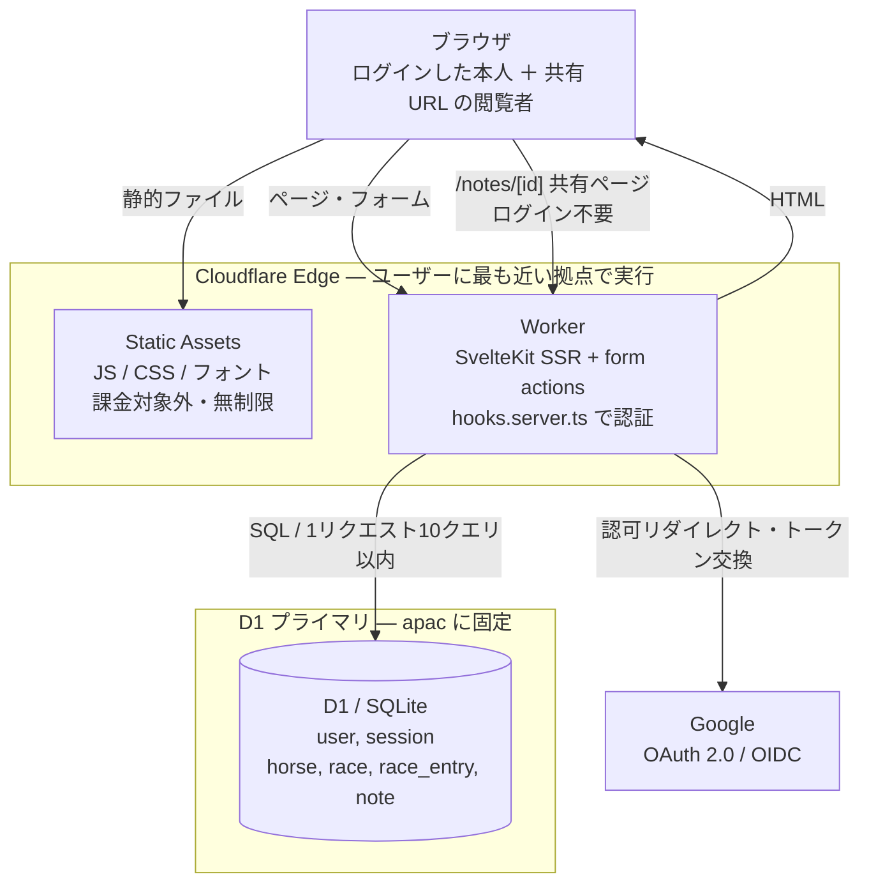
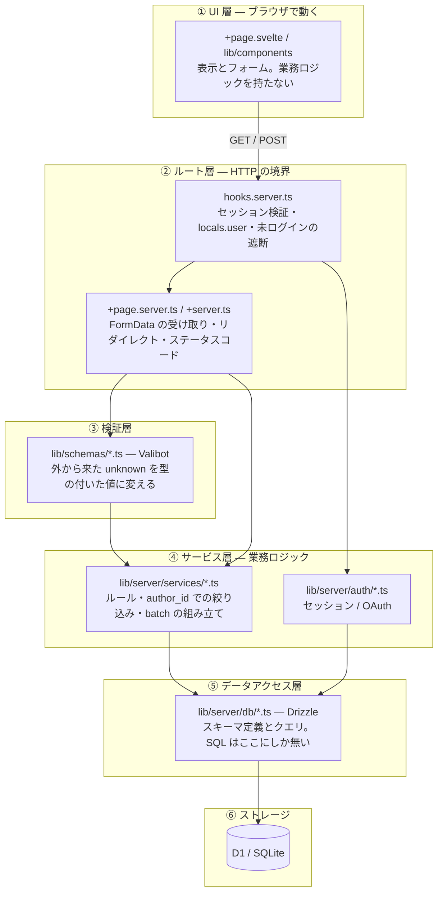
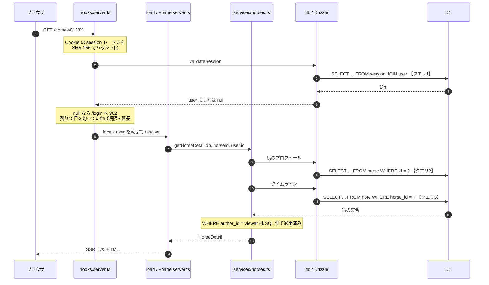
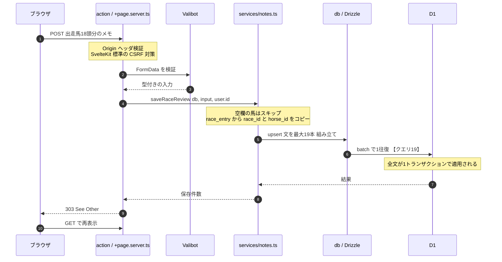
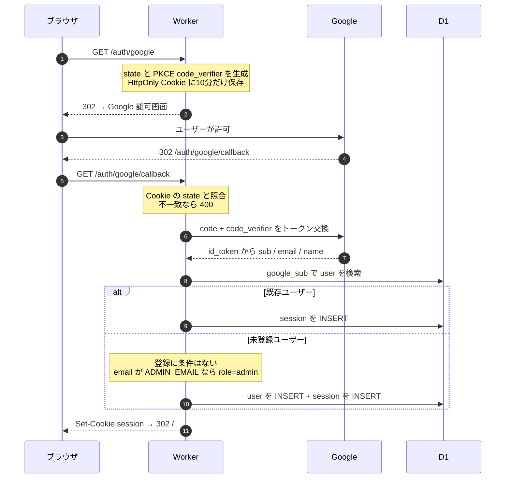
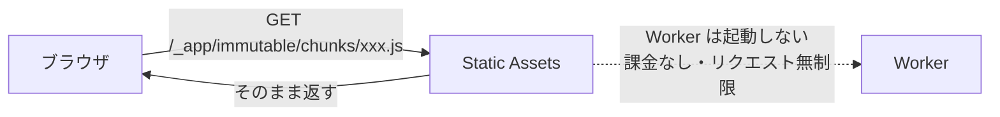
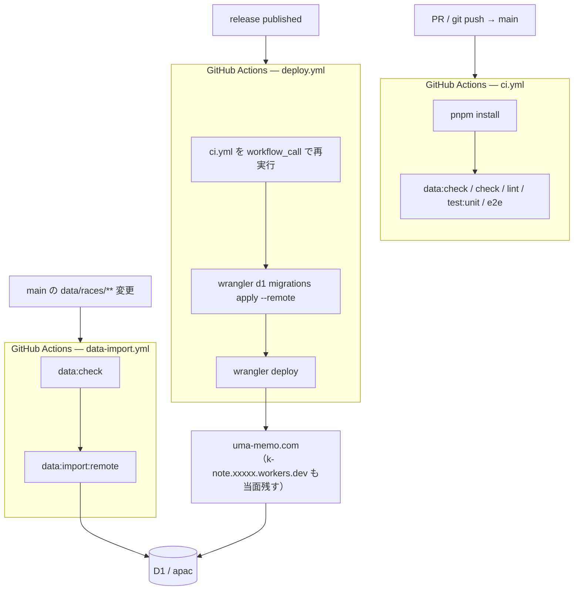
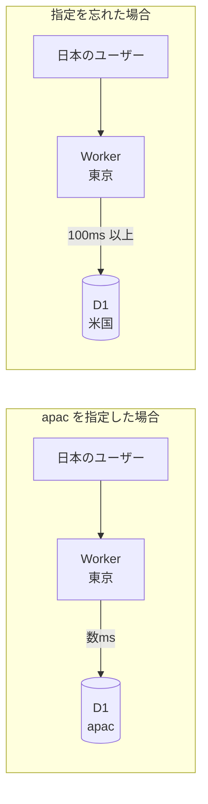
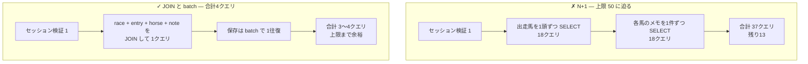

# uma-memo アーキテクチャ・コスト・技術選定

[product.md](./product.md) が「何を作るか」なのに対し、こちらは「どう動き、いくらかかり、なぜその技術か」をまとめたもの。

- 作成日: 2026-09-20
- 更新日: 2026-09-21 — 招待制をやめて登録を開き、メモを既定非公開にした変更を反映（→ 3-6 / 第6章）
- 更新日: 2026-09-23 — AGENTS.md の「ランタイム上の約束」「DB とデータ」を第0章に移し、
  依存の向きの表（第2章）をここを正にした
- 更新日: 2026-09-23 — アプリ名を uma-memo に変え、独自ドメイン `uma-memo.com` を当てた（→ 第4章 / 第6章）
- 更新日: 2026-09-23 — 監視（`lib/server/monitoring/`）を足し、`createDb` が D1 の observer を受けるようにした
  （→ 第2章 / 3-1 / 第8章、詳細は [monitoring.md](./monitoring.md)）
- 更新日: 2026-09-24 — Worker の入口を `src/worker.js` にし、見つからないアセットの 404 を
  ブラウザに抱えさせないようにした（→ 3-5）
- 更新日: 2026-09-24 — D1 の書き込み上限がステージングと共有であることと、レースデータ投入の書き込みを試算に足した（→ 第6章）
- 更新日: 2026-09-24 — Workers Paid に上げ、Worker に CPU 時間とサブリクエスト数の上限を置いた（→ 第6章・第7章・第8章、詳細は [monitoring.md 第9章](./monitoring.md)）
- 更新日: 2026-09-24 — Worker の入口に `email` ハンドラを足し、`src/worker.js` が monitoring の `email.ts` を import するようにした（→ 第2章）
- **読む場面:** サーバー側（ルートの `.server.ts`・サービス層・DB）、スキーマ、依存の向きを触るとき。
  第0章だけは、コードを変えるなら毎回
- **ここに無いもの:** ルートの一覧と action の約束は [api.md](./api.md)、画面側の書き方は
  [frontend.md](./frontend.md)、Cloudflare の構築とデプロイの手順は [operations.md](./operations.md)
- 料金・制限の出典: Cloudflare 公式ドキュメント（2026-09-20 時点で確認）
  - [Workers Pricing](https://developers.cloudflare.com/workers/platform/pricing/)
  - [D1 Limits](https://developers.cloudflare.com/d1/platform/limits/)

---

## 0. 守ること

破ると本番で他人のメモが漏れるか、Workers で壊れるもの。理由は括弧の先の章にある。

### ランタイム

- **メモを読む関数は `viewerId` を必須引数で受け取り、SQL の WHERE に `author_id = :viewer` を入れる。**
  省略可能にした時点で、絞り忘れが「全ユーザーに見える」に直結する。
  `visibility` を見てよいのは共有ページ `/notes/[id]` だけ（→ 3-6・3-7）
- **D1 クライアントはリクエストごとに `createDb(platform.env, locals.monitor.onQuery)` で作る。** モジュールスコープに
  接続やユーザー情報を持たせない。Workers の実行環境は複数のリクエストで使い回される（→ 3-1）
- **認証の判断は `src/hooks.server.ts` に閉じる。** ルートは `locals.user` だけを見る。
  ログイン不要のパスは `PUBLIC_PATHS` にあるものだけ（→ [api.md 第2章](./api.md)）
- **依存は一方向。** サービス層（`src/lib/server/services/`）は SvelteKit を import しない。
  画面側はサーバーのコードを型ですら import しない（→ 第2章）
- 1リクエストの D1 クエリは10以内（Free の頃の上限は50。Paid では上限でなくレビューで守る）。超えそうなら JOIN か `batch()` にまとめる（→ 7-1）
- **セッショントークンは DB に平文で入れない。** 保存するのは SHA-256 ハッシュだけ
- `nodejs_compat` は付けない（起動コストとバンドルが増える。採用ライブラリは Web 標準 API で動く）。
  `compatibility_date` は意図して上げるとき以外は変えない（→ 5-4）
- モック認証（`MOCK_AUTH`）は `dev` ガードの中にだけ置く。本番ビルドから分岐ごと消えるのが前提

### DB とデータ

- スキーマの正は `src/lib/server/db/schema.ts`。マイグレーションは `pnpm run db:generate` で作り、
  生成された `drizzle/*.sql` と `drizzle/meta/` は手で直さない。生成物も一緒にコミットする
- 出走馬データは画面からではなく `data/races/*.yaml` で入れる。書式は [data/README.md](../data/README.md)。
  触ったら `pnpm run data:check` を通す。`main` にマージされるとリリースを待たずに
  `data-import.yml` が本番に投入するので、PR 本文にその旨を書く（→ 第4章）
- **本番の D1（`--remote`）、`wrangler secret`、`deploy` は人が行う。** エージェントからは叩かない

---

## 1. 全体像

サーバーは存在しない。**Worker が1つあるだけ**で、静的アセットも SSR も API も同じ Worker が受ける。



外部依存は **Google OAuth だけ**。それ以外は Cloudflare の中で完結する。
バックエンドサーバー、コンテナ、VPC、ロードバランサ、Redis — どれも要らない。

### なぜこの形になるか

数人が週末に使う規模に対して、常時起動のサーバーは過剰。
Workers はリクエストが来たときだけ実行され、来なければ何も動かない（＝何も課金されない）。
一方で「ゼロから起動する」コールドスタートの待ち時間が実質ないため、
月に数回しか触らないアプリでも初回アクセスが遅くならない。

**このアプリの使われ方（週末に集中し、平日はほぼ無風）と課金モデルが噛み合っている。**

---

## 2. レイヤ構成

Worker の中身は6層に分ける。**依存は上から下への一方向のみ**とし、逆流させない。



### 各層の責務

| 層 | 置き場所 | やること | **やらないこと** |
| --- | --- | --- | --- |
| ① UI | `+page.svelte`, `lib/components/` | 表示、フォームの組み立て | DB アクセス、認可判断 |
| ② ルート | `+page.server.ts`, `+server.ts`, `hooks.server.ts` | HTTP の入出力、Cookie、リダイレクト | 業務ルール、SQL |
| ③ 検証 | `lib/schemas/` | `FormData` / クエリ文字列を型付きの入力に変換 | DB アクセス |
| ④ サービス | `lib/server/services/`, `lib/server/auth/` | 業務ルール、`author_id` での絞り込み、`batch()` の構成 | HTTP を知ること |
| ⑤ データアクセス | `lib/server/db/` | Drizzle でのクエリ組み立て、型定義 | 業務ルール |
| ⑥ ストレージ | D1 | 永続化、制約（FK・CHECK・UNIQUE） | — |

### 層を分ける実利 — サービス層は SvelteKit を知らない

**`lib/server/services/` は SvelteKit の型（`RequestEvent`, `Cookies`, `error()` など）を
一切 import しない。** 引数で `db` と `userId` を受け取り、値を返すだけの純粋な関数群にする。

```ts
// ✓ 良い — HTTP を知らない。テストで直接呼べる
export async function getHorseTimeline(
  db: Db, horseId: string, viewerId: string
): Promise<TimelineItem[]> { ... }

// ✗ 悪い — SvelteKit に縛られ、将来 API から再利用できない
export async function getHorseTimeline(event: RequestEvent) { ... }
```

これが効いてくる場面は3つ。

1. **テスト** — Vitest から D1 のローカルインスタンスを渡して直接呼べる。HTTP のモックが要らない
2. **将来の API 追加** — [api.md](./api.md) のとおり当面 REST API は作らないが、
   必要になったとき `+server.ts` から同じサービス関数を呼ぶだけで済む
3. **移植性** — 万一 Cloudflare から離れることになっても、business logic は素の TypeScript のまま残る

### 依存の向き — どこからどこを import してよいか

依存は**縦（層）と横（機能）の2軸**で決め、どちらも一方向にする。
今は約束で、ESLint の規則として `pnpm run lint` で止めるのは [harness.md 第2層](./harness.md) の PR から。
ファイル単位の依存図は手で描くとすぐ実物とずれるので置かない。正はこの節と、規則を入れたあとの `eslint.config.js`。

**縦の軸 — 層**（上の図の6層を、import の単位に割ったもの）

| from ＼ to | component | ui | pure | service | auth | db | route-helper |
| --- | --- | --- | --- | --- | --- | --- | --- |
| page（`+page.svelte`・`+layout.svelte`） | ✓ | ✓ | ✓ | ✗ | ✗ | ✗ | ✗ |
| component（`lib/components/`） | ✓ | ✓ | ✓ | ✗ | ✗ | ✗ | ✗ |
| ui（`lib/components/ui/`） | ✗ | ✓ | `utils.ts` だけ | ✗ | ✗ | ✗ | ✗ |
| endpoint（`.server.ts`・`+server.ts`・`hooks.server.ts`） | ✗ | ✗ | ✓ | ✓ | ✓ | ✓ | ✓ |
| service（`lib/server/services/`） | ✗ | ✗ | ✓ | 横の軸に従う | ✗ | ✓ | ✗ |
| auth（`lib/server/auth/`） | ✗ | ✗ | ✓ | ✗ | ✓ | ✓ | ✗ |
| db（`lib/server/db/`） | ✗ | ✗ | ✓ | ✗ | ✗ | ✓ | ✗ |
| pure（`lib/schemas/`・`lib/utils/`） | ✗ | ✗ | ✓ | ✗ | ✗ | ✗ | ✗ |

route-helper は `lib/server/util.ts`（`ctx` / `ctxAdmin`）。

monitoring（`lib/server/monitoring/`。ログと Discord への通知）は endpoint と、Worker の入口の `email` ハンドラからだけ使う。
monitoring が import してよいのは pure と db（`errors.ts` と observer の型）だけ。
**db は monitoring を import しない。** `createDb` は observer を引数で受け、ルートが `locals.monitor.onQuery` を渡す。
service と auth も monitoring を知らない（失敗は投げたままにし、ルートか `handleError` が拾う）。

Worker の入口 `src/worker.js` は SvelteKit の外（adapter の Worker を包むだけ）で、import するのは
adapter の成果物と `lib/server/asset-cache.ts`（SvelteKit も DB も知らない関数1つ）と
`lib/server/monitoring/email.ts`（Cloudflare の通知メールを Discord へ流す。import するのは同じ monitoring の
`discord.ts` と `log.ts` だけ）だけ（→ 3-5、[monitoring.md 9-2](./monitoring.md)）。
wrangler がそのまま束ねるので、ここから辿れるファイルは `$lib` などの別名を使えない。

- **画面側（page / component）はサーバーのコードを型ですら import しない。** 画面が要る型は
  `./$types` の `PageData` から取るか、pure に置く。SvelteKit は `$lib/server` の値の import は
  止めるが `import type` は通す
- **SQL は db と service（と auth）にしか無い。** `drizzle-orm` をルートやコンポーネントから import しない

パッケージ単位の禁止:

| 対象 | import しないもの |
| --- | --- |
| services / auth / db / schemas / utils | `@sveltejs/kit`・`$app/*` |
| routes / components / schemas / utils | `drizzle-orm` |
| auth 以外 | `arctic`・`@oslojs/*` |

**横の軸 — 機能**

機能は次の順に並べ、**右は左を使ってよいが、左は右を使わない**。順位で並べるので循環は起こりえない。

```
horses ← races ← notes ← share ← dashboard
  馬     レース・     メモ・見立て・  共有     ダッシュボード・
         出馬表・枠   印・タグ・的中  リンク   今週
```

- 機能を持たないもの（shared）: `lib/schemas/`・`lib/server/db/`・`lib/server/auth/`・`lib/server/monitoring/`・
  `lib/utils/` の `date` / `redirect` / `role`・`components/ui/`。どの機能からも使ってよいが、shared から機能は使わない
- **ルート（`src/routes/`）は機能を組み合わせる場所**なので、横の軸の制約は受けない
- 今ある違反（直す予定）は [harness.md 2-5](./harness.md)

---

## 3. データアクセスの経路

### 3-1. D1 クライアントの生成とライフサイクル

D1 への入口は `event.platform.env.DB` というバインディング1つ。
**Worker にはグローバル状態を置かず、リクエストごとに Drizzle クライアントを作る。**

```ts
// src/lib/server/db/index.ts
import { drizzle } from 'drizzle-orm/d1';
import { instrumentD1, type QueryObserver } from './instrument';
import * as schema from './schema';

export function createDb(env: App.Platform['env'], observe: QueryObserver) {
  return drizzle(instrumentD1(env.DB, observe), { schema });
}
export type Db = ReturnType<typeof createDb>;
```

`instrumentD1` は D1 の binding を包み、クエリごとの時間と失敗を `observe` に渡す
（D1 の失敗と遅いクエリの監視。→ [monitoring.md 第3章](./monitoring.md)）。

Workers の実行環境は複数リクエストで再利用されうるため、
**モジュールスコープに DB 接続やユーザー情報を保持するとリクエスト間で漏れる。**
Drizzle クライアントの生成自体はほぼコストゼロなので、毎回作って問題ない。

接続プールは存在しない。D1 はバインディング経由の RPC であり、
TCP コネクションの管理という概念がそもそもない。

### 3-2. 読み取りの経路 — `GET /horses/[id]`



**1ページ＝3クエリ。** タイムラインが1クエリで済むのは、
[product.md](./product.md) のとおり `note` に `horse_id` を非正規化しているため。
レース紐付きメモと近況メモをマージする処理が要らない。

使うインデックスは `note_author_horse (author_id, horse_id, occurred_at DESC)`。
**先頭が `author_id`** なのは、読みが必ず viewer で絞られるため（→ 3-6）。
D1 は**スキャンした行数**で課金されるので、インデックスが効いているかどうかが
そのままコストに直結する。

### 3-3. 書き込みの経路 — `POST /races/[id]?/saveReview`

ふりかえり画面の一括保存。**このアプリで最もクエリ数が増える経路。**



**`batch()` を使う理由は速度だけではない。**
個別に `INSERT` を19回投げると、往復19回に加えて後述の
「1リクエストあたりのクエリ数上限」を消費する。
`batch()` は1トランザクションとしてまとめて適用されるため、
途中で失敗したときに半分だけ保存される事故も防げる。

### 3-4. 認証の経路



Google への通信は Worker からの**サブリクエスト**で、Cloudflare は課金しない
（"Cloudflare does not bill for subrequests you make from your Worker"）。

### 3-5. 静的アセットは Worker を通らない



SvelteKit がビルドした JS/CSS はここに乗る。**この分は一切コストにならない。**

見つからなかったときだけは Worker に落ちる。`/_app/immutable/*` には adapter の `_headers` で
`Cache-Control: public, immutable, max-age=31536000` が付き、これは 404 にも付く。デプロイの
切り替わりの間に新しいチャンクが 404 で返ると、ブラウザがその 404 を1年抱えて画面が JS 無しで固まる
（2026-09-23 の v1.1.1 で起きた）。そこで Worker の入口 `src/worker.js` が adapter の Worker を包み、
失敗に付いた `immutable` を `no-store` に差し替える（`src/lib/server/asset-cache.ts`）。
adapter は自分の設定の main を消して書き出すので、adapter には `wrangler.adapter.toml` を読ませ、
書き出し先（`.svelte-kit/cloudflare/_worker.js`）と wrangler の main（`src/worker.js`）を分けている。

これは抱えるのを防ぐだけで、すでに 404 を抱えたブラウザには届かない（キャッシュから返るので Worker に来ない）。
その人にはサイトデータの削除（Chrome ならアドレスバーの鍵 → サイトの設定 → データを削除）を頼む。

### 3-6. 認可はどの層でかけるか

**「誰のメモか」の絞り込みはサービス層の SQL に埋める。** UI では絞らない。

```ts
// services/notes.ts — WHERE 句に必ず viewer の条件を入れる
where(and(
  eq(note.horseId, horseId),
  eq(note.authorId, viewerId),
))
```

UI 側でフィルタすると、見えてはいけない行が
SSR の HTML やデータペイロードに乗ってしまう。
**DB から出さない**のが唯一確実な方法。

`visibility`（`private` / `unlisted`）を見るのは**共有ページ1本だけ**。
ログイン中の読みはすべて `author_id = :viewer` で閉じているので、
公開範囲の判定がそもそも要らない（→ [product.md 第2章 2-2](./product.md)）。

```ts
// routes/notes/[id]/+page.server.ts — ここだけが visibility を見る
where(and(eq(note.id, id), eq(note.visibility, 'unlisted')))
```

**この形の弱点は「絞り忘れ＝全員に見える」になること。**
`shared` を混ぜていた頃は、絞り忘れても他人の private までは出なかった。
いまは `author_id` の条件が1本抜けるだけで全ユーザーのメモが出る。
だから**サービス層の読み取り関数は `viewerId` を必須引数で受け取る**形を崩さない。
省略可能にしたり既定値を与えたりした時点で、この防波堤は消える。

一方「admin だけがマスタを編集できる」といった**操作の可否**はルート層で弾く。
データの絞り込みはサービス層、操作の可否はルート層、と役割を分ける。

### 3-7. 共有ページはこの経路の例外

`/notes/[id]` は `hooks.server.ts` の公開パスに入るため、`locals.user` が null のまま
load に到達する。**前提が他の全ルートと違う唯一の場所**なので、独立して覚えておく。

| | 通常のルート | `/notes/[id]` |
| --- | --- | --- |
| `locals.user` | 必ず非 null | null でも通る |
| WHERE 句 | `author_id = :viewer` | `id = :id AND visibility = 'unlisted'` |
| 該当なし | — | **404**（403 にすると「その ID は在る」と漏れる） |
| ヘッダ | 既定 | `X-Robots-Tag: noindex, nofollow` / `Referrer-Policy: no-referrer` / `Cache-Control: private, no-store` |

未ログインの閲覧者はセッション Cookie を持たないので検証クエリが走らず、
**主キー1件引きの1クエリだけ**で返る。通常ページより軽い。

---

## 4. デプロイ構成



**アプリとレースデータは別系統で出る。**

アプリは `main` へのマージでは本番に出ない。出るのはリリースを publish したときだけで、
main は「次に出す候補」。どこを出すかはタグを切る側が決める。

レースデータはリリースを待たずに `main` へのマージで入る。周期が違うためで、
出馬表は開催前に入っている必要があり、1レースにつき 予定 → 枠確定 → 結果 の3回更新される。
データ側に版番号は振っていない。**適用状況はファイル内容の SHA-256 を `data_import`
テーブルに持つ形で表していて**、投入先（local / remote）ごとに別に進む。

結合点は1つだけ。YAML に新しい項目を足す変更はスクリプトとスキーマの変更を伴うので、
**先にアプリのリリースが要る**。逆は自由で、データ更新はアプリに影響しない。

**マイグレーション → デプロイの順に固定している。**
逆にすると新しいコードが古いスキーマに当たる。この順でも
「古いコードが新しいスキーマに当たる」窓が数十秒開くので、
列を消すような破壊的なマイグレーションはそれを承知で流す（利用者が数人なので許容する）。

リリースのタグは main の CI を通った commit のはずだが、任意の commit からも
タグは切れるので、`deploy.yml` は出す前に `ci.yml` をもう一度呼んで回す
（→ [operations.md](./operations.md)）。

| 環境 | Worker | D1 | 用途 |
| --- | --- | --- | --- |
| local | `vite dev`（Miniflare 経由） | ローカル SQLite（`.wrangler/state`） | 開発 |
| production | `k-note` | `k-note` | 本番（`uma-memo.com`） |

Worker と D1 の名前が旧名の `k-note` のままなのは意図どおり。変えると別の Worker・別の D1 になる
（→ [operations.md「名前について」](./operations.md#名前について)）。

プレビュー環境は当面作らない。この規模のアプリに2系統は要らない。
必要になったら `wrangler versions upload` によるプレビュー URL を使う。

### D1 の配置

```bash
pnpm exec wrangler d1 create k-note --location apac
```

**`--location apac` を必ず付ける。** D1 は「プライマリが1箇所にある SQLite」であり、
Worker 自体はユーザーの近くで動いても、SQL は毎回プライマリまで往復する。



3クエリで 300ms を捨てることになるので、ここは最初に必ず指定する。
利用者が日本だけなので apac 固定が最適。読み取りレプリカは要らない。

---

## 5. 採用技術

### 5-1. 一覧

| 領域 | 採用 | バージョン想定 |
| --- | --- | --- |
| フレームワーク | SvelteKit（Svelte 5 runes） | 2.x / 5.x |
| アダプタ | `@sveltejs/adapter-cloudflare` | 最新 |
| ランタイム | Cloudflare Workers | `compatibility_date` は作成時の日付で固定 |
| DB | Cloudflare D1（SQLite） | — |
| ORM | Drizzle ORM + drizzle-kit | 0.4x |
| 認証 | Arctic（OAuth）+ Oslo（暗号・エンコード） | Arctic 3.x |
| 検証 | Valibot | 1.x |
| スタイル | Tailwind CSS v4 | 4.x |
| テスト | Vitest / Playwright | — |
| パッケージ管理 | pnpm | — |
| CI/CD | GitHub Actions + Wrangler | — |

### 5-2. なぜこれを選んだか

**SvelteKit** — 決定済みだが、この用途には実際よく合う。
本アプリはフォームの塊（レース登録、出走馬入力、メモ）であり、
SvelteKit の form actions は JS が無効でも動く HTML フォームがそのまま基盤になる。
クライアント側の状態管理ライブラリが要らず、バンドルも小さいまま済む。
Workers は CPU 時間で課金・制限されるため、SSR が軽いことはそのままコストに効く。

**D1** — メモをレース軸と馬軸の両方から引く、つまり関係を辿る読み方が中心。
KV（結果整合・キー参照のみ）や Durable Objects（単一エンティティの強整合）では
横断クエリが書けない。SQL が必要で、規模は小さい。D1 の適合範囲のど真ん中。

**Drizzle** — D1 ドライバが公式にあり、生成されるマイグレーションが読める SQL。
Prisma は Workers 対応こそ進んだがバンドルが重く、CPU 時間で課金される環境では不利。
生 SQL は型が付かず、`note` のような条件付きカラム（kind ごとに埋まる列が変わる）を
手で扱うと事故る。Drizzle はその中間として妥当。

**Arctic + Oslo** — Lucia はライブラリとしての提供をやめ実装ガイドに移行したため、
その構成要素である Arctic（OAuth クライアント）と Oslo（暗号・エンコード）を直接使う。
どちらも Web Crypto ベースで Node 固有 API に依存せず、Workers でそのまま動く。
セッション管理は自分で書くが、[product.md の第4章](./product.md)のとおり150行程度で収まる範囲。

**Valibot** — Zod と同等の書き味でバンドルが小さい。
ここも CPU 時間と起動コストに直結するため軽い方を採る。

### 5-3. 検討して採らなかったもの

| 候補 | 不採用の理由 |
| --- | --- |
| Cloudflare Access | 当初は独自ドメインが無く、`*.workers.dev` は保護できなかった。`uma-memo.com` を取った今も、誰でも登録できる仕組みなので門は要らない |
| Neon / Supabase + Hyperdrive | 本物の Postgres は魅力だが構成要素が増える。D1 で足りる規模 |
| Workers KV をメインストアに | 結果整合でクエリが書けない。メモの横断参照に致命的 |
| Durable Objects | 単一エンティティの強整合が要件ではない。オーバースペック |
| Prisma | バンドルサイズと CPU コスト |
| REST API + SPA | 画面遷移ごとに API を叩く分リクエストが増え、実装も二重になる |

### 5-4. ランタイム上の注意

- **`nodejs_compat` は極力付けない。** 付けると起動時のコストとバンドルが増える。
  Arctic / Oslo / Drizzle-D1 はいずれも Web 標準 API だけで動くため、原則不要
- `compatibility_date` は初期化時の日付で固定し、上げるときは意図的に上げる
- Worker のバンドルサイズ上限は圧縮後 3MB（Free）。SvelteKit の SSR コードなら
  まず当たらないが、重い依存を足すときは意識する

---

## 6. コスト

### 結論

**Cloudflare の利用料は月額 $5（Workers Paid の基本料）。含まれる枠に収まり、従量課金に届く見込みはない。**

2026-09-24 に Free から Workers Paid に上げた。以下の試算は Free の頃のもので、
Free の上限に対して余裕があることは、Paid の枠（桁が大きい）に対してはなおさら成り立つ。
Paid では上限を超えると止まらずに課金されるので、暴走の見張りを [monitoring.md 第9章](./monitoring.md) に置いた。

ほかにかかるお金は独自ドメイン `uma-memo.com` の年額だけ。
Workers の Custom Domains は無料で、Google OAuth も無料。

### 6-1. 無料枠と、このアプリの想定使用量

前提: 実利用者5人、開催日（土日）中心、1開催日あたり12レースをふりかえる。

招待制をやめたので**人数の上限は仕組みとしては無くなった**が、
検索にも一覧にも出ない以上、外から見つけて登録してくる人はいない。
実質の利用者数は招待制だった頃と変わらない見込みで、試算もそれを前提に置く。
外れたときに何が起きるかは 6-2 の表のとおりで、$5/月の Paid が天井になる。

| 項目 | Free の上限 | 本アプリの想定 | 消費率 |
| --- | --- | --- | --- |
| Worker リクエスト | 100,000 / 日 | 約 350 / 開催日 | **0.4%** |
| 静的アセット配信 | 無制限・課金対象外 | — | — |
| D1 rows read | 5,000,000 / 日 | 約 35,000 / 開催日 | **0.7%** |
| D1 rows written | 100,000 / 日 | 約 1,500 / 開催日 | **1.5%** |
| D1 ストレージ | 500 MB / DB | 年間 約 20 MB | **年4%** |

**試算の根拠**

- リクエスト: 5人 × 60ページ遷移 + フォーム送信50回 ≒ 350。平日はほぼゼロ
- rows read: 1リクエストあたり平均100行（セッション1 + レース詳細で entries 18・notes 20 など）
- rows written: 1レースのふりかえり＝レースメモ1 + 出走馬メモ18。
  インデックス3本への書き込みも rows written に計上されるため約4倍で見て 76行。
  12レースで912行、出走馬登録などを足して 1,500行
- **D1 の上限はアカウント単位で、ステージング D1（[staging.md](./staging.md)）とも共有する。**
  レースデータの投入（`data:import:*`）は変わったファイルだけを流すので1回あたり数百行だが、
  全ファイルを流し直すと1回で約1万7千行（索引の更新を除く）を書く。
  2026-09-24 にステージングが毎回全ファイルを流していたため、マージが5回続いた日に上限を使い切り、
  本番のメモの保存が 500 になった。**`--all` は日に何度も走る経路に入れない**
- ストレージ: 年間1,200レース × (entry 14 + note 15) 行 ≒ 35,000行、インデックス込みで約20 MB

D1 の Free は**1データベースあたり 500 MB**（アカウント合計5 GB とは別の制限）。
年20 MB なら **25年分**入る。

### 6-2. 有料化が必要になる条件

**2026-09-24 に Paid に上げた。** 下の表は、それまで判断に使っていた材料として残す。

| # | トリガ | 現状 | 起きたときの対処 |
| --- | --- | --- | --- |
| 1 | **1リクエストの D1 クエリが 50 を超える**（Free の上限。Paid は1000） | 1ページ3クエリ | `batch()` と JOIN で抑える。**要注意（→ 7章）** |
| 2 | **CPU 時間が 10ms / 呼び出しを超える**（Free の上限） | SSR で数ms の想定 | 重い処理を削るか Paid（最大30秒）へ |
| 3 | DB が 500 MB を超える | 年20 MB | Paid（10 GB）へ |
| 4 | Time Travel で7日より前に戻したい | 7日で足りる | Paid（30日）へ |

Paid に上げた場合も、含まれる枠（リクエスト1,000万/月、D1 読み250億行/月、書き5,000万行/月）に対して
本アプリの使用量は誤差なので、**$5 ちょうど**で頭打ちになる。従量課金に届く余地がない。

### 6-3. 将来コストが増える可能性のある拡張

| 拡張 | コスト影響 |
| --- | --- |
| 独自ドメイン | ドメイン代のみ（年1,000〜2,000円程度）。Cloudflare 側は無料 |
| 外部データの自動取り込み（Phase 5） | Cron Trigger は Free でも動く。書き込み行数が増えるが桁が違う |
| 全文検索（FTS5） | D1 内で完結。インデックス分のストレージのみ |
| Web Push 通知 | Cron + fetch。追加費用なし |
| 画像アップロード（レース写真など） | R2 が必要。10 GB まで無料、以降 $0.015/GB-月 |

---

## 7. 制約とスケール限界

コストより先に効いてくるのは**技術的な上限**のほう。順に。

### 7-1. 1リクエストあたりの D1 クエリ数 — Free の頃の上限は 50

**これが本アプリで最も現実的なリスク。**

ふりかえり画面は18頭分のメモを扱う。ここで N+1 を書くと即座に上限へ近づく。



**設計ルール: 1リクエストあたりの D1 クエリは10以内に収める。**
超えそうなら JOIN か `batch()` にまとめる。これを守っていれば Free の頃の上限の50は遠い。
Paid に上げたので上限に当たって落ちることはまず無いが、クエリ数はそのまま時間と rows read に効くので、約束は変えない。

### 7-2. CPU 時間 — 上限 1,000ms / 呼び出し（`[limits] cpu_ms`）

SvelteKit の SSR は通常数ms で収まるが、18行のテーブルに Markdown レンダリングを
全行かけるような処理を足すと近づく。メモ本文の Markdown → HTML 変換は
**サーバーではなくクライアントで行う**か、軽量なパーサを使う。

超えた場合の症状は「エラーで落ちる」（利用者に 1102 が出る）であり、静かな劣化ではない。
ただし Worker ごと止められるので Discord には届かない。Workers Logs を人が見る（→ [monitoring.md 9-1](./monitoring.md)）。

### 7-3. D1 は単一スレッド

D1 は1データベースにつき1スレッドで、クエリを1つずつ処理する。
平均1ms のクエリなら毎秒1,000件が上限。5人の同時利用では問題にならない。

### 7-4. その他の上限（いずれも遠い）

| 項目 | 上限 | 備考 |
| --- | --- | --- |
| 1テーブルの列数 | 100 | `race_entry` が最多でも20列程度 |
| 1行 / BLOB の最大サイズ | 2 MB | メモ本文がこれを超えることはない |
| バインドパラメータ数 | 1クエリ100個 | 18頭の一括 INSERT は `batch()` で分割されるので該当しない |
| SQL 文の長さ | 100 KB | — |
| Worker からの同時 D1 接続数 | 6 | 逐次処理なので該当しない |

---

## 8. 運用

| 項目 | どうするか |
| --- | --- |
| **バックアップ** | D1 の Time Travel で過去30日間（Paid）の任意の時点に復元できる。**別途バックアップの仕組みは作らない。** 節目で `pnpm exec wrangler d1 export` を手動実行して手元に置けば十分 |
| **ログ** | Workers Logs が Paid で 2,000万イベント/月・7日保持（`[observability] enabled = true`）。構造化ログの形と出さないものは [monitoring.md](./monitoring.md) |
| **通知** | ERROR と、GitHub Actions の失敗・本番デプロイの結果を Discord へ。死活監視は `health.yml` が `/api/health` を外から叩く（→ [monitoring.md](./monitoring.md)） |
| **メトリクス** | Cloudflare ダッシュボードの Worker / D1 メトリクス。rows read/written はここで実測を確認できる |
| **シークレット** | `pnpm exec wrangler secret put`（本番）/ `.dev.vars`（ローカル、`.gitignore` 済み） |
| **マイグレーション** | `wrangler d1 migrations apply` を GitHub Actions のデプロイ前に実行 |
| **暴走課金の防止** | Worker に CPU 時間とサブリクエスト数の上限を置き（`[limits]`）、使用量と従量課金の見込みを Cloudflare から知らせる（→ [monitoring.md 第9章](./monitoring.md)） |

---

## 9. この構成の要約

- **サーバーもコンテナもない。** Worker 1つと D1 1つ、外部依存は Google OAuth だけ
- **層は6つ、依存は一方向。** 要は「サービス層が SvelteKit を知らない」の1点。
  これだけでテストが書け、将来の API 追加にも耐える
- **データアクセスは必ず ④→⑤→⑥ を通る。** ルートから直接 SQL を書かない。
  `author_id = :viewer` を SQL の WHERE 句に埋めるのも、この経路を1本に保てているから成立する
- **公開範囲を見るのは共有ページ1本だけ。** ログイン中の読みは全部
  「自分のメモ」に閉じているので、`visibility` の判定が散らばらない
- **月額 $5（Workers Paid）。** Free の枠に対しても消費率は最も高い項目で 1.5% だった。25年分のストレージ余裕がある
- **コストより先にクエリ数が効く。** Free の頃は「1リクエスト50クエリ」が上限だった。Paid では上限は遠いが、
  JOIN と `batch()` でクエリ数を10以内に保つことが、性能（D1 は単一スレッド）とコスト（rows read）に同時に効く
- **有料化してもその先がない。** $5/月を超える従量課金には、この規模では到達しようがない
