# uma-memo アーキテクチャ・コスト・技術選定

[product.md](./product.md) が「何を作るか」なのに対し、こちらは「どう動き、いくらかかり、なぜその技術か」をまとめたもの。

- 作成日: 2026-09-20
- 更新日: 2026-09-21 — 招待制をやめて登録を開き、メモを既定非公開にした変更を反映（→ 3-6 / 第6章）
- 更新日: 2026-09-23 — AGENTS.md の「ランタイム上の約束」「DB とデータ」を第0章に移し、
  依存の向きの表（第2章）をここを正にした
- 更新日: 2026-09-23 — アプリ名を uma-memo に変え、独自ドメイン `uma-memo.com` を当てた（→ 第4章 / 第6章）
- 更新日: 2026-09-23 — 監視（`lib/server/monitoring/`）を足し、`createDb` が D1 の observer を受けるようにした
  （→ 第2章 / 3-1 / 第8章、詳細は [monitoring.md](./monitoring.md)）
- 更新日: 2026-09-24 — Worker の入口を `src/worker.js` にし、見つからないアセットの 404 を
  ブラウザに抱えさせないようにした（→ 3-5）
- 更新日: 2026-09-24 — D1 の書き込み上限がステージングと共有であることと、レースデータ投入の書き込みを試算に足した（→ 第6章）
- 更新日: 2026-09-24 — Workers Paid に上げ、Worker に CPU 時間とサブリクエスト数の上限を置いた（→ 第6章・第7章・第8章、詳細は [monitoring.md 第9章](./monitoring.md)）
- 更新日: 2026-09-24 — 画像を Static Assets に置くときの約束（`?no-inline`）を足した（→ 3-5）
- 更新日: 2026-09-24 — Cron Trigger でオッズを取りに行くようにした。外部依存に取得元（netkeiba）が加わり、
  `src/worker.js` が `scheduled` も受ける（→ 第0章 / 第1章 / 第2章 / 3-8 / 第6章）
- 更新日: 2026-09-25 — 出走馬の取得を Worker（Cron・管理画面）から GitHub Actions に頼めるようにした。
  Worker は Actions を起動するだけで、出馬表は YAML の PR で入る（→ 第0章 / 第1章 / 第2章 / 3-9）
- 更新日: 2026-09-26 — Worker の fetch を東京に置いた（`[placement]`。→ 第1章）
- 更新日: 2026-09-26 — オッズの取得を Worker の Cron から GitHub Actions に移した。netkeiba は Workers から来たリクエストを
  時間帯によってまとめて 400 で返す。取得と保存は `scripts/odds/` に移り、Worker は netkeiba へ行かない（→ 第0章 / 第1章 / 第2章 / 3-8）
- 更新日: 2026-09-27 — 騎手（jockeys）を機能の並びに足した（→ 第2章）
- 更新日: 2026-09-28 — 予想まとめの共有に SNS のプレビュー画像を足した。`src/worker.js` が resvg の wasm を渡し、
  フォントは Static Assets から読む（→ 第2章 / 3-7 / 5-4）
- 更新日: 2026-10-03 — MCP の口（`/mcp`）と、その認可サーバー（OAuth 2.1）を足した。`/mcp` は Bearer だけで入り、
  トークンの口は `src/worker.js` が SvelteKit より先に受ける（→ 第0章 / 第2章 / 3-10）
- 更新日: 2026-10-03 — Client ID Metadata Document（Claude の推奨の認証方式）を受けるようにした。外部依存に
  AI のクライアントが置いた文書が加わり、Worker が同意画面から取りに行く（→ 第0章 / 第1章 / 3-10）
- 更新日: 2026-10-03 — オッズの更新の起動を GitHub の schedule から Worker の Cron（`workflow_dispatch`）に移した。
  schedule は混んでいると大半の回を飛ばしていた。取得元へ行くのは引き続き Actions だけ（→ 第1章 / 第2章 / 3-8）
- 更新日: 2026-10-04 — Client ID Metadata Document で、`none` も使えると書いた ChatGPT の文書（`private_key_jwt` を選んでいる）を受けるようにした（→ 3-10）
- 更新日: 2026-10-04 — MCP に予想を書く tool（`save_my_race_preview`）とスコープ `notes:write` を足した。`/mcp` の本文の上限を 64 KiB にした（→ 3-10）
- **読む場面:** サーバー側（ルートの `.server.ts`・サービス層・DB）、スキーマ、依存の向きを触るとき。
  第0章だけは、コードを変えるなら毎回
- **ここに無いもの:** ルートの一覧と action の約束は [api.md](./api.md)、画面側の書き方は
  [frontend.md](./frontend.md)、Cloudflare の構築とデプロイの手順は [operations.md](./operations.md)
- 料金・制限の出典: Cloudflare 公式ドキュメント（2026-09-20 時点で確認）
  - [Workers Pricing](https://developers.cloudflare.com/workers/platform/pricing/)
  - [D1 Limits](https://developers.cloudflare.com/d1/platform/limits/)

---

## 0. 守ること

破ると本番で他人のメモが漏れるか、Workers で壊れるもの。理由は括弧の先の章にある。

### ランタイム

- **メモを読む関数は `viewerId` を必須引数で受け取り、SQL の WHERE に `author_id = :viewer` を入れる。**
  省略可能にした時点で、絞り忘れが「全ユーザーに見える」に直結する。
  `visibility` を見てよいのは共有ページ `/notes/[id]` だけ（→ 3-6・3-7）
- **D1 クライアントはリクエストごとに `createDb(platform.env, locals.monitor.onQuery)` で作る。** モジュールスコープに
  接続やユーザー情報を持たせない。Workers の実行環境は複数のリクエストで使い回される（→ 3-1）
- **認証の判断は `src/hooks.server.ts` に閉じる。** ルートは `locals.user` だけを見る。
  ログイン不要のパスは `PUBLIC_PATHS` にあるものだけ（→ [api.md 第2章](./api.md)）。
  例外は OAuth のトークンの口 `/oauth/token` だけで、`src/worker.js` が SvelteKit より先に受け、コード・PKCE・
  リフレッシュトークンで判断する（Cookie を見ない。`PUBLIC_PATHS` には足さない。→ 3-10）
- **`/mcp` は Bearer（OAuth のアクセストークン）だけで入り、Bearer は `/mcp` でしか効かない。**
  `/mcp` で Cookie を見ると他サイトから本人として叩かれ（CSRF）、画面で Bearer を見ると漏れたトークンで画面に入られる。
  MCP の tool の `viewerId` はトークンの持ち主で、入力からは受けない（→ 3-10）
- **依存は一方向。** サービス層（`src/lib/server/services/`）は SvelteKit を import しない。
  画面側はサーバーのコードを型ですら import しない（→ 第2章）
- 1リクエストの D1 クエリは10以内（Free の頃の上限は50。Paid では上限でなくレビューで守る）。超えそうなら JOIN か `batch()` にまとめる（→ 7-1）
- **セッショントークンは DB に平文で入れない。** 保存するのは SHA-256 ハッシュだけ
- `nodejs_compat` は付けない（起動コストとバンドルが増える。採用ライブラリは Web 標準 API で動く）。
  `compatibility_date` は意図して上げるとき以外は変えない（→ 5-4）
- モック認証（`MOCK_AUTH`）は `dev` ガードの中にだけ置く。本番ビルドから分岐ごと消えるのが前提
- **Worker は外部のデータ元（netkeiba）へ行かない。** オッズは GitHub Actions が取って D1 に書き、画面は読むだけ。
  取得元に固有の処理（URL・応答の形）は `scripts/odds/<取得元>/` の外に出さない（→ 3-8）
- **出走馬の取得を Worker から頼むときは、GitHub Actions を起動するだけ。** Worker は出馬表を取りに行かず、
  D1 にも書かない。Actions が YAML を書いて PR を作り、マージで入る（下の「DB とデータ」の経路のまま。→ 3-9）
- **利用者が渡した URL へ Worker が取りに行くのは、Client ID Metadata Document だけ。** 入口はログインが要る同意画面に限り、
  URL の形を絞り、リダイレクトを追わず、時間と大きさに上限を置く（`auth/client-metadata.ts`）。
  ほかの口で、入力の URL へ取りに行く処理を足さない（→ 3-10）

### DB とデータ

- スキーマの正は `src/lib/server/db/schema.ts`。マイグレーションは `pnpm run db:generate` で作り、
  生成された `drizzle/*.sql` と `drizzle/meta/` は手で直さない。生成物も一緒にコミットする
- 出走馬データは画面からではなく `data/races/*.yaml` で入れる。書式は [data/README.md](../data/README.md)。
  触ったら `pnpm run data:check` を通す。`main` にマージされるとリリースを待たずに
  `data-import.yml` が本番に投入するので、PR 本文にその旨を書く（→ 第4章）
- **本番の D1（`--remote`）、`wrangler secret`、`deploy` は人が行う。** エージェントからは叩かない

---

## 1. 全体像

サーバーは存在しない。**Worker が1つあるだけ**で、静的アセットも SSR も API も同じ Worker が受ける。

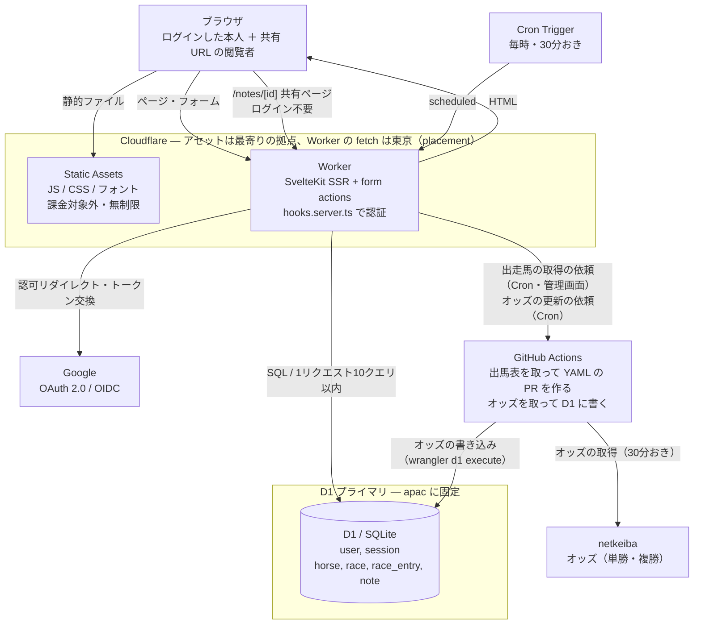
```mermaid
flowchart TB
    U["ブラウザ<br/>ログインした本人 ＋ 共有 URL の閲覧者"]

    subgraph CF["Cloudflare — アセットは最寄りの拠点、Worker の fetch は東京（placement）"]
        A["Static Assets<br/>JS / CSS / フォント<br/>課金対象外・無制限"]
        W["Worker<br/>SvelteKit SSR + form actions<br/>hooks.server.ts で認証"]
    end

    subgraph APAC["D1 プライマリ — apac に固定"]
        D[("D1 / SQLite<br/>user, session<br/>horse, race, race_entry, note")]
    end

    G["Google<br/>OAuth 2.0 / OIDC"]
    N["netkeiba<br/>オッズ（単勝・複勝）"]
    GH["GitHub Actions<br/>出馬表を取って YAML の PR を作る<br/>オッズを取って D1 に書く"]
    CR["Cron Trigger<br/>毎時・30分おき"]

    U -->|"静的ファイル"| A
    U -->|"ページ・フォーム"| W
    U -->|"/notes/[id] 共有ページ<br/>ログイン不要"| W
    W -->|"SQL / 1リクエスト10クエリ以内"| D
    W -->|"認可リダイレクト・トークン交換"| G
    W -->|"HTML"| U
    CR -->|"scheduled"| W
    W -->|"出走馬の取得の依頼（Cron・管理画面）<br/>オッズの更新の依頼（Cron）"| GH
    GH -->|"オッズの取得（30分おき）"| N
    GH -->|"オッズの書き込み（wrangler d1 execute）"| D
```

外部依存は **Google OAuth と、オッズの取得元（netkeiba）と、GitHub の API と、AI のクライアントが置いた Client ID Metadata Document の4つ**。
netkeiba へは GitHub Actions だけが行き、Worker は行かない（→ 3-8）。GitHub へは出走馬の取得とオッズの更新を Actions に頼むときだけ行く（→ 3-8・3-9）。
Client ID Metadata Document へは、ログインした本人が同意画面を開いたときと「許可する」を押したときだけ、
クライアントが `client_id` に書いた HTTPS の URL へ取りに行く（24時間は保存した内容を使う。→ 3-10）。それ以外は Cloudflare の中で完結する。
バックエンドサーバー、コンテナ、VPC、ロードバランサ、Redis — どれも要らない。

### なぜこの形になるか

数人が週末に使う規模に対して、常時起動のサーバーは過剰。
Workers はリクエストが来たときだけ実行され、来なければ何も動かない（＝何も課金されない）。
一方で「ゼロから起動する」コールドスタートの待ち時間が実質ないため、
月に数回しか触らないアプリでも初回アクセスが遅くならない。

**このアプリの使われ方（週末に集中し、平日はほぼ無風）と課金モデルが噛み合っている。**

---

## 2. レイヤ構成

Worker の中身は6層に分ける。**依存は上から下への一方向のみ**とし、逆流させない。

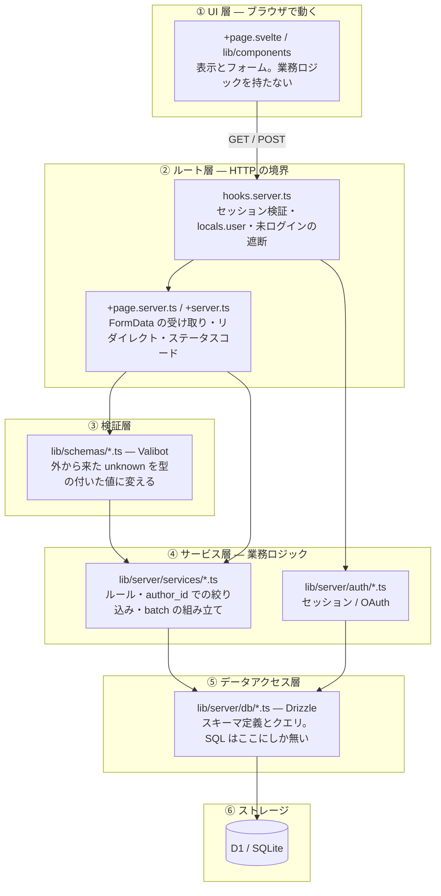
```mermaid
flowchart TB
    subgraph L1["① UI 層 — ブラウザで動く"]
        C["+page.svelte / lib/components<br/>表示とフォーム。業務ロジックを持たない"]
    end

    subgraph L2["② ルート層 — HTTP の境界"]
        H["hooks.server.ts<br/>セッション検証・locals.user・未ログインの遮断"]
        R["+page.server.ts / +server.ts<br/>FormData の受け取り・リダイレクト・ステータスコード"]
    end

    subgraph L3["③ 検証層"]
        V["lib/schemas/*.ts — Valibot<br/>外から来た unknown を型の付いた値に変える"]
    end

    subgraph L4["④ サービス層 — 業務ロジック"]
        S["lib/server/services/*.ts<br/>ルール・author_id での絞り込み・batch の組み立て"]
        AU["lib/server/auth/*.ts<br/>セッション / OAuth"]
    end

    subgraph L5["⑤ データアクセス層"]
        Q["lib/server/db/*.ts — Drizzle<br/>スキーマ定義とクエリ。SQL はここにしか無い"]
    end

    subgraph L6["⑥ ストレージ"]
        D[("D1 / SQLite")]
    end

    C -->|"GET / POST"| H
    H --> R
    R --> V
    V --> S
    R --> S
    S --> Q
    AU --> Q
    H --> AU
    Q --> D
```

### 各層の責務

| 層 | 置き場所 | やること | **やらないこと** |
| --- | --- | --- | --- |
| ① UI | `+page.svelte`, `lib/components/` | 表示、フォームの組み立て | DB アクセス、認可判断 |
| ① UI の WebMCP 境界 | `lib/webmcp/` | tool 登録・解除、load の値の整形、下書きを既存フォームへ渡す | DB アクセス、HTTP、submit、LLM 呼び出し |
| ② ルート | `+page.server.ts`, `+server.ts`, `hooks.server.ts` | HTTP の入出力、Cookie、リダイレクト | 業務ルール、SQL |
| ② ルートの MCP | `lib/server/mcp/` | JSON-RPC の読み書き、tool の入力の検証と返す項目の選び出し、スコープの確認、応答の種類（200・400・スコープ不足）を決める | SQL、認証の判断、HTTP のヘッダ（`WWW-Authenticate` などはルートが付ける） |
| ③ 検証 | `lib/schemas/` | `FormData` / クエリ文字列を型付きの入力に変換 | DB アクセス |
| ④ サービス | `lib/server/services/`, `lib/server/auth/` | 業務ルール、`author_id` での絞り込み、`batch()` の構成 | HTTP を知ること |
| ⑤ データアクセス | `lib/server/db/` | Drizzle でのクエリ組み立て、型定義 | 業務ルール |
| ⑥ ストレージ | D1 | 永続化、制約（FK・CHECK・UNIQUE） | — |

### 層を分ける実利 — サービス層は SvelteKit を知らない

**`lib/server/services/` は SvelteKit の型（`RequestEvent`, `Cookies`, `error()` など）を
一切 import しない。** 引数で `db` と `userId` を受け取り、値を返すだけの純粋な関数群にする。

```ts
// ✓ 良い — HTTP を知らない。テストで直接呼べる
export async function getHorseTimeline(
  db: Db, horseId: string, viewerId: string
): Promise<TimelineItem[]> { ... }

// ✗ 悪い — SvelteKit に縛られ、将来 API から再利用できない
export async function getHorseTimeline(event: RequestEvent) { ... }
```

これが効いてくる場面は3つ。

1. **テスト** — Vitest から D1 のローカルインスタンスを渡して直接呼べる。HTTP のモックが要らない
2. **将来の API 追加** — [api.md](./api.md) のとおり当面 REST API は作らないが、
   必要になったとき `+server.ts` から同じサービス関数を呼ぶだけで済む
3. **移植性** — 万一 Cloudflare から離れることになっても、business logic は素の TypeScript のまま残る

### 依存の向き — どこからどこを import してよいか

依存は**縦（層）と横（機能）の2軸**で決め、どちらも一方向にする。
今は約束で、ESLint の規則として `pnpm run lint` で止めるのは [harness.md 第2層](./harness.md) の PR から。
ファイル単位の依存図は手で描くとすぐ実物とずれるので置かない。正はこの節と、規則を入れたあとの `eslint.config.js`。

**縦の軸 — 層**（上の図の6層を、import の単位に割ったもの）

| from ＼ to | component | ui | pure | service | auth | db | route-helper |
| --- | --- | --- | --- | --- | --- | --- | --- |
| page（`+page.svelte`・`+layout.svelte`） | ✓ | ✓ | ✓ | ✗ | ✗ | ✗ | ✗ |
| component（`lib/components/`） | ✓ | ✓ | ✓ | ✗ | ✗ | ✗ | ✗ |
| ui（`lib/components/ui/`） | ✗ | ✓ | `utils.ts` だけ | ✗ | ✗ | ✗ | ✗ |
| endpoint（`.server.ts`・`+server.ts`・`hooks.server.ts`） | ✗ | ✗ | ✓ | ✓ | ✓ | ✓ | ✓ |
| service（`lib/server/services/`） | ✗ | ✗ | ✓ | 横の軸に従う | ✗ | ✓ | ✗ |
| auth（`lib/server/auth/`） | ✗ | ✗ | ✓ | ✗ | ✓ | ✓ | ✗ |
| db（`lib/server/db/`） | ✗ | ✗ | ✓ | ✗ | ✗ | ✓ | ✗ |
| pure（`lib/schemas/`・`lib/utils/`） | ✗ | ✗ | ✓ | ✗ | ✗ | ✗ | ✗ |

route-helper は `lib/server/util.ts`（`ctx` / `ctxAdmin`）。

monitoring（`lib/server/monitoring/`。ログと Discord への通知）は endpoint からだけ使う。
monitoring が import してよいのは pure と db（`errors.ts` と observer の型）だけ。
**db は monitoring を import しない。** `createDb` は observer を引数で受け、ルートが `locals.monitor.onQuery` を渡す。
service と auth も monitoring を知らない（失敗は投げたままにし、ルートか `handleError` が拾う）。

Worker の入口 `src/worker.js` は SvelteKit の外（adapter の Worker を包むだけ）で、import するのは
adapter の成果物と `lib/server/asset-cache.ts`（SvelteKit も DB も知らない関数1つ）と、
Cron の入口 `lib/server/race-data/scheduled.ts`・`lib/server/odds/scheduled.ts` と、共有の画像を描く resvg の wasm（`@resvg/resvg-wasm/index_bg.wasm`）と、
OAuth のトークンの口（`lib/server/auth/token-endpoint.ts` と、それに渡す `createDb`・monitoring）だけ（→ 3-5・3-7・3-8・3-9・3-10）。

mcp（`lib/server/mcp/`。MCP の JSON-RPC と tools）は endpoint と同じ扱いで、`routes/mcp/+server.ts` だけが使う。
import してよいのは pure と service と、db の型 `Db` だけ。SvelteKit・auth・`drizzle-orm` は import しない
（SQL はサービス層、誰かの判断は hooks）。

og（`lib/server/og/`。共有の画像を PNG にする）は service と同じ扱いで、SvelteKit も D1 も知らない。
import してよいのは pure（描く SVG は `utils/share-card.ts` が組む）と `@resvg/resvg-wasm` だけ。機能の軸では share に入る。

odds の型と検査（`lib/server/odds/odds.ts`）は pure と同じ扱いで、何も import しない。予想画面の読み出し（`services/odds.ts`）と、
GitHub Actions が動かす取得と保存（`scripts/odds/`）の両方から使う。`scripts/` は Worker に束ねられず、Node で直接動く
（`scripts/` から読む `src/` のファイルは、相対パスに `.ts` まで書く）。取得元に固有の処理は `scripts/odds/netkeiba/` の中に閉じ、
`odds.ts` の型（`RaceOdds`・`OddsProvider`）より外に出さない。
Cron から Actions を起動する `lib/server/odds/scheduled.ts`・`request.ts` は、下の race-data と同じ分け方
（`scheduled.ts` は endpoint、`request.ts` は service と同じ扱い）。起動には race-data の `dispatch.ts` を使う（odds は races の右なので使ってよい）。

race-data（`lib/server/race-data/`。出走馬の取得を Actions に頼む）も同じ分け方。`scheduled.ts` は endpoint と同じ扱いで、
`dispatch.ts`・`request.ts` は service と同じ扱い（monitoring を知らない）。機能の軸では races に入る。

- **画面側（page / component）はサーバーのコードを型ですら import しない。** 画面が要る型は
  `./$types` の `PageData` から取るか、pure に置く。SvelteKit は `$lib/server` の値の import は
  止めるが `import type` は通す
- **SQL は db と service（と auth）にしか無い。** `drizzle-orm` をルートやコンポーネントから import しない
- **WebMCP も UI 側。** `lib/webmcp/` が import してよいのは pure（schemas / utils）だけ。
  API と型の変動をこの境界に閉じ、`load` が本人に渡した材料を再利用する。新しい問い合わせ経路や保存責務は持たない。
  tool の入出力と下書きの扱いは [frontend.md 第8章](./frontend.md#8-webmcp-で予想の下書きを受ける)。

パッケージ単位の禁止:

| 対象 | import しないもの |
| --- | --- |
| services / auth / db / schemas / utils | `@sveltejs/kit`・`$app/*` |
| routes / components / schemas / utils | `drizzle-orm` |
| auth 以外 | `arctic`・`@oslojs/*` |

**横の軸 — 機能**

機能は次の順に並べ、**右は左を使ってよいが、左は右を使わない**。順位で並べるので循環は起こりえない。

```
horses ← races ← odds ← notes ← jockeys ← share ← dashboard
  馬     レース・     オッズ  メモ・見立て・  騎手の    共有     ダッシュボード・
         出馬表・枠           印・タグ・的中  まとめ・  リンク   今週
                                             騎乗
```

jockeys（騎手）はマスタの表を持たず、出走馬（`race_entry.jockey`）の名前で束ねる。騎乗（races）に自分のメモ（notes）を重ねるので notes の右に置く。

- 機能を持たないもの（shared）: `lib/schemas/`・`lib/server/db/`・`lib/server/auth/`・`lib/server/monitoring/`・
  `lib/utils/` の `date` / `redirect` / `role`・`components/ui/`。どの機能からも使ってよいが、shared から機能は使わない
- **ルート（`src/routes/`）は機能を組み合わせる場所**なので、横の軸の制約は受けない
- 今ある違反（直す予定）は [harness.md 2-5](./harness.md)

---

## 3. データアクセスの経路

### 3-1. D1 クライアントの生成とライフサイクル

D1 への入口は `event.platform.env.DB` というバインディング1つ。
**Worker にはグローバル状態を置かず、リクエストごとに Drizzle クライアントを作る。**

```ts
// src/lib/server/db/index.ts
import { drizzle } from 'drizzle-orm/d1';
import { instrumentD1, type QueryObserver } from './instrument';
import * as schema from './schema';

export function createDb(env: App.Platform['env'], observe: QueryObserver) {
  return drizzle(instrumentD1(env.DB, observe), { schema });
}
export type Db = ReturnType<typeof createDb>;
```

`instrumentD1` は D1 の binding を包み、クエリごとの時間と失敗を `observe` に渡す
（D1 の失敗と遅いクエリの監視。→ [monitoring.md 第3章](./monitoring.md)）。

Workers の実行環境は複数リクエストで再利用されうるため、
**モジュールスコープに DB 接続やユーザー情報を保持するとリクエスト間で漏れる。**
Drizzle クライアントの生成自体はほぼコストゼロなので、毎回作って問題ない。

接続プールは存在しない。D1 はバインディング経由の RPC であり、
TCP コネクションの管理という概念がそもそもない。

### 3-2. 読み取りの経路 — `GET /horses/[id]`

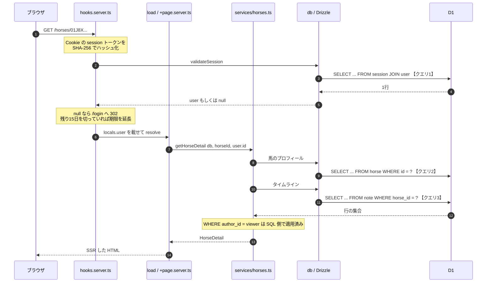
```mermaid
sequenceDiagram
    autonumber
    participant B as ブラウザ
    participant H as hooks.server.ts
    participant L as load / +page.server.ts
    participant S as services/horses.ts
    participant Q as db / Drizzle
    participant D as D1

    B->>H: GET /horses/01J8X...
    Note over H: Cookie の session トークンを<br/>SHA-256 でハッシュ化
    H->>Q: validateSession
    Q->>D: SELECT ... FROM session JOIN user 【クエリ1】
    D-->>Q: 1行
    Q-->>H: user もしくは null
    Note over H: null なら /login へ 302<br/>残り15日を切っていれば期限を延長
    H->>L: locals.user を載せて resolve
    L->>S: getHorseDetail db, horseId, user.id
    S->>Q: 馬のプロフィール
    Q->>D: SELECT ... FROM horse WHERE id = ? 【クエリ2】
    S->>Q: タイムライン
    Q->>D: SELECT ... FROM note WHERE horse_id = ? 【クエリ3】
    D-->>S: 行の集合
    Note over S: WHERE author_id = viewer は SQL 側で適用済み
    S-->>L: HorseDetail
    L-->>B: SSR した HTML
```

**1ページ＝3クエリ。** タイムラインが1クエリで済むのは、
[product.md](./product.md) のとおり `note` に `horse_id` を非正規化しているため。
レース紐付きメモと近況メモをマージする処理が要らない。

使うインデックスは `note_author_horse (author_id, horse_id, occurred_at DESC)`。
**先頭が `author_id`** なのは、読みが必ず viewer で絞られるため（→ 3-6）。
D1 は**スキャンした行数**で課金されるので、インデックスが効いているかどうかが
そのままコストに直結する。

### 3-3. 書き込みの経路 — `POST /races/[id]?/saveReview`

ふりかえり画面の一括保存。**このアプリで最もクエリ数が増える経路。**

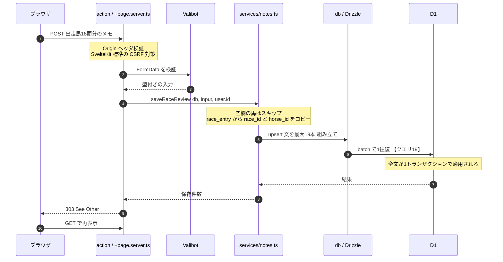
```mermaid
sequenceDiagram
    autonumber
    participant B as ブラウザ
    participant A as action / +page.server.ts
    participant V as Valibot
    participant S as services/notes.ts
    participant Q as db / Drizzle
    participant D as D1

    B->>A: POST 出走馬18頭分のメモ
    Note over A: Origin ヘッダ検証<br/>SvelteKit 標準の CSRF 対策
    A->>V: FormData を検証
    V-->>A: 型付きの入力
    A->>S: saveRaceReview db, input, user.id
    Note over S: 空欄の馬はスキップ<br/>race_entry から race_id と horse_id をコピー
    S->>Q: upsert 文を最大19本 組み立て
    Q->>D: batch で1往復 【クエリ19】
    Note over D: 全文が1トランザクションで適用される
    D-->>S: 結果
    S-->>A: 保存件数
    A-->>B: 303 See Other
    B->>A: GET で再表示
```

**`batch()` を使う理由は速度だけではない。**
個別に `INSERT` を19回投げると、往復19回に加えて後述の
「1リクエストあたりのクエリ数上限」を消費する。
`batch()` は1トランザクションとしてまとめて適用されるため、
途中で失敗したときに半分だけ保存される事故も防げる。

### 3-4. 認証の経路

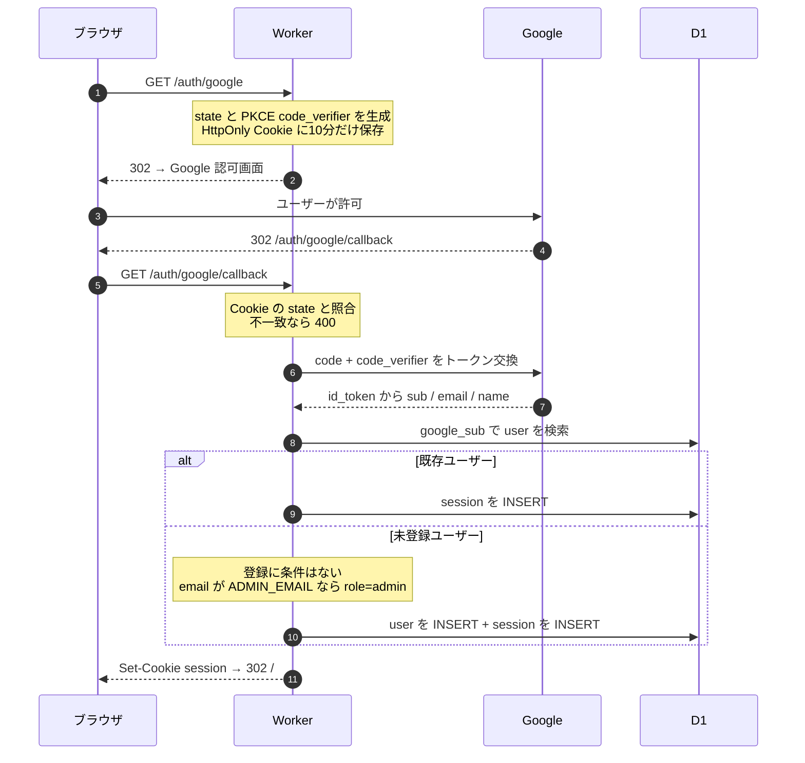
```mermaid
sequenceDiagram
    autonumber
    participant B as ブラウザ
    participant W as Worker
    participant G as Google
    participant D as D1

    B->>W: GET /auth/google
    Note over W: state と PKCE code_verifier を生成<br/>HttpOnly Cookie に10分だけ保存
    W-->>B: 302 → Google 認可画面
    B->>G: ユーザーが許可
    G-->>B: 302 /auth/google/callback
    B->>W: GET /auth/google/callback
    Note over W: Cookie の state と照合<br/>不一致なら 400
    W->>G: code + code_verifier をトークン交換
    G-->>W: id_token から sub / email / name
    W->>D: google_sub で user を検索

    alt 既存ユーザー
        W->>D: session を INSERT
    else 未登録ユーザー
        Note over W: 登録に条件はない<br/>email が ADMIN_EMAIL なら role=admin
        W->>D: user を INSERT + session を INSERT
    end

    W-->>B: Set-Cookie session → 302 /
```

Google への通信は Worker からの**サブリクエスト**で、Cloudflare は課金しない
（"Cloudflare does not bill for subrequests you make from your Worker"）。

### 3-5. 静的アセットは Worker を通らない

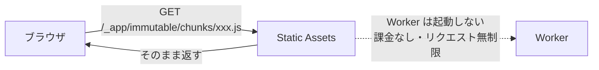
```mermaid
flowchart LR
    B["ブラウザ"] -->|"GET /_app/immutable/chunks/xxx.js"| A["Static Assets"]
    A -->|"そのまま返す"| B
    A -.->|"Worker は起動しない<br/>課金なし・リクエスト無制限"| W["Worker"]
```

SvelteKit がビルドした JS/CSS はここに乗る。**この分は一切コストにならない。**

画像も同じ場所に置く。`src/lib/assets/` に置いて import すると、Vite が名前にハッシュを付けて
`/_app/immutable/assets/` に出すので、JS/CSS と同じく1年キャッシュされ、差し替えれば URL ごと変わる。
ただし 4KB 未満のファイルは JS に data: URI で埋め込まれ、別ファイルにならない。
キャッシュさせたい画像は `?no-inline` を付けて import する（コース図 `CourseMap` がこの形）。
R2 は、利用者が画像を上げる機能を作るときまで入れない。

見つからなかったときだけは Worker に落ちる。`/_app/immutable/*` には adapter の `_headers` で
`Cache-Control: public, immutable, max-age=31536000` が付き、これは 404 にも付く。デプロイの
切り替わりの間に新しいチャンクが 404 で返ると、ブラウザがその 404 を1年抱えて画面が JS 無しで固まる
（2026-09-23 の v1.1.1 で起きた）。そこで Worker の入口 `src/worker.js` が adapter の Worker を包み、
失敗に付いた `immutable` を `no-store` に差し替える（`src/lib/server/asset-cache.ts`）。
adapter は自分の設定の main を消して書き出すので、adapter には `wrangler.adapter.toml` を読ませ、
書き出し先（`.svelte-kit/cloudflare/_worker.js`）と wrangler の main（`src/worker.js`）を分けている。

これは抱えるのを防ぐだけで、すでに 404 を抱えたブラウザには届かない（キャッシュから返るので Worker に来ない）。
その人にはサイトデータの削除（Chrome ならアドレスバーの鍵 → サイトの設定 → データを削除）を頼む。

### 3-6. 認可はどの層でかけるか

**「誰のメモか」の絞り込みはサービス層の SQL に埋める。** UI では絞らない。

```ts
// services/notes.ts — WHERE 句に必ず viewer の条件を入れる
where(and(
  eq(note.horseId, horseId),
  eq(note.authorId, viewerId),
))
```

UI 側でフィルタすると、見えてはいけない行が
SSR の HTML やデータペイロードに乗ってしまう。
**DB から出さない**のが唯一確実な方法。

`visibility`（`private` / `unlisted`）を見るのは**共有ページ1本だけ**。
ログイン中の読みはすべて `author_id = :viewer` で閉じているので、
公開範囲の判定がそもそも要らない（→ [product.md 第2章 2-2](./product.md)）。

```ts
// routes/notes/[id]/+page.server.ts — ここだけが visibility を見る
where(and(eq(note.id, id), eq(note.visibility, 'unlisted')))
```

**この形の弱点は「絞り忘れ＝全員に見える」になること。**
`shared` を混ぜていた頃は、絞り忘れても他人の private までは出なかった。
いまは `author_id` の条件が1本抜けるだけで全ユーザーのメモが出る。
だから**サービス層の読み取り関数は `viewerId` を必須引数で受け取る**形を崩さない。
省略可能にしたり既定値を与えたりした時点で、この防波堤は消える。

一方「admin だけがマスタを編集できる」といった**操作の可否**はルート層で弾く。
データの絞り込みはサービス層、操作の可否はルート層、と役割を分ける。

### 3-7. 共有ページはこの経路の例外

レース単位の共有は `/shared/races/[id]`。本人が `?/share` を送ったときに、
`viewerId` で絞った予想を `race_share.content` にコピーする。公開ページはこのコピーと
`user.public_name` だけを読み、`note` は読まない。既存のメモ閲覧の規則は変えない。
`race_share` は `(author_id, race_id)` ごとに1件。更新は同じURL、取り消しはコピーを削除し、再共有は新しいID。
凍結済みの著者は両方の共有ページで404になる。未設定の公開名は「匿名」で、Google名へは戻さない。
共有ページのレイアウトはログイン中も `user: null` を返し、HTMLやデータ応答にアカウント情報を含めない。
予想まとめの load が返すのはログインしているかの真偽（`signedIn`）だけで、未ログインの人に案内を出すのに使う。

SNS に貼ったときのプレビュー（OGP）も、このコピーと公開名だけから組む。印を描いた画像
`/shared/races/[id]/og.png` は Worker が描く。SVG を `utils/share-card.ts` で組み、`lib/server/og/render.ts` が resvg（wasm）で PNG にする。

- Workers は実行中にバイト列から wasm をコンパイルできず、SvelteKit（Vite）の側では `.wasm` を import できない。
  そこで wrangler が束ねる `src/worker.js` が import し（コンパイル済みの `WebAssembly.Module` になる）、`env.RESVG_WASM` に足して渡す。
  `vite dev` はこの入口を通らないので描けない（503）。確かめるのは E2E（`wrangler dev`）
- フォントは Noto Sans JP の太字を ASCII・Latin-1 と JIS X 0208 に絞ったもの（約 2.7MB。`pnpm run og-font` で書き出してコミット）。
  Worker の本体には束ねず、`static/og/` に置いて `ASSETS` のバインディングから読む。それ以外の字（第3水準以上の漢字・絵文字）は画像では空白になる
- wasm の初期化とフォントは isolate ごとに1度だけにし、モジュールスコープに置く（初期化は2度呼ぶと例外）。
  利用者に依らない不変のものなので、第0章の「モジュールスコープに持たせない」（接続とユーザー情報）には当たらない
- 1枚の描画は手元で初回 60〜80ms、2枚目から 20〜30ms（CPU の上限 1000ms に対して十分低い）。
  画像も共有ページと同じく `no-store`。取りに来るのは SNS のクローラーで、1回取れば向こうが持つ

`/notes/[id]` は `hooks.server.ts` の公開パスに入るため、`locals.user` が null のまま
load に到達する。共有ページは通常のログイン必須ルートと前提が違う。

| | 通常のルート | `/notes/[id]` |
| --- | --- | --- |
| `locals.user` | 必ず非 null | null でも通る |
| WHERE 句 | `author_id = :viewer` | `id = :id AND visibility = 'unlisted'` |
| 該当なし | — | **404**（403 にすると「その ID は在る」と漏れる） |
| ヘッダ | 既定 | `X-Robots-Tag: noindex, nofollow` / `Referrer-Policy: no-referrer` / `Cache-Control: private, no-store` |

未ログインの閲覧者はセッション Cookie を持たないので検証クエリが走らず、
**主キー1件引きの1クエリだけ**で返る。通常ページより軽い。

### 3-8. オッズの取得 — GitHub Actions だけが外へ取りに行く

予想画面に出す単勝・複勝のオッズは、GitHub Actions（`odds-update.yml`）が取得元から取って `race_odds` に書き、
画面は D1 の値を読むだけ（→ [product.md 第1章「例外 — オッズ」](./product.md)）。**Worker は取得元へ行かない。**
Actions を30分おきに起動するのは Worker の Cron で、取りに行く時間帯に入った重賞があるときだけ `workflow_dispatch` で起動する。

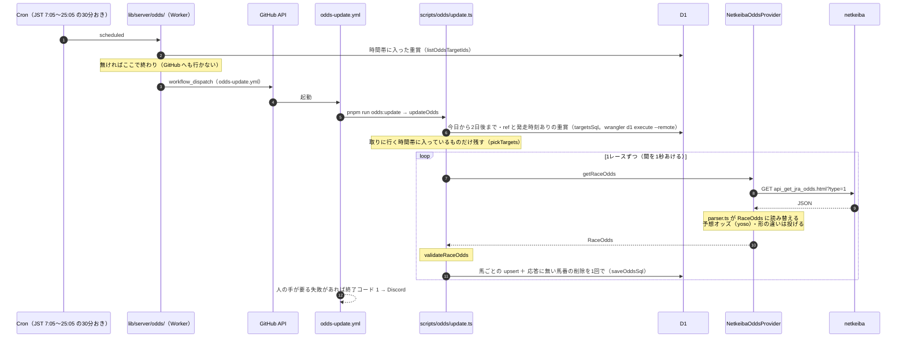
```mermaid
sequenceDiagram
    autonumber
    participant C as Cron（JST 7:05〜25:05 の30分おき）
    participant W as lib/server/odds/（Worker）
    participant G as GitHub API
    participant A as odds-update.yml
    participant U as scripts/odds/update.ts
    participant D as D1
    participant P as NetkeibaOddsProvider
    participant N as netkeiba

    C->>W: scheduled
    W->>D: 時間帯に入った重賞（listOddsTargetIds）
    Note over W: 無ければここで終わり（GitHub へも行かない）
    W->>G: workflow_dispatch（odds-update.yml）
    G->>A: 起動
    A->>U: pnpm run odds:update → updateOdds
    U->>D: 今日から2日後まで・ref と発走時刻ありの重賞（targetsSql。wrangler d1 execute --remote）
    Note over U: 取りに行く時間帯に入っているものだけ残す（pickTargets）
    loop 1レースずつ（間を1秒あける）
        U->>P: getRaceOdds
        P->>N: GET api_get_jra_odds.html?type=1
        N-->>P: JSON
        Note over P: parser.ts が RaceOdds に読み替える<br/>予想オッズ（yoso）・形の違いは投げる
        P-->>U: RaceOdds
        Note over U: validateRaceOdds
        U->>D: 馬ごとの upsert ＋ 応答に無い馬番の削除を1回で（saveOddsSql）
    end
    A-->>A: 人の手が要る失敗があれば終了コード 1 → Discord
```

| 層 | 置き場所 | 持つもの |
| --- | --- | --- |
| 型と約束 | `src/lib/server/odds/odds.ts` | `RaceOdds`・`OddsProvider`・`OddsError`（失敗の種類）・`validateRaceOdds`。予想画面の読み出しと共有する |
| 取得元 | `scripts/odds/netkeiba/` | URL と通信（`provider.ts`）、応答の読み替え（`parser.ts`。通信しないので fixture で試す） |
| 手順 | `scripts/odds/update.ts` | 順番・再試行・ログの重さ。対象の選び方と保存は `OddsStore` として受け取る |
| 保存 | `scripts/odds/store.ts` | 対象を選ぶ SQL と保存の SQL。値を文字列に埋める（`wrangler d1 execute` はバインドを受けない） |
| 入口 | `scripts/odds-update.ts` | `wrangler d1 execute` の store・provider・ログを作って渡す。**取得元を替えるときに直すのはここだけ** |
| 起動 | `src/lib/server/odds/scheduled.ts`・`request.ts` | Worker の Cron。時間帯に入った重賞があれば `odds-update.yml` を起動する（`race-data/dispatch.ts` の `dispatchWorkflow`）。取得元へは行かない |
| 読み出し | `src/lib/server/services/odds.ts` | 予想画面の `getRaceOdds`。Worker が触るのはここだけ |

**なぜ Worker で取らないか。** 最初は Worker の Cron で取っていたが、netkeiba の手前の CloudFront が、Cloudflare Workers から
来たリクエストを時間帯によってまとめて 400（本文なし）で返すようになった。2026-09-26 は 10:30 から 20:30 まで21回続けて弾かれた。
拠点（大阪・東京・チューリッヒ・ダラス）には関係がなかった。同じ時間帯に GitHub Actions（アメリカ東部）と手元からは 200 が返った。
Workers の外向きの IP は多くの Worker で共有されていて、その IP ごとに制限されていると見ている。IP やヘッダを変えて避けることはしない（下の約束）。

- D1 へは `data:import:remote` と同じく `CLOUDFLARE_API_TOKEN` で `wrangler d1 execute --remote` する。1回の起動で
  読むのが1回、書くのが対象のレースごとに1回

**なぜ起動を Worker の Cron にするか。** はじめは GitHub の schedule で30分おきに起動していたが、1日37回のうち
5回ほどしか起動せず、起動しても数時間遅れることがあった（2026-09-27〜10-02）。schedule は混んでいると間引かれる。
Cloudflare の Cron は時刻どおりに動き、`workflow_dispatch` は間引かれない。Worker がするのは GitHub の API を1回叩くことだけで、
取得元へは行かない（上の CloudFront の制限には当たらない）。

- 対象が無い回（ほとんどの回）は Worker が D1 を1回読んで終わり、Actions は起動しない
- 起動の合図とその後の Actions で2回、同じ選び方をする（Worker は `services/odds.ts` の `listOddsTargetIds`、Actions は `store.ts`）。
  Worker だけは、発走まで1分を切ったレースを外す（Actions が D1 を読む頃には発走を過ぎ、何もせずに終わるため）。
  Actions の起動が遅れて発走を過ぎたら、Actions 側で対象から外れて何もしない
- トークンは出走馬の取得と同じ `GITHUB_DISPATCH_TOKEN`（このリポジトリの `Actions: Read and write`。→ 3-9）
- **本番に効くのはリリースのあと。** `odds-update.yml` から schedule を消したのは main へのマージで効くが、Worker の Cron は
  リリースの publish（`deploy.yml`）で初めて効く。その間はオッズの更新が起動しないので、マージしたらリリースまで続けて出す
- 起動から取得のステップが始まるまでは20秒ほど（2026-10 の run の実測）。30分おきは目安で、画面は「何時時点」を出す
- `odds-update.yml` は main からしか動かない（`if: github.ref == 'refs/heads/main'`）。本番の D1 に書くため
- 手元では `pnpm run odds:update --local` で、ローカルの D1 に向けて1回ぶん動く（取得元へは本当に行く）

**取得元への負荷を抑える約束**（取得元に止められたら機能ごと失う）:

- 対象は YAML に `ref` と `startTime` を書いた**重賞（G1〜G3）だけ**。取りに行く時間帯は格で決まる（`src/lib/utils/odds.ts`）

  | 格 | 取りに行き始める | 1レースの回数（日曜 15:40 発走の例） |
  | --- | --- | --- |
  | G1 | 前々日の 18:30（金曜から売る G1 がある） | 金 14回 + 土 37回 + 日 18回 = 69回 |
  | G2・G3 | 前日の 18:30（前日発売のオッズが出始める頃） | 土 14回 + 日 18回 = 32回 |
  | L・OP・条件戦 | 取りに行かない | 0回 |

  どれも発走まで。Cron は JST 7:05〜25:05（翌 1:05）に回す（5分ずらすのは、発走の直前の回（15:40 発走なら 15:35）が発走に重ならないように）。ネットの前日発売は夜間も売っているので 25:00 まで取り、
  25:00〜7:00 は取りに行かない。発売前は取得元が予想オッズしか返さず、
  何も保存しない（`not-available`）
- 1レースずつ順に取り、間を1秒あける。並列にしない
- 再試行は、届かなかった・5xx のときに1回だけ（3秒あけて）。429 か取得元の `limit` が返ったら、
  **その回の残りのレースも取りに行かずに終える**
- 制限を避けるための細工（プロキシ・IP の切り替え・User-Agent の偽装）はしない。User-Agent は用途を名乗る

**失敗しても前の値を壊さない。** 取れなかった・形が違った・値がおかしい（0以下、下限 > 上限、馬番の重複）ときは
何も書かず、前回の値が時点とともに残る。保存の2文（upsert と削除）は1回の `--command` で送る。
`--remote` のときは D1 の REST API（`/query`）に1回で渡り、API の文書は「複数の文は batch として実行する」としている
（D1 の batch は1トランザクション）ので半端に混ざらない。最後の砦として `race_odds` の CHECK もある。

### 3-9. 出走馬の取得 — Worker は Actions を起動するだけ

出馬表（候補・枠順）は、Worker が netkeiba から取って D1 に書くのでは**なく**、GitHub Actions が
`data:fetch entries` で `data/races/*.yaml` を書き、PR を作る。本番に入るのは人がマージしたとき（`data-import.yml`）。
出走馬データの正を YAML に置いたままにするため（第0章「DB とデータ」）。Worker が D1 に直接書くと、次に YAML を
投入したときに枠・馬番が YAML の値で入れ直され（そのレースぶんを NULL にしてから入れる）、書いたものが消える。

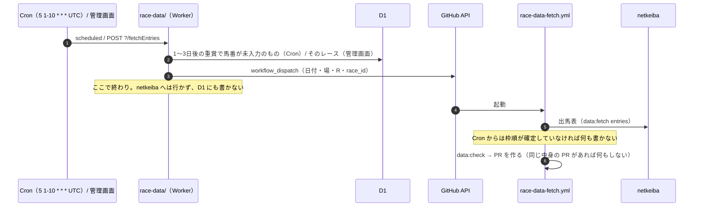
```mermaid
sequenceDiagram
    autonumber
    participant C as Cron（5 1-10 * * * UTC）/ 管理画面
    participant W as race-data/（Worker）
    participant D as D1
    participant G as GitHub API
    participant A as race-data-fetch.yml
    participant N as netkeiba

    C->>W: scheduled / POST ?/fetchEntries
    W->>D: 1〜3日後の重賞で馬番が未入力のもの（Cron）/ そのレース（管理画面）
    W->>G: workflow_dispatch（日付・場・R・race_id）
    Note over W: ここで終わり。netkeiba へは行かず、D1 にも書かない
    G->>A: 起動
    A->>N: 出馬表（data:fetch entries）
    Note over A: Cron からは枠順が確定していなければ何も書かない
    A->>A: data:check → PR を作る（同じ中身の PR があれば何もしない）
```

| 層 | 置き場所 | 持つもの |
| --- | --- | --- |
| 依頼 | `lib/server/race-data/dispatch.ts` | GitHub の API に1回送る。失敗の種類（`DispatchError`） |
| 手順 | `lib/server/race-data/request.ts` | Cron の対象を1つずつ頼む・止める条件・ログの重さ |
| 対象 | `lib/server/services/entries-fetch.ts` | D1 から対象のレースを選ぶ（読むだけ） |
| 入口 | `lib/server/race-data/scheduled.ts`・`/settings/admin` の `?/fetchEntries` | 監視の口と D1 クライアントを作って渡す |
| 取得 | `.github/workflows/race-data-fetch.yml` → `scripts/race-data.ts` | netkeiba への取得・YAML の書き込み・PR |

- Cron は枠順が本番に入る（馬番が付く）まで毎時頼む。Actions は、Cron からなら確定前は出馬表を1回見て終わる
- 起動元（Cron・管理画面）によらず、開いている PR と同じ中身なら何もしない（PR も通知も出ない）。
  開いている PR が無ければ（PR の作成で落ちてブランチだけ残った・人がマージせずに閉じた、も含む）、作り直して PR を作る。
  PR ができたら Discord の「デプロイ」に知らせる
- トークン（`GITHUB_DISPATCH_TOKEN`）は、このリポジトリの Actions に書き込めるだけのもの。漏れても
  できるのは main のワークフローの起動までで、出走馬の取得でできた PR は人がマージするまで本番に入らない。
  ただし同じトークンで起動する `odds-update.yml`（3-8）は、本番の D1 の `race_odds` に直接書く。
  書くのは main のコードが取得元から取って検査を通した値だけで、起動する人がその中身を決めることはできない

### 3-10. MCP と OAuth 2.1 — AI のクライアントは本人が許した範囲だけを読む

Claude・ChatGPT（スマホのアプリを含む）から読めるように、同じ Worker に MCP の口（`/mcp`）と、その認可サーバーを置く。
ブラウザの中で動く WebMCP（[frontend.md 第8章](./frontend.md#8-webmcp-で予想の下書きを受ける)）は試験的なまま残す。
**書けるのは本人の予想（見立て・印・札・出走前メモ）だけ。** ふりかえり・近況メモ・展開を書く tool と、共有する・消す tool とスコープは無い。

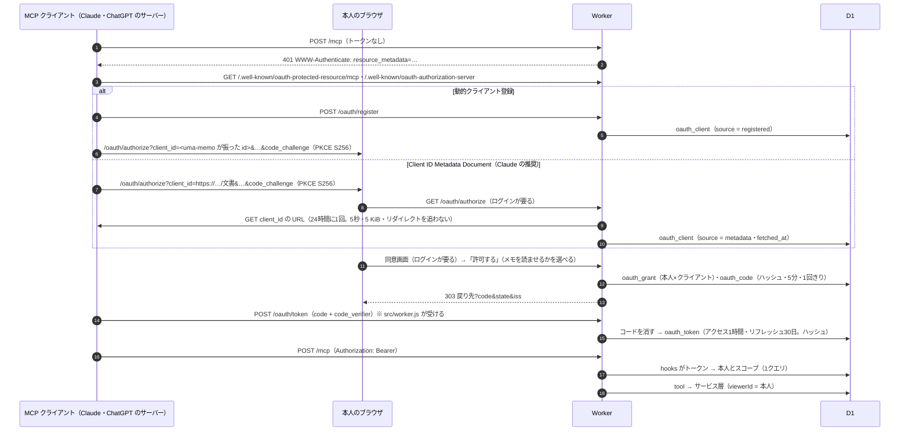
```mermaid
sequenceDiagram
    autonumber
    participant C as MCP クライアント（Claude・ChatGPT のサーバー）
    participant B as 本人のブラウザ
    participant W as Worker
    participant D as D1

    C->>W: POST /mcp（トークンなし）
    W-->>C: 401 WWW-Authenticate: resource_metadata=…
    C->>W: GET /.well-known/oauth-protected-resource/mcp・/.well-known/oauth-authorization-server
    alt 動的クライアント登録
        C->>W: POST /oauth/register
        W->>D: oauth_client（source = registered）
        C->>B: /oauth/authorize?client_id=<uma-memo が振った id>&…&code_challenge（PKCE S256）
    else Client ID Metadata Document（Claude の推奨）
        C->>B: /oauth/authorize?client_id=https://…/文書&…&code_challenge（PKCE S256）
        B->>W: GET /oauth/authorize（ログインが要る）
        W->>C: GET client_id の URL（24時間に1回。5秒・5 KiB・リダイレクトを追わない）
        W->>D: oauth_client（source = metadata・fetched_at）
    end
    B->>W: 同意画面（ログインが要る）→「許可する」（メモを読ませるかを選べる）
    W->>D: oauth_grant（本人×クライアント）・oauth_code（ハッシュ・5分・1回きり）
    W-->>B: 303 戻り先?code&state&iss
    C->>W: POST /oauth/token（code + code_verifier）※ src/worker.js が受ける
    W->>D: コードを消す → oauth_token（アクセス1時間・リフレッシュ30日。ハッシュ）
    C->>W: POST /mcp（Authorization: Bearer）
    W->>D: hooks がトークン → 本人とスコープ（1クエリ）
    W->>D: tool → サービス層（viewerId = 本人）
```

| 層 | 置き場所 | 持つもの |
| --- | --- | --- |
| 案内 | `routes/.well-known/*`・`lib/server/auth/oauth-metadata.ts` | RFC 9728 / RFC 8414 のメタデータ（公開。DB に触らない） |
| 登録 | `routes/oauth/register/+server.ts` | 公開クライアントだけを登録（戻り先は https かループバック） |
| 文書の取得 | `lib/server/auth/client-metadata.ts` | Client ID Metadata Document の取得・検証・24時間の保存・未連携の行の上限と掃除 |
| 同意 | `routes/oauth/authorize/` | 要求の検証・スコープの選択・コードの発行。枠に入れさせない（`X-Frame-Options`） |
| トークン | `src/worker.js` → `lib/server/auth/token-endpoint.ts` | フォームの読み取り・`resource` の確認 |
| 認可の中身 | `lib/server/auth/oauth.ts` | PKCE・コードとトークンの発行と検証・リフレッシュのローテーション・連携の一覧と解除 |
| 入口の判断 | `hooks.server.ts` | `/mcp` だけ Bearer を検証し、`locals.user` と `locals.oauthScopes` を載せる |
| MCP | `routes/mcp/+server.ts` → `lib/server/mcp/` | JSON-RPC（initialize / ping / tools/list / tools/call）。スコープが足りなければ 403 `insufficient_scope` |
| 解除 | `/settings/connections` | 本人の連携の一覧と解除（CASCADE でコードとトークンも消える） |

- **トークンの口だけ SvelteKit に通さない。** トークンの要求は Origin の無いフォームの POST で、SvelteKit の CSRF の検査が
  hooks より前に 403 にする（パスごとに外す設定は無い）。この口は Cookie を見ないので、検査が守るものが無い。
  `vite dev` では `src/worker.js` を通らないので、この口は 404 になる（E2E は `wrangler dev` で通る）
- **スコープ:** `races:read`（マスタ。外せない）と `notes:read`（本人のメモ。同意画面で外せる）と `notes:write`（本人の予想を書く。同意画面で外せる）。
  足りない tool は tools/list に出さず、呼ばれたら動かさずに 403。`races:read` だけのときは、レースの一覧に添える「自分のメモの件数」も出さない。
  `notes:write` が加わる前の連携は持っていないので、書かせるには本人が連携し直す（スコープは更新で広がらない）
- **書く tool（`save_my_race_preview`）は、渡した見立て・渡した馬の渡した項目だけを書き換える。** 省いた項目は今の値で埋め、
  省いた馬と見立てには触らない（AI が一部だけ渡して、ほかの馬のメモが消えないように）。本文・印・札がすべて空になった馬は消える（画面の保存と同じ）。
  - 出走馬は DB を正とする。`entryId` がそのレースの出走馬でなければ何も書かず、`horse_id` は入力から受けない（予想画面の action と同じ）
  - 展開（`flow`）は渡さないので触らない（`savePreviewNotes` に `raceNote.flow` を渡さない）
  - 返すのは書いた結果（`saved`・`cleared`・`unchanged`）だけで、本文は返さない。`notes:read` の無い連携に、省いた項目の今の値を見せない
  - tools/list の `annotations` で `readOnlyHint: false`・`destructiveHint: true` を名乗る。クライアントが実行の前に本人に確かめる目安になる
  - 残る弱さ: AI が読んだメモ・レース名に書かれた指示（プロンプトインジェクション）で呼ばれうる。tool の説明と initialize の
    instructions で「本人に頼まれたときだけ」と書いているが、強制はできない。書けるのは本人の予想だけで、共有・削除・他人のメモには届かない
- **返す項目は tool で1つずつ選ぶ。** サービスの戻り値を広げて返さない（書いた人の名前・公開範囲・`created_by`・`profile_memo` を出さない）
- **リフレッシュトークンは1回きり。ただし回線断での送り直しは受ける**（`auth/oauth.ts` の `judgeRetry`）。競馬場のスマホのように
  電波の弱い所では、要求は届いたのに応答が届かず、クライアントが同じトークンで送り直すことがある。使用済みのトークンが来たとき:
  - **受ける**: 前に使われてから30分（`REFRESH_RETRY_GRACE_SEC`）の内で、そのとき出したアクセストークンが**一度も使われていない**
    （リフレッシュするのは tool を呼ぶためなので、受け取っていればすぐ使う。アクセストークンは初めて使われた時刻を `used_at` に1回だけ残す）。
    届かなかった1組を止め（`parent_id` で辿る）、最初の更新で確定したスコープのまま新しい1組を出す。
    再送で `scope` を省略しても縮小前の権限には戻らず、明示したスコープが最初の更新と異なれば `invalid_scope` で断る。
    Workers Logs に info を残す
  - **連携を消さずに断る**: 同じ未使用状態を読んだ別の要求が先に更新したときは `503 temporarily_unavailable` と `Retry-After: 1` を返す。
    トークンを捨てさせる `invalid_grant` と区別する（MCP 公式 SDK は `invalid_grant` でトークンを捨てるが、
    `temporarily_unavailable` では捨てない。ただし `Retry-After` は読まず、次の tool 呼び出しの更新で回復する）
  - **盗まれたとみなして連携ごと消す**: 出したアクセストークンが使われた・次のリフレッシュトークンが使われた・30分を過ぎた・
    止めた1組があとで使われた（止めた直後でも待たない）。使用済みの印と子の INSERT は同じ batch で確定するので、
    「印があって子が無い」のは送り直しで止めた1組だけで、処理中と取り違えることは無い。Workers Logs に warn を残す
  - 残る弱さ: 正規のクライアントが新しいアクセストークンを初めて使うまで（ふつうは数秒）の間に盗まれた古いトークンが来ると受けてしまう。
    その場合も、正規のクライアントが次に更新したときに見つかって連携ごと消える。
    また、正規のクライアントが同じリフレッシュトークンで同時に2回更新し、後の要求が先の確定のあとに届くと送り直しとして受け、
    先の1組を止める。クライアントが先の応答のほうを残すと、次の更新で盗まれたとみなされて連携が切れる（実クライアントでは未確認）
  - **発行をまとめて確定する**: 同意の世代・未使用状態を条件に新しい1組を INSERT し、使用済みの印・届かなかったアクセスの削除・掃除を
    同じ D1 `batch()` で行う。保存が失敗すれば印もロールバックされ、通常更新・送り直しのどちらも元の状態から再試行できる
- **tool やスコープを足したら、テストも同じ形で足す。** スコープが足りないトークンでは tools/list に出ず 403 になること、
  別のユーザーのトークンでは相手のデータしか返らないこと（入力で相手を選べないこと）を、単体（`mcp/protocol.spec.ts`）と
  E2E（`e2e/mcp.e2e.ts`）の両方で確かめる
- **同意画面は、要求の誤りで戻り先へ飛ばさない。** 登録は誰でもでき、戻り先は https ならどこでも登録できるので、
  誤りで飛ばすとオープンリダイレクトになる。戻り先へ送るのは本人が「許可する」「許可しない」を押したときだけ
- 同意し直したら grant の ID を世代として切り替え、前の grant と子のトークン・コードを CASCADE で消し、新しい grant とコードを同じ batch で作る。
  発行の INSERT もその世代が有効か確かめるので、処理中だった古いコード交換・更新・送り直しから以前の権限を復活できない。
  同意の保存に失敗したときは、前の連携を維持する。許可した日と最終利用日は新しい同意のものになる
- MCP はステートレスで、応答は JSON（SSE なし）。SDK を使わないのは `nodejs_compat` を付けないため（第0章）
- `/oauth/register`・`/oauth/token` の本文は読み取り中に 8 KiB、`/mcp` は 64 KiB（予想を書く tool が見立てと出走馬ぶんの本文を運ぶ）で止め、超えたら 413。
  Content-Length が無い場合や小さく偽った場合も同じ上限を使う
- **クライアントの識別は2通り。** 動的クライアント登録（`/oauth/register`。id は uma-memo が振る）と、
  Client ID Metadata Document（CIMD。Claude の推奨。`client_id` が文書の HTTPS の URL。`auth/client-metadata.ts`）。
  CIMD は登録の口を通らず、同意画面を開いたときに文書を取りに行き、`oauth_client` に `source = 'metadata'` で入れて24時間使う。
  - **利用者が渡した URL（client_id）へ Worker が取りに行く経路。** 取りに行くのはログインした本人が同意画面を開いたときと「許可する」を押したときだけで、誰でも叩ける口からは行かない。
    URL は https・パスあり・クエリ／フラグメント／認証情報／`.` と `..` のセグメント／IP の直書きなし。リダイレクトを追わず、5秒・5 KiB・JSON だけ
  - 文書の `client_id` が URL と完全に一致し、戻り先が https かループバックで、公開クライアント（`none`）として使えるときだけ使う。
    `token_endpoint_auth_method` が無いか `none`、または別の方式（ChatGPT は `private_key_jwt`）でも `token_endpoint_auth_methods_supported` に `none` があればよい。
    案内（認可サーバーのメタデータ）は `none` しか挙げないので、クライアントは `none` で来る想定（実クライアントでは未確認）。
    トークンの口は `client_id` を本文か Basic からしか読まないので、`client_assertion` だけで来ると交換に失敗する。
    `client_assertion` が付いてきても検証せずに捨てる（PKCE・`client_id`・戻り先で判断し、公開クライアントと同じ権限しか出さない）
    取り直しに失敗したら古い内容は使わない
  - 名前は自己申告だが、URL のホストは文書を置いた提供元として確かめられるので、同意画面と「AIとの連携」に「提供元」として出す
  - CIMD の行は動的登録の上限に数えず、一度も連携していない CIMD の行を別に1,000件まで（超えたら同意画面で「混み合っています」）。取ってから24時間を過ぎた未連携の行は次の取得のときに最大100件ずつ消す。E2E だけ `OAUTH_CIMD_ALLOW_LOOPBACK=1` で `http://localhost` を許す
  - 同意画面の GET の `load` で `oauth_client` に書く。取ってきた文書のキャッシュにあたり、本人の権限は何も変えない（[api.md 第1章](./api.md)の例外）
  - 残る弱さ: 本人ごとの取得の頻度は数えていない（ログインした本人が URL を変えて開き直せば、そのたびに取りに行く）。
    同意画面の GET は他サイトから開かせることもできるので、ログイン中の本人に文書を取りに行かせることはできる（できるのは
    取得と未連携の行を1つ増やすことまでで、許可は本人が押さないと出ない）。名前で私的なアドレスを指すホストは形では弾けず、
    Workers の fetch が私的なネットワークへ届かないことに頼っている
- クライアントの登録は誰でもできるが、全体で直近60秒に100件、**一度も連携していない**登録（`oauth_client.connected_at` が NULL）は1,000件まで。
  条件付き INSERT で判定し、同時要求でも上限を超えない。超過時は 429 と `Retry-After: 60` を返す。
  一度も連携していない登録は作成から24時間で認可に使えなくなり、次の登録要求で期限切れを最大100件ずつ削除する。
  **一度でも連携した登録は、連携が解除・使い回しの検出・凍結で消えたあとも消さない。** 公式 SDK は `invalid_grant` で
  トークンだけを捨て、手元の client_id のまま認可に来るので、登録を消すと同じアプリからつなぎ直せなくなる。
  登録が来なければ期限切れの行は残るが、認可には使えない。
  この制限は D1 の保存行数と登録頻度を抑えるもので、要求そのものの到達やDB読み取りを止めるものではない。
  全体の上限なので、上限に達すると正規クライアントの新規登録も待つ（既存の連携は引き続き使える）。
  Cloudflare 側のレート制限はこの実装に含めない

---

## 4. デプロイ構成

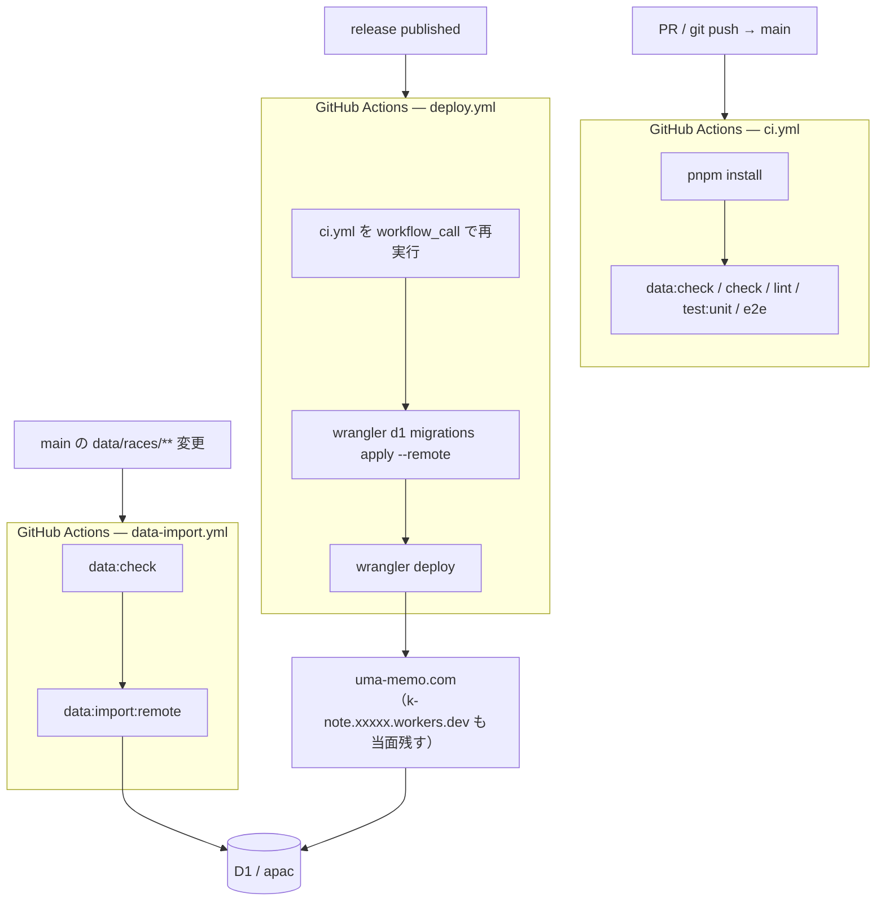
```mermaid
flowchart TB
    P["PR / git push → main"] --> CI
    R["release published"] --> DL
    Q["main の data/races/** 変更"] --> DI

    subgraph CI["GitHub Actions — ci.yml"]
        direction TB
        I["pnpm install"] --> T["data:check / check / lint / test:unit / e2e"]
    end

    subgraph DL["GitHub Actions — deploy.yml"]
        direction TB
        V["ci.yml を workflow_call で再実行"] --> M["wrangler d1 migrations apply --remote"]
        M --> DP["wrangler deploy"]
    end

    subgraph DI["GitHub Actions — data-import.yml"]
        direction TB
        C["data:check"] --> IM["data:import:remote"]
    end

    DP --> W["uma-memo.com<br/>（k-note.xxxxx.workers.dev も当面残す）"]
    IM --> D
    W --> D[("D1 / apac")]
```

**アプリとレースデータは別系統で出る。**

アプリは `main` へのマージでは本番に出ない。出るのはリリースを publish したときだけで、
main は「次に出す候補」。どこを出すかはタグを切る側が決める。

レースデータはリリースを待たずに `main` へのマージで入る。周期が違うためで、
出馬表は開催前に入っている必要があり、1レースにつき 予定 → 枠確定 → 結果 の3回更新される。
データ側に版番号は振っていない。**適用状況はファイル内容の SHA-256 を `data_import`
テーブルに持つ形で表していて**、投入先（local / remote）ごとに別に進む。

結合点は1つだけ。YAML に新しい項目を足す変更はスクリプトとスキーマの変更を伴うので、
**先にアプリのリリースが要る**。逆は自由で、データ更新はアプリに影響しない。

**マイグレーション → デプロイの順に固定している。**
逆にすると新しいコードが古いスキーマに当たる。この順でも
「古いコードが新しいスキーマに当たる」窓が数十秒開くので、
列を消すような破壊的なマイグレーションはそれを承知で流す（利用者が数人なので許容する）。

リリースのタグは main の CI を通った commit のはずだが、任意の commit からも
タグは切れるので、`deploy.yml` は出す前に `ci.yml` をもう一度呼んで回す
（→ [operations.md](./operations.md)）。

| 環境 | Worker | D1 | 用途 |
| --- | --- | --- | --- |
| local | `vite dev`（Miniflare 経由） | ローカル SQLite（`.wrangler/state`） | 開発 |
| production | `k-note` | `k-note` | 本番（`uma-memo.com`） |

Worker と D1 の名前が旧名の `k-note` のままなのは意図どおり。変えると別の Worker・別の D1 になる
（→ [operations.md「名前について」](./operations.md#名前について)）。

プレビュー環境は当面作らない。この規模のアプリに2系統は要らない。
必要になったら `wrangler versions upload` によるプレビュー URL を使う。

### D1 の配置

```bash
pnpm exec wrangler d1 create k-note --location apac
```

**`--location apac` を必ず付ける。** D1 は「プライマリが1箇所にある SQLite」であり、
Worker 自体はユーザーの近くで動いても、SQL は毎回プライマリまで往復する。

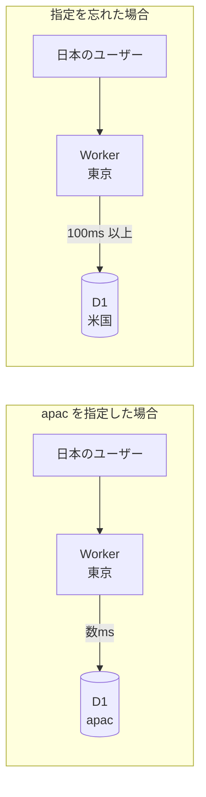
```mermaid
flowchart LR
    subgraph ok["apac を指定した場合"]
        U1["日本のユーザー"] --> W1["Worker<br/>東京"] -->|"数ms"| D1A[("D1<br/>apac")]
    end
    subgraph ng["指定を忘れた場合"]
        U2["日本のユーザー"] --> W2["Worker<br/>東京"] -->|"100ms 以上"| D2A[("D1<br/>米国")]
    end
```

3クエリで 300ms を捨てることになるので、ここは最初に必ず指定する。
利用者が日本だけなので apac 固定が最適。読み取りレプリカは要らない。

---

## 5. 採用技術

### 5-1. 一覧

| 領域 | 採用 | バージョン想定 |
| --- | --- | --- |
| フレームワーク | SvelteKit（Svelte 5 runes） | 2.x / 5.x |
| アダプタ | `@sveltejs/adapter-cloudflare` | 最新 |
| ランタイム | Cloudflare Workers | `compatibility_date` は作成時の日付で固定 |
| DB | Cloudflare D1（SQLite） | — |
| ORM | Drizzle ORM + drizzle-kit | 0.4x |
| 認証 | Arctic（OAuth）+ Oslo（暗号・エンコード） | Arctic 3.x |
| 検証 | Valibot | 1.x |
| スタイル | Tailwind CSS v4 | 4.x |
| テスト | Vitest / Playwright | — |
| パッケージ管理 | pnpm | — |
| CI/CD | GitHub Actions + Wrangler | — |

### 5-2. なぜこれを選んだか

**SvelteKit** — 決定済みだが、この用途には実際よく合う。
本アプリはフォームの塊（レース登録、出走馬入力、メモ）であり、
SvelteKit の form actions は JS が無効でも動く HTML フォームがそのまま基盤になる。
クライアント側の状態管理ライブラリが要らず、バンドルも小さいまま済む。
Workers は CPU 時間で課金・制限されるため、SSR が軽いことはそのままコストに効く。

**D1** — メモをレース軸と馬軸の両方から引く、つまり関係を辿る読み方が中心。
KV（結果整合・キー参照のみ）や Durable Objects（単一エンティティの強整合）では
横断クエリが書けない。SQL が必要で、規模は小さい。D1 の適合範囲のど真ん中。

**Drizzle** — D1 ドライバが公式にあり、生成されるマイグレーションが読める SQL。
Prisma は Workers 対応こそ進んだがバンドルが重く、CPU 時間で課金される環境では不利。
生 SQL は型が付かず、`note` のような条件付きカラム（kind ごとに埋まる列が変わる）を
手で扱うと事故る。Drizzle はその中間として妥当。

**Arctic + Oslo** — Lucia はライブラリとしての提供をやめ実装ガイドに移行したため、
その構成要素である Arctic（OAuth クライアント）と Oslo（暗号・エンコード）を直接使う。
どちらも Web Crypto ベースで Node 固有 API に依存せず、Workers でそのまま動く。
セッション管理は自分で書くが、[product.md の第4章](./product.md)のとおり150行程度で収まる範囲。

**Valibot** — Zod と同等の書き味でバンドルが小さい。
ここも CPU 時間と起動コストに直結するため軽い方を採る。

### 5-3. 検討して採らなかったもの

| 候補 | 不採用の理由 |
| --- | --- |
| Cloudflare Access | 当初は独自ドメインが無く、`*.workers.dev` は保護できなかった。`uma-memo.com` を取った今も、誰でも登録できる仕組みなので門は要らない |
| Neon / Supabase + Hyperdrive | 本物の Postgres は魅力だが構成要素が増える。D1 で足りる規模 |
| Workers KV をメインストアに | 結果整合でクエリが書けない。メモの横断参照に致命的 |
| Durable Objects | 単一エンティティの強整合が要件ではない。オーバースペック |
| Prisma | バンドルサイズと CPU コスト |
| REST API + SPA | 画面遷移ごとに API を叩く分リクエストが増え、実装も二重になる |

### 5-4. ランタイム上の注意

- **`nodejs_compat` は極力付けない。** 付けると起動時のコストとバンドルが増える。
  Arctic / Oslo / Drizzle-D1 はいずれも Web 標準 API だけで動くため、原則不要
- `compatibility_date` は初期化時の日付で固定し、上げるときは意図的に上げる
- Worker のバンドルサイズ上限は圧縮後 3MB（Free）、10MB（Paid）。SvelteKit の SSR コードなら
  まず当たらないが、重い依存を足すときは意識する。2026-09-28 に共有の画像のため resvg の wasm を足し、
  圧縮後 約 370KB → 約 1.3MB になった（フォントは Static Assets に置き、ここに入れていない。→ 3-7）

---

## 6. コスト

### 結論

**Cloudflare の利用料は月額 $5（Workers Paid の基本料）。含まれる枠に収まり、従量課金に届く見込みはない。**

2026-09-24 に Free から Workers Paid に上げた。以下の試算は Free の頃のもので、
Free の上限に対して余裕があることは、Paid の枠（桁が大きい）に対してはなおさら成り立つ。
Paid では上限を超えると止まらずに課金されるので、暴走の見張りを [monitoring.md 第9章](./monitoring.md) に置いた。

ほかにかかるお金は独自ドメイン `uma-memo.com` の年額だけ。
Workers の Custom Domains は無料で、Google OAuth も無料。

### 6-1. 無料枠と、このアプリの想定使用量

前提: 実利用者5人、開催日（土日）中心、1開催日あたり12レースをふりかえる。

招待制をやめたので**人数の上限は仕組みとしては無くなった**が、
検索にも一覧にも出ない以上、外から見つけて登録してくる人はいない。
実質の利用者数は招待制だった頃と変わらない見込みで、試算もそれを前提に置く。
外れたときに何が起きるかは 6-2 の表のとおりで、$5/月の Paid が天井になる。

| 項目 | Free の上限 | 本アプリの想定 | 消費率 |
| --- | --- | --- | --- |
| Worker リクエスト | 100,000 / 日 | 約 350 / 開催日 | **0.4%** |
| 静的アセット配信 | 無制限・課金対象外 | — | — |
| D1 rows read | 5,000,000 / 日 | 約 35,000 / 開催日 | **0.7%** |
| D1 rows written | 100,000 / 日 | 約 1,500 / 開催日 | **1.5%** |
| D1 ストレージ | 500 MB / DB | 年間 約 20 MB | **年4%** |

**試算の根拠**

- リクエスト: 5人 × 60ページ遷移 + フォーム送信50回 ≒ 350。平日はほぼゼロ
- rows read: 1リクエストあたり平均100行（セッション1 + レース詳細で entries 18・notes 20 など）
- rows written: 1レースのふりかえり＝レースメモ1 + 出走馬メモ18。
  インデックス3本への書き込みも rows written に計上されるため約4倍で見て 76行。
  12レースで912行、出走馬登録などを足して 1,500行
- **D1 の上限はアカウント単位で、ステージング D1（[staging.md](./staging.md)）とも共有する。**
  レースデータの投入（`data:import:*`）は変わったファイルだけを流すので1回あたり数百行だが、
  全ファイルを流し直すと1回で約1万7千行（索引の更新を除く）を書く。
  2026-09-24 にステージングが毎回全ファイルを流していたため、マージが5回続いた日に上限を使い切り、
  本番のメモの保存が 500 になった。**`--all` は日に何度も走る経路に入れない**
- ストレージ: 年間1,200レース × (entry 14 + note 15) 行 ≒ 35,000行、インデックス込みで約20 MB
- オッズ（3-8）: G1 1つ・G2/G3 2つの週末として、(69 + 32 × 2) 回 × 18頭 ≒ 2,400行の書き込み（`race_odds` は
  主キーのほかに索引が無い）。GitHub Actions は1日37回起動するが、対象の無い回は D1 を1回読むだけ

D1 の Free は**1データベースあたり 500 MB**（アカウント合計5 GB とは別の制限）。
年20 MB なら **25年分**入る。

### 6-2. 有料化が必要になる条件

**2026-09-24 に Paid に上げた。** 下の表は、それまで判断に使っていた材料として残す。

| # | トリガ | 現状 | 起きたときの対処 |
| --- | --- | --- | --- |
| 1 | **1リクエストの D1 クエリが 50 を超える**（Free の上限。Paid は1000） | 1ページ3クエリ | `batch()` と JOIN で抑える。**要注意（→ 7章）** |
| 2 | **CPU 時間が 10ms / 呼び出しを超える**（Free の上限） | SSR で数ms の想定 | 重い処理を削るか Paid（最大30秒）へ |
| 3 | DB が 500 MB を超える | 年20 MB | Paid（10 GB）へ |
| 4 | Time Travel で7日より前に戻したい | 7日で足りる | Paid（30日）へ |

Paid に上げた場合も、含まれる枠（リクエスト1,000万/月、D1 読み250億行/月、書き5,000万行/月）に対して
本アプリの使用量は誤差なので、**$5 ちょうど**で頭打ちになる。従量課金に届く余地がない。

### 6-3. 将来コストが増える可能性のある拡張

| 拡張 | コスト影響 |
| --- | --- |
| 独自ドメイン | ドメイン代のみ（年1,000〜2,000円程度）。Cloudflare 側は無料 |
| 外部データの自動取り込み（Phase 5） | Cron Trigger は Free でも動く。書き込み行数が増えるが桁が違う |
| 全文検索（FTS5） | D1 内で完結。インデックス分のストレージのみ |
| Web Push 通知 | Cron + fetch。追加費用なし |
| 画像アップロード（レース写真など） | R2 が必要。10 GB まで無料、以降 $0.015/GB-月 |

---

## 7. 制約とスケール限界

コストより先に効いてくるのは**技術的な上限**のほう。順に。

### 7-1. 1リクエストあたりの D1 クエリ数 — Free の頃の上限は 50

**これが本アプリで最も現実的なリスク。**

ふりかえり画面は18頭分のメモを扱う。ここで N+1 を書くと即座に上限へ近づく。

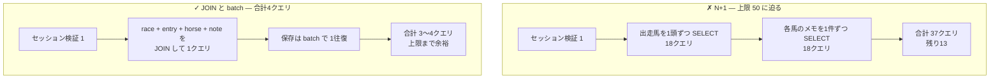
```mermaid
flowchart TB
    subgraph bad["✗ N+1 — 上限 50 に迫る"]
        B1["セッション検証 1"] --> B2["出走馬を1頭ずつ SELECT<br/>18クエリ"]
        B2 --> B3["各馬のメモを1件ずつ SELECT<br/>18クエリ"]
        B3 --> B4["合計 37クエリ<br/>残り13"]
    end

    subgraph good["✓ JOIN と batch — 合計4クエリ"]
        G1["セッション検証 1"] --> G2["race + entry + horse + note を<br/>JOIN して 1クエリ"]
        G2 --> G3["保存は batch で 1往復"]
        G3 --> G4["合計 3〜4クエリ<br/>上限まで余裕"]
    end
```

**設計ルール: 1リクエストあたりの D1 クエリは10以内に収める。**
超えそうなら JOIN か `batch()` にまとめる。これを守っていれば Free の頃の上限の50は遠い。
Paid に上げたので上限に当たって落ちることはまず無いが、クエリ数はそのまま時間と rows read に効くので、約束は変えない。

### 7-2. CPU 時間 — 上限 1,000ms / 呼び出し（`[limits] cpu_ms`）

SvelteKit の SSR は通常数ms で収まるが、18行のテーブルに Markdown レンダリングを
全行かけるような処理を足すと近づく。メモ本文の Markdown → HTML 変換は
**サーバーではなくクライアントで行う**か、軽量なパーサを使う。

超えた場合の症状は「エラーで落ちる」（利用者に 1102 が出る）であり、静かな劣化ではない。
ただし Worker ごと止められるので Discord には届かない。Workers Logs を人が見る（→ [monitoring.md 9-1](./monitoring.md)）。

### 7-3. D1 は単一スレッド

D1 は1データベースにつき1スレッドで、クエリを1つずつ処理する。
平均1ms のクエリなら毎秒1,000件が上限。5人の同時利用では問題にならない。

### 7-4. その他の上限（いずれも遠い）

| 項目 | 上限 | 備考 |
| --- | --- | --- |
| 1テーブルの列数 | 100 | `race_entry` が最多でも20列程度 |
| 1行 / BLOB の最大サイズ | 2 MB | メモ本文がこれを超えることはない |
| バインドパラメータ数 | 1クエリ100個 | 18頭の一括 INSERT は `batch()` で分割されるので該当しない |
| SQL 文の長さ | 100 KB | — |
| Worker からの同時 D1 接続数 | 6 | 逐次処理なので該当しない |

---

## 8. 運用

| 項目 | どうするか |
| --- | --- |
| **バックアップ** | D1 の Time Travel で過去30日間（Paid）の任意の時点に復元できる。**別途バックアップの仕組みは作らない。** 節目で `pnpm exec wrangler d1 export` を手動実行して手元に置けば十分 |
| **ログ** | Workers Logs が Paid で 2,000万イベント/月・7日保持（`[observability] enabled = true`）。構造化ログの形と出さないものは [monitoring.md](./monitoring.md) |
| **通知** | ERROR と、GitHub Actions の失敗・本番デプロイの結果を Discord へ。死活監視は `health.yml` が `/api/health` を外から叩く（→ [monitoring.md](./monitoring.md)） |
| **メトリクス** | Cloudflare ダッシュボードの Worker / D1 メトリクス。rows read/written はここで実測を確認できる |
| **シークレット** | `pnpm exec wrangler secret put`（本番）/ `.dev.vars`（ローカル、`.gitignore` 済み） |
| **マイグレーション** | `wrangler d1 migrations apply` を GitHub Actions のデプロイ前に実行 |
| **暴走課金の防止** | Worker に CPU 時間とサブリクエスト数の上限を置き（`[limits]`）、使用量と従量課金の見込みを Cloudflare から知らせる（→ [monitoring.md 第9章](./monitoring.md)） |

---

## 9. この構成の要約

- **サーバーもコンテナもない。** Worker 1つと D1 1つ、外部依存は Google OAuth と、GitHub Actions だけが行くオッズの取得元と GitHub の API、
  同意画面から取りに行く AI のクライアントの文書（Client ID Metadata Document）
- **層は6つ、依存は一方向。** 要は「サービス層が SvelteKit を知らない」の1点。
  これだけでテストが書け、将来の API 追加にも耐える
- **データアクセスは必ず ④→⑤→⑥ を通る。** ルートから直接 SQL を書かない。
  `author_id = :viewer` を SQL の WHERE 句に埋めるのも、この経路を1本に保てているから成立する
- **公開範囲を見るのは共有ページ1本だけ。** ログイン中の読みは全部
  「自分のメモ」に閉じているので、`visibility` の判定が散らばらない
- **月額 $5（Workers Paid）。** Free の枠に対しても消費率は最も高い項目で 1.5% だった。25年分のストレージ余裕がある
- **コストより先にクエリ数が効く。** Free の頃は「1リクエスト50クエリ」が上限だった。Paid では上限は遠いが、
  JOIN と `batch()` でクエリ数を10以内に保つことが、性能（D1 は単一スレッド）とコスト（rows read）に同時に効く
- **有料化してもその先がない。** $5/月を超える従量課金には、この規模では到達しようがない
