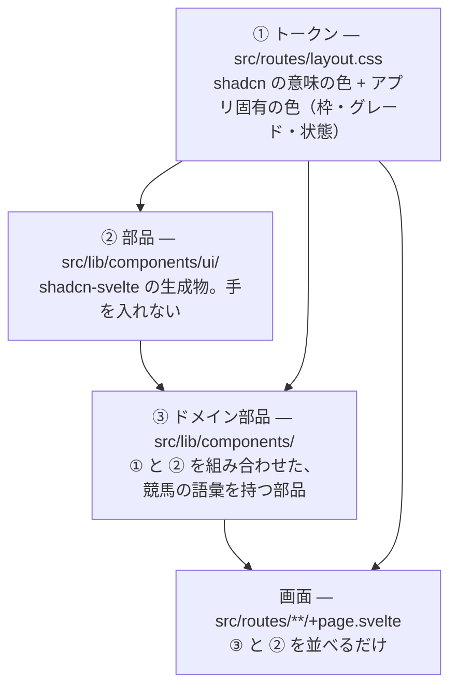

# uma-memo のデザインシステム

画面の見せ方の決まり。shadcn-svelte を前提に、色・部品・ドメイン部品をどう選ぶか。

- **読む場面:** 画面やコンポーネントの見た目を足す・変えるとき
- **ここに無いもの:** Svelte の書き方・ファイルの役割は [frontend.md](./frontend.md)、
  UX の原則（何を優先して見せるか）は [product.md](./product.md) と [harness.md 第1層](./harness.md)、
  この決まりを lint でどう止めるか・移行の順番は [harness.md 第3層](./harness.md)、
  見た目の確かめ方は [testing.md 第5章](./testing.md)
- 作成日: 2026-09-23 — harness.md 第3層の設計から、書くときに要る部分を移した
- ステータス: **移行中。** 第2章の「これから足すトークン」はまだ `layout.css` に無い。
  足されるまでは使えない（未定義のクラスは何も描かないので、書いても見た目が消えるだけ）

---

## 1. 3段の組み立て

**下の段にあるもので済むなら、上の段を作らない。**

## 2. ① トークン

**色は意味で呼ぶ。** 画面とドメイン部品では、パレットの色名（`gray-500`・`red-600`）を新しく書かない。
今のコードには約250箇所残っていて、画面ごとの PR で置き換えていく（→ [harness.md 第3層](./harness.md)）。

### 2-1. 今使えるもの — shadcn のトークン

`layout.css` に shadcn-svelte の base color `neutral` で入っている。`--primary` と `--ring` だけは
テーマカラーの紺に替えてある（→ 2-4）。

| 用途 | 使うもの | 置き換える前の書き方の例 |
| --- | --- | --- |
| 本文 | `text-foreground` | `text-gray-900` |
| 補足の文字 | `text-muted-foreground` | `text-gray-500` / `text-gray-600` |
| 罫線 | `border-border`（`*` に既定で当たっているので、多くは `border` だけでよい） | `border-gray-200` / `border-gray-300` |
| 薄い面 | `bg-muted` / `bg-secondary` | `bg-gray-50` / `bg-gray-100` |
| 取り消せない操作・エラー | `destructive`（`Button variant="destructive"`、`text-destructive`） | `bg-red-600` / `text-red-700` |
| カード・浮く面 | `bg-card` / `bg-popover` | `bg-white` |
| 主な操作（保存・追加）・リンクの色 | `bg-primary text-primary-foreground`（紺。`Button` の既定もこれ） | `bg-gray-900 text-white` |
| フォーカスの輪 | `ring-ring` | — |
| 角丸 | `rounded-sm` 〜 `rounded-xl`（`--radius` から算出） | — |

### 2-2. これから足すもの — アプリ固有のトークン

shadcn に無いので、`layout.css` の `:root` と `@theme inline` に shadcn と同じ書式で足す。
**足す PR が入るまでは使えない。** それまでは、同じ用途の既存の画面と同じクラスを使う。

| トークン | 用途 | 今の書き方 |
| --- | --- | --- |
| `--warning` / `--warning-foreground` | 注意（書きかけあり、未確定） | `bg-amber-100 text-amber-900` |
| `--success` / `--success-foreground` | 済み・的中 | `bg-emerald-*` |
| `--info` / `--info-foreground` | 案内・共有中 | `bg-sky-100 text-sky-900` |
| `--bracket-1` 〜 `--bracket-8`（と `-foreground`） | 枠色。**JRA の帽子の色そのまま**（1白 2黒 3赤 4青 5黄 6緑 7橙 8桃） | `BracketBadge` の中の表 |
| `--grade-g1` / `--grade-g2` / `--grade-g3` | グレード | `GradeBadge` の中の表 |
| `--text-2xs` | 11px の小さい文字 | `text-[11px]`（10箇所） |

枠色とグレードは「見やすさで選んだ色」ではなく**外の世界で決まっている色**なので、
トークンにして1箇所に閉じ込める。見やすさで置き換えると、中継や新聞を見ながら読む人の頭の中と食い違う。

ただし、外の世界で決まっているのは**色味（青・赤・緑）**まで。白抜きの文字を載せる札は、
色味を保ったまま、白い文字とのコントラストが **4.5:1**（WCAG AA、11px の小さい文字）に届く明るさを選ぶ。
グレードは G1 `blue-600`（5.26:1）・G2 `red-600`（4.76:1）・G3 `green-700`（4.94:1）。
G3 は以前 `green-600` だったが、3.22:1 で届かなかったので1段暗くした。
`--grade-g1`〜`g3` を足すときも、この値を引き継ぐ。
**6枠の札（`BracketBadge`）はまだ `green-600` に白い文字で、届いていない**（別の作業で直す）。

### 2-3. ダークモード

今は作らない（`.dark` を付ける場所が無い）。トークン経由にしておけば、あとで `.dark` の値を埋めるだけで済む。

### 2-4. テーマカラーと、環境の見分け

**テーマカラーは紺**（`oklch(0.346 0.074 256)`、ファビコンの蹄鉄と同じ色）。入れるのは `--primary` と
`--ring` だけで、背景・罫線・文字は無彩色のまま。

赤・青・緑・黄・橙はグレード・枠色・状態の色（2-2）で意味が決まっている。紺は G1 の青（`blue-600`、
`oklch(0.546 0.215 263)`）や4枠の青と同じ系統なので、**明るさと鮮やかさを大きく落として**見分けられるようにしている。
テーマカラーを明るく・鮮やかにすると、「押せるもの」と「G1」「4枠」の見分けがつかなくなる。
値を変えるときは、G1 の青と並べて見分けがつくことを確かめる。

**「次走消し」の札（`slate-700`）とは明るさがほぼ同じ**で、色味の差だけで分かれている。
札は小さな文字の面、ボタンは幅いっぱいの面と形が違うので今は並べているが、
どちらかの色を変えるときはこの2つを並べて確かめる（画面カタログの `race-preview-editing-drop`）。
予想印の `×`（消し）は薄いグレーの面（`bg-muted`）に、字を `text-foreground`、輪郭を
`border-muted-foreground` で出す。表示と選択中の印で色をそろえ、記号でも意味を伝える。

**ステージングでもテーマカラーは変えない。** ステージングはリリース前に本番と同じ見た目で確かめる場所なので、
違うのは次の2つだけにする（`AppEnvMark`。`APP_ENV` が `staging` のときに出る）。

- タブのアイコンが暗い地に灰色の蹄鉄になる（`src/lib/assets/favicon-staging.svg`）。色だけでなく明るさも本番と逆にして、色覚によらず見分けられるようにしている
- ページの一番上に「ステージング環境（データは本番と別）」の細い帯が出る

ローカル（`pnpm run dev`・E2E・キャプチャ）は本番と同じ見た目にする。PR に貼るキャプチャが本番の見た目であるために。

## 3. ② 部品 — shadcn-svelte

- 部品は `pnpm exec shadcn-svelte add <名前>` で入れる。バージョンは devDependencies の
  `shadcn-svelte` に揃える（`pnpm dlx` で最新を引くと、既存の部品と書き方がずれる）。
  設定は `components.json`（style `nova`・アイコン `lucide`）
- **`src/lib/components/ui/` は手で直さない。** 見た目を変えたいときは、トークンを変えるか、
  呼ぶ側で `class` を足すか、③ のドメイン部品で包む
- 今あるもの: avatar / badge / button / card / dropdown-menu / input / label / select / separator / sonner / textarea
- **素の `<button>` `<select>` `<textarea>` を新しく書かない。** 押せる大きさやフォーカスの見え方が
  部品ごとに揃わなくなる。shadcn に無い操作が要るときは、まず `shadcn-svelte add` で足せるものが無いかを見る
- アイコンは `@lucide/svelte/icons/<名前>` を1つずつ import する

どの部品を使うかの目安:

| やりたいこと | 使う部品 |
| --- | --- |
| 押して何かが起きる | `Button`（主操作は既定、その他は `variant="outline"` / `"ghost"`、消すものは `"destructive"`） |
| 状態や分類を小さく出す | `Badge`、または ③ のドメイン部品 |
| ひとかたまりの情報 | `Card` |
| 毎回は使わない操作を畳む | `DropdownMenu`（`⋯`）。出しっぱなしにするのは毎回踏む導線だけ |
| 入力 | `Input` / `Textarea` / `Select` + `Label` |
| 操作が済んだことを一時的に知らせる（保存しました） | トースト（`toast.success`。`Toaster` はルートレイアウトに1つだけ、下の中央、`theme="light"` 固定、`richColors` なし＝成功の緑の文字が 4.5:1 に届かない）。失敗は画面に残す |

## 4. ③ ドメイン部品

`src/lib/components/` に置く、競馬の語彙を持つ部品。

| 部品 | 何を出すか |
| --- | --- |
| `GradeBadge` | グレード（G1 / G2 / G3 / L / OP）。一覧の行ではレース名の前に置く（→ [product.md 第6章](./product.md)） |
| `BracketBadge` | 枠番。色だけでなく必ず数字を出す |
| `MarkBadge` / `MarkPicker` | 予想印（◎ ○ ▲ △ ☆ ×）の表示と選択 |
| `TagBadges` / `TagPicker` | メモの札の表示と選択 |
| `KindBadge` | メモの種類 |
| `SharedBadge` / `ShareControl` | 共有中の印と、共有の切り替え |
| `RaceHeading` / `RaceFilterForm` / `RaceListEmpty` / `PastRuns` | レースの見出し・絞り込み・一覧が0件のときの文・馬柱 |
| `RaceSummary` | 1レースの見立て・各馬のメモ・札・印。本人のまとめ画面と共有ページで共通 |
| `RaceFlowEditor` / `RaceFlowBoard` / `RaceFlowDetails` / `RaceFlowView` / `FlowDigest` / `FlowOrder` | 展開の予想の入力（畳んだ1行・ペース・局面のタブ）・盤面（前後 × 内外のマス目に枠の色のコマ。上が内ラチ、先頭はスタンドから見た向き。キーボードは矢印キー）・読むだけの畳んだ形・その中の3局面の並び・閉じた行（ペースと局面ごとの隊列）・隊列の1行（列の切れ目でだけ折り返す） |
| `CourseMap` | レースを走るコースの図と、回り・直線・高低差。図は `src/lib/assets/courses/` の SVG で、`src/lib/utils/course.ts` から `pnpm run course-maps` で書き出す生成物（手で直さない） |
| `NoteMenu` / `AnswerCheck` / `DraftKeeper` / `SaveBar` | メモの `⋯` メニュー・的中の確認・書きかけの保持・未保存のときだけ出る保存ボタン |
| `AccountMenu` | ヘッダのアバター |
| `AppEnvMark` | ファビコンと、ステージングの帯（→ 2-4） |
| `LegalDocument` | プライバシーポリシーと利用規約の枠（見出し・制定日と改定日・戻り先） |
| `GoogleLogin` / `LandingPage` | 「Google でログイン」と規約への同意の一文・未ログインのトップの紹介ページ（使う順の3段階に機能とキャプチャを並べる。キャプチャは `pnpm run landing:shots` で撮る → [testing.md 第8章](./testing.md)） |

- 同じ意味のものは、画面ごとに作らずここの部品を使う
- 見た目の分岐（グレードごと、印ごと）は1箇所の表に書く。新しく書くものは `tailwind-variants` の `tv()` にし、
  shadcn の部品と書き方を揃える（今ある部品は `Record<…, string>` の表で持っている）
- 色はトークンだけを使う（2-2 が入るまでは、部品の中の表に閉じ込めておく）
- 1部品につき `*.svelte.spec.ts` を1本（表示と操作）

## 5. 大きさ・余白・文言

- 余白と大きさは Tailwind の既定の段（`gap-2` / `gap-4` / `p-4` …）だけを使う。`[...]` の任意値は新しく書かない
- 押せるものは mobile で 24px 四方以上（WCAG 2.2 の 2.5.8）。一覧の行のように主に押すものは 44px を目安にする
- 390px 幅で横にはみ出さない（画面カタログが落とす → [testing.md 第4章](./testing.md)）
- **色だけに意味を持たせない。** 枠・印・グレードは必ず文字も出す
- ボタンの文言は動詞で終える（「保存する」「共有をやめる」）。確かめる文は、何が起きるかを先に書く

## 6. 避けること

「こう見せたい」より「こうはしない」のほうが揺れが少ない。新しく書くときに次をしない。

- グラデーション、強い影、ぼかし。面の区別は罫線（`border`）と `bg-muted` だけでつける
- 飾りだけの絵文字やアイコン。アイコンは操作か状態の意味を持つときだけ置き、ボタンなら文字も添える
- カードの中にカードを入れる。1段で足りないときは見出しと罫線で分ける
- 目立たせたいものを色で塗る。強調は太字と置き場所（上・左）でつける。色は意味（トークン）にだけ使う
- 画面ごとの独自の部品。同じ意味のものは第4章の部品を使う
- 頼まれていない「ついで」の飾りや説明文（→ [evaluation.md](./evaluation.md) の Product）
