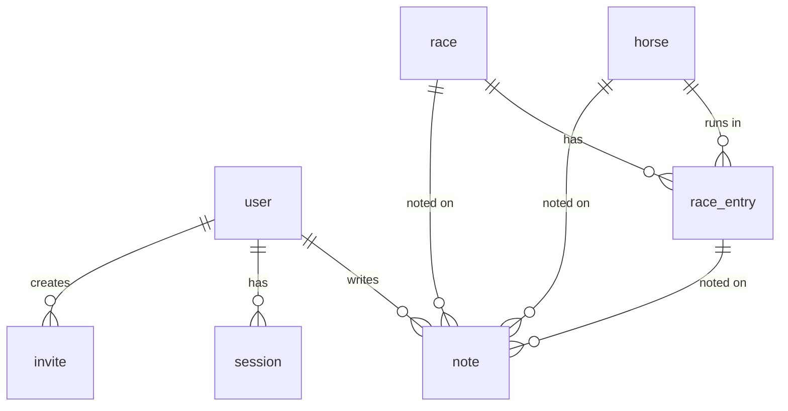

# keiba-note 設計ドキュメント

競馬の観戦メモを残し、レース単位／馬単位でふりかえるための Web アプリ。
Cloudflare Workers 上で動かす。

- 作成日: 2026-09-20
- ステータス: 確定（実装着手可）
- 関連: [architecture.md](./architecture.md) — アーキテクチャ / コスト / 技術選定の根拠

---

## 1. 前提・要件

### 決定済み

| 項目 | 決定 |
| --- | --- |
| 利用者 | 少人数で共有（招待制）。不特定多数への公開はしない |
| データ入力 | 馬・レースとも手入力。将来の外部取り込みを阻害しない構造にする |
| フロントエンド | SvelteKit (Svelte 5) |
| 実行環境 | Cloudflare Workers |
| 認証 | Google OAuth + 招待コード（自前セッション）。独自ドメインを持たないため |

### やりたいこと（優先度順）

1. **レースのふりかえり** — レースを見終わったあと、そのレースについてまとめて記録する
2. **レース自体のメモ** — ペース、馬場、展開など「レースの性質」の記録
3. **レース単位の観戦メモ** — そのレースで出走馬それぞれがどう走ったか
4. **馬ごとのメモ蓄積・タイムライン** — 1頭を追いかけ、過去のメモを時系列で読み返す

### 今回はやらないこと（Phase 5 以降）

- タグ・全文検索
- 次走チェックリスト／通知
- 外部データ（netkeiba / JRA 等）の自動取り込み
- 馬券収支の管理
- モバイルアプリ、ネイティブ通知

---

## 2. 設計の中心となる考え方

4つの要件を素直にテーブルへ落とすと「レースのメモ」と「馬のメモ」が別物になり、
**馬ごとのタイムラインを作るときに両方をマージする羽目になる**。

そこで、メモの実体を **1つの `note` テーブル**に統一し、
「どのレースの」「どの馬の」メモかを **非正規化して保持する**。

```
レース観戦メモを書く
  → note (kind='entry', race_id=R, horse_id=H, race_entry_id=E)
        ↓                                ↓
  レース詳細で「このレースのメモ」    馬詳細で「この馬のタイムライン」
  として race_id で引ける              として horse_id で引ける
```

1回の書き込みが、レース側からも馬側からも自然に読める。
タイムラインは `WHERE horse_id = ? ORDER BY occurred_at DESC` の1クエリで済み、
JOIN もマージもいらない。これが本アプリのデータモデルの肝。

---

## 3. 技術スタック

| レイヤ | 採用 | 理由 |
| --- | --- | --- |
| フレームワーク | SvelteKit 2 / Svelte 5 (runes) | 決定済み。フォーム中心のアプリと相性が良い |
| アダプタ | `@sveltejs/adapter-cloudflare` | Workers + Static Assets で配信 |
| DB | Cloudflare D1 (SQLite) | リレーショナルな読み書きが主体。無料枠で十分 |
| ORM | Drizzle ORM + drizzle-kit | D1 対応が厚く、マイグレーションが SQL で読める |
| バリデーション | Valibot | Zod より軽く、Workers のバンドルサイズに効く |
| スタイル | Tailwind CSS v4 | 追加ビルド設定がほぼ不要 |
| テスト | Vitest（単体）/ Playwright（E2E） | |
| デプロイ | Wrangler + GitHub Actions | |

### API の形

**専用の REST API は作らない。** SvelteKit の `load` + form actions で完結させる。

- 読み: `+page.server.ts` の `load` で D1 を直接叩く
- 書き: form actions（JS 無効でも動く＝プログレッシブエンハンスメント）

将来モバイルクライアント等が必要になった時点で `/api/v1/*` を足す。
そのときのためにビジネスロジックは `src/lib/server/services/` に置き、
ルートからは薄く呼ぶだけにしておく。

---

## 4. 認証 — Google OAuth + 招待コード

独自ドメインを持たない（`*.workers.dev` で運用する）ため、Cloudflare Access は使えない。
**Google OAuth でログインし、アカウント作成は招待コード経由に限定する**方式を採る。

パスワードは一切保存しない。ユーザーが覚えるものはゼロ。

### 使うもの

- **[Arctic](https://arcticjs.dev/) v3** — OAuth プロバイダのクライアント。依存が軽く Workers で動く
- **[Oslo](https://oslojs.dev/)**（`@oslojs/crypto`, `@oslojs/encoding`）— トークン生成とハッシュ
- セッションストアは D1。Web Crypto API は Workers 標準なので追加依存なし

### ログインフロー

```
/login
  └ [Googleでログイン]
      ↓
GET /auth/google
  ├ state と PKCE code_verifier を生成
  ├ HttpOnly Cookie に10分間だけ保存
  └ Google の認可画面へ 302
      ↓
GET /auth/google/callback?code=...&state=...
  ├ Cookie の state と照合（不一致なら 400）
  ├ code + code_verifier をトークンに交換
  ├ id_token から sub / email / name / picture を取り出す
  └ user を google_sub で検索
       ├ 既存 → セッション発行して /
       └ 未登録 → 下の「新規登録の判定」へ
```

### 新規登録の判定

未登録ユーザーが callback に到達したとき、次の順で判定する。

1. **招待 Cookie があるか** — `/invite/[code]` を踏むと、招待コードを HttpOnly Cookie（30分）に入れてから `/auth/google` へ送る。これでリダイレクト往復をまたいで招待を持ち回る
2. **招待が有効か** — `used_at IS NULL` かつ `expires_at > now`
3. **宛先が一致するか** — `invite.email` が設定されていれば、Google から返った email と一致すること
4. すべて満たせば `user` を作成し、`invite.used_at` / `used_by` を埋めてセッション発行
5. 満たさなければ `/login?error=invite_required` へ。**ユーザーは作らない**

招待コードの有無だけが登録の門になる。Google アカウントを持っている人が URL を知っても入れない。

### 最初のユーザー（オーナー）

招待を出す人が最初はいないので、ブートストラップの口を1つ用意する。

- Worker のシークレット `OWNER_EMAIL` に自分のアドレスを入れておく
- `user` テーブルが**空**で、かつログインした email が `OWNER_EMAIL` と一致する場合のみ、招待なしで `role='owner'` として作成する
- 2人目以降は必ず招待が要る（`user` が空でなくなるため、この口は自動的に閉じる）

### セッション

| 項目 | 決定 |
| --- | --- |
| トークン | 32バイトの乱数を base32 エンコードして Cookie に入れる |
| DB に置くもの | **トークンそのものではなく SHA-256 ハッシュ**。D1 が漏れてもなりすませない |
| Cookie | `session` / `HttpOnly` / `Secure` / `SameSite=Lax` / `Path=/` |
| 有効期限 | 30日 |
| 更新 | スライディング。残り15日を切ったアクセスで30日に延長（毎回 UPDATE しない） |
| ログアウト | `session` 行を削除し Cookie を破棄 |

`SameSite=Lax` は OAuth のリダイレクト（トップレベルの GET ナビゲーション）で Cookie が送られるので問題ない。

### hooks.server.ts

認証の判断はここに閉じ込め、ルートからは `event.locals.user` しか見ない。

```ts
// src/hooks.server.ts（骨子）
const PUBLIC_PATHS = ['/login', '/auth/', '/invite/'];

export const handle: Handle = async ({ event, resolve }) => {
  const token = event.cookies.get('session');
  event.locals.user = token
    ? await validateSession(event.platform!.env.DB, token) // 期限切れなら null + 行削除
    : null;

  if (!event.locals.user && !PUBLIC_PATHS.some((p) => event.url.pathname.startsWith(p))) {
    redirect(302, `/login?redirect=${encodeURIComponent(event.url.pathname)}`);
  }
  return resolve(event);
};
```

```ts
// src/app.d.ts
declare global {
  namespace App {
    interface Locals {
      user: { id: string; email: string; displayName: string; role: 'owner' | 'member' } | null;
    }
    interface Platform {
      env: {
        DB: D1Database;
        GOOGLE_CLIENT_ID: string;
        GOOGLE_CLIENT_SECRET: string;
        OWNER_EMAIL: string;
      };
    }
  }
}
```

### シークレットの管理

| 変数 | 本番 | ローカル |
| --- | --- | --- |
| `GOOGLE_CLIENT_ID` | `wrangler secret put` | `.dev.vars`（`.gitignore` 済み） |
| `GOOGLE_CLIENT_SECRET` | 同上 | 同上 |
| `OWNER_EMAIL` | 同上 | 同上 |

Google Cloud Console の OAuth クライアントには、リダイレクト URI を2つ登録する。

- `http://localhost:5173/auth/google/callback`
- `https://keiba-note.<subdomain>.workers.dev/auth/google/callback`

### セキュリティ上の押さえどころ

- **CSRF** — SvelteKit の form actions は既定で Origin ヘッダを検証する（`csrf.checkOrigin`）。これを無効化しない
- **state / PKCE** — Arctic が生成するものをそのまま使い、callback で必ず照合する
- **オープンリダイレクト** — `?redirect=` は `/` で始まる相対パスのみ許可する（`//evil.com` を弾く）
- **招待コード** — 推測不能な乱数（24バイト以上）。使用済み・期限切れは同じエラー文言にして状態を漏らさない
- **期限切れセッション** — 検証時に見つけたら即削除する遅延クリーンアップ。取りこぼしは Phase 4 で Cron を足すか、放置してもよい（行が増えるだけ）

---

## 5. データモデル



### user

| カラム | 型 | 備考 |
| --- | --- | --- |
| id | text PK | ULID |
| google_sub | text UNIQUE NOT NULL | Google の `sub`。**ログイン時の引き当てキー**。email は変わりうるので使わない |
| email | text UNIQUE NOT NULL | 表示と招待の照合に使う |
| display_name | text NOT NULL | Google の `name` を初期値に、あとから変更可 |
| avatar_url | text | Google の `picture` |
| role | text NOT NULL | `owner` / `member`。招待を出せるのは owner |
| deleted_at | integer | 退会は論理削除（→ 第9章 #8）。NULL 以外はログイン不可 |
| created_at / updated_at | integer NOT NULL | unixepoch |

### session

| カラム | 型 | 備考 |
| --- | --- | --- |
| id | text PK | セッショントークンの **SHA-256 ハッシュ（hex）**。生トークンは保存しない |
| user_id | text FK→user.id ON DELETE CASCADE NOT NULL | |
| expires_at | integer NOT NULL | unixepoch。スライディングで延長される |
| created_at | integer NOT NULL | |

- `INDEX session_user ON session(user_id)` — 「全端末からログアウト」用
- `INDEX session_expires ON session(expires_at)` — 期限切れの一括削除用

### invite

| カラム | 型 | 備考 |
| --- | --- | --- |
| id | text PK | |
| code | text UNIQUE NOT NULL | URL に乗せる乱数（24バイト以上） |
| email | text | 宛先を固定する場合。NULL なら誰でも1回使える |
| invited_by | text FK→user.id NOT NULL | |
| expires_at | integer NOT NULL | 既定7日 |
| used_at | integer | NULL なら未使用 |
| used_by | text FK→user.id | 使った結果できた user |
| created_at | integer NOT NULL | |

### horse

| カラム | 型 | 備考 |
| --- | --- | --- |
| id | text PK | |
| name | text NOT NULL | 馬名 |
| name_kana | text | |
| sex | text | `牡` / `牝` / `セ` |
| birth_year | integer | |
| trainer | text | 調教師 |
| owner_name | text | 馬主 |
| sire | text | 父 |
| dam | text | 母 |
| profile_memo | text | プロフィール欄の常設メモ（タイムラインとは別） |
| external_ref | text | netkeiba の馬ID等。**将来の取り込み用に最初から置く** |
| created_by | text FK→user.id | |
| created_at / updated_at | integer | |

- `UNIQUE INDEX horse_name_birth ON horse(name, birth_year)` — 同名馬対策
- `INDEX horse_name ON horse(name)`

### race

| カラム | 型 | 備考 |
| --- | --- | --- |
| id | text PK | |
| date | text NOT NULL | `YYYY-MM-DD` |
| course | text NOT NULL | 競馬場（東京、中山…） |
| race_number | integer | 第Nレース |
| name | text | レース名 |
| grade | text | `G1` / `G2` / `G3` / `L` / `OP` / NULL |
| class_name | text | 条件（3勝クラス 等） |
| surface | text | `芝` / `ダート` / `障害` |
| distance | integer | m |
| direction | text | `右` / `左` / `直線` |
| track_condition | text | `良` / `稍重` / `重` / `不良` |
| weather | text | |
| external_ref | text | 将来の取り込み用 |
| created_by | text FK→user.id | |
| created_at / updated_at | integer | |

- `INDEX race_date ON race(date DESC)`
- `UNIQUE INDEX race_ident ON race(date, course, race_number)`

### race_entry（出走馬）

| カラム | 型 | 備考 |
| --- | --- | --- |
| id | text PK | |
| race_id | text FK→race.id ON DELETE CASCADE | |
| horse_id | text FK→horse.id | |
| bracket | integer | 枠番 |
| horse_number | integer | 馬番 |
| jockey | text | |
| weight_carried | real | 斤量 |
| horse_weight | integer | 馬体重 |
| horse_weight_diff | integer | 増減 |
| odds | real | |
| popularity | integer | 人気 |
| finish_position | integer | 着順。NULL = 未確定／除外 |
| finish_time | text | `1:34.2` |
| margin | text | 着差 |
| passing | text | 通過順（`3-3-2-2`） |
| last_3f | real | 上がり3F |

- `UNIQUE INDEX entry_race_horse ON race_entry(race_id, horse_id)`
- `UNIQUE INDEX entry_race_number ON race_entry(race_id, horse_number)`
- `INDEX entry_horse ON race_entry(horse_id)`

### note（メモ — 本アプリの中心）

| カラム | 型 | 備考 |
| --- | --- | --- |
| id | text PK | |
| author_id | text FK→user.id NOT NULL | |
| kind | text NOT NULL | `race` / `horse` / `entry` |
| race_id | text FK→race.id ON DELETE CASCADE | kind に応じて埋まる |
| horse_id | text FK→horse.id ON DELETE CASCADE | 同上 |
| race_entry_id | text FK→race_entry.id ON DELETE CASCADE | 同上 |
| body | text NOT NULL | Markdown |
| rating | integer | 次走期待度 1–5。任意 |
| visibility | text NOT NULL | `shared`（メンバー全員が読める）/ `private` |
| occurred_at | text NOT NULL | タイムライン用。レース紐付きならレース日、それ以外は記入日 |
| created_at / updated_at | integer NOT NULL | |

**kind ごとの埋め方（CHECK 制約で強制する）**

| kind | race_id | horse_id | race_entry_id | 意味 |
| --- | --- | --- | --- | --- |
| `race` | ○ | NULL | NULL | レース自体のメモ（ペース、馬場、展開） |
| `horse` | NULL | ○ | NULL | レースに紐づかない馬のメモ（調教、近況、印象） |
| `entry` | ○ | ○ | ○ | **このレースでこの馬がどう走ったか** |

```sql
CHECK (
     (kind = 'race'  AND race_id IS NOT NULL AND horse_id IS NULL     AND race_entry_id IS NULL)
  OR (kind = 'horse' AND race_id IS NULL     AND horse_id IS NOT NULL AND race_entry_id IS NULL)
  OR (kind = 'entry' AND race_id IS NOT NULL AND horse_id IS NOT NULL AND race_entry_id IS NOT NULL)
)
```

`entry` のとき `race_id` / `horse_id` は `race_entry` から導出できるが、**あえて持つ**。
これによって主要クエリがすべて単一テーブルのインデックススキャンで済む。
整合性はサービス層（`race_entry` から値をコピーして INSERT する）で担保する。

- `INDEX note_horse_timeline ON note(horse_id, occurred_at DESC)`
- `INDEX note_race ON note(race_id)`
- `INDEX note_author ON note(author_id, created_at DESC)`

### 主要クエリ

```sql
-- 馬のタイムライン（レース観戦メモも近況メモも混ざって時系列で出る）
SELECT * FROM note
WHERE horse_id = ?1 AND (visibility = 'shared' OR author_id = ?2)
ORDER BY occurred_at DESC, created_at DESC;

-- レース詳細で出す全メモ（レース自体のメモ + 各馬のメモ）
SELECT * FROM note
WHERE race_id = ?1 AND (visibility = 'shared' OR author_id = ?2);

-- ダッシュボード: 最近のメモ
SELECT * FROM note
WHERE visibility = 'shared' OR author_id = ?1
ORDER BY created_at DESC LIMIT 20;
```

---

## 6. 画面とルーティング

```
/                             ダッシュボード（最近のメモ / 直近のレース）

/login                        ログイン（[Googleでログイン] のみ）
/auth/google                  認可画面へリダイレクト（GET）
/auth/google/callback         OAuth コールバック
/auth/logout                  ログアウト（POST のみ）
/invite/[code]                招待受諾 → Cookie に code を置いて /auth/google へ

/races                        レース一覧（日付降順）
/races/new                    レース登録
/races/[id]                   ★レース詳細＝ふりかえりの主戦場
/races/[id]/edit              レース情報編集
/races/[id]/entries           出走馬の一括入力・編集

/horses                       馬一覧・インクリメンタル検索
/horses/new                   馬登録
/horses/[id]                  ★馬詳細＝プロフィール + タイムライン
/horses/[id]/edit             馬情報編集

/settings/members             メンバー・招待管理（owner のみ）
```

### ★ `/races/[id]` — ふりかえり画面

このアプリで一番よく使う画面。**1画面・1送信でレース1本分のふりかえりが完結する**ことを目標にする。

```
┌──────────────────────────────────────────────┐
│ 2026-09-20 中山11R  オールカマー (G2)        │
│ 芝2200m / 右 / 良 / 晴                       │
├──────────────────────────────────────────────┤
│ ■ レースのメモ                               │
│ ┌──────────────────────────────────────────┐ │
│ │ 前半緩くて上がり勝負。内有利。           │ │
│ └──────────────────────────────────────────┘ │
├──────────────────────────────────────────────┤
│ ■ 出走馬                                     │
│ 1着 ⑤ ホースA   ルメール  1:34.2   ★★★★☆ │
│     ┌──────────────────────────────────────┐ │
│     │ 直線で外に出してから一完歩が速い。   │ │
│     └──────────────────────────────────────┘ │
│ 2着 ③ ホースB   武豊      クビ     ★★★☆☆ │
│     ┌──────────────────────────────────────┐ │
│     │ 出遅れ。距離ロスあり、着差以上。     │ │
│     └──────────────────────────────────────┘ │
│  …                                           │
├──────────────────────────────────────────────┤
│              [ まとめて保存 ]                │
└──────────────────────────────────────────────┘
```

- 全馬分のテキストエリアを1つの `<form>` に入れ、1回の form action で保存
- 空欄の馬はスキップ（note を作らない）
- 既存メモがあればそこに表示され、編集＝上書き
- 保存は D1 の `batch()` で1往復にまとめる

### ★ `/horses/[id]` — 馬詳細

```
┌──────────────────────────────────────────────┐
│ ホースA  牡4 / 父サンプル / 美浦・○○厩舎    │
│ [プロフィールメモ]                           │
├──────────────────────────────────────────────┤
│ ■ タイムライン          [+ 近況メモを追加]   │
│                                              │
│ 2026-09-20  中山11R オールカマー(G2) 1着     │
│   直線で外に出してから一完歩が速い。 ★★★★☆│
│                                              │
│ 2026-08-02  （近況メモ）                     │
│   北海道滞在。追い切りの動き良いとのこと。   │
│                                              │
│ 2026-06-15  東京11R ○○S(G3) 3着            │
│   道中かかり気味。折り合い次第。     ★★★☆☆│
└──────────────────────────────────────────────┘
```

レース紐付きメモと近況メモが同じ流れに並ぶ。これが `note` を1テーブルにした狙い。

---

## 7. ディレクトリ構成

```
keiba-note/
├── docs/
│   └── design.md
├── src/
│   ├── app.d.ts
│   ├── app.html
│   ├── hooks.server.ts            # 認証。ここだけが認証方式を知っている
│   ├── lib/
│   │   ├── server/
│   │   │   ├── db/
│   │   │   │   ├── schema.ts      # Drizzle スキーマ
│   │   │   │   └── index.ts       # D1 → Drizzle クライアント生成
│   │   │   ├── auth/
│   │   │   │   ├── session.ts     # 発行 / 検証 / 延長 / 破棄
│   │   │   │   ├── google.ts      # Arctic クライアント
│   │   │   │   └── invite.ts      # 発行 / 検証 / 消費
│   │   │   └── services/          # ビジネスロジック（ルートから薄く呼ぶ）
│   │   │       ├── notes.ts
│   │   │       ├── races.ts
│   │   │       └── horses.ts
│   │   ├── schemas/               # Valibot スキーマ（フォーム入出力）
│   │   ├── components/
│   │   └── utils/
│   └── routes/
│       ├── +layout.svelte
│       ├── +page.server.ts
│       ├── login/
│       ├── auth/
│       │   ├── google/
│       │   │   ├── +server.ts
│       │   │   └── callback/+server.ts
│       │   └── logout/+server.ts
│       ├── invite/[code]/
│       ├── races/
│       ├── horses/
│       └── settings/
├── drizzle/                       # 生成されたマイグレーション SQL
├── drizzle.config.ts
├── wrangler.toml
├── svelte.config.js
├── vite.config.ts
└── package.json
```

`wrangler.toml` の要点:

```toml
name = "keiba-note"
main = ".svelte-kit/cloudflare/_worker.js"
compatibility_date = "2026-09-01"

assets = { directory = ".svelte-kit/cloudflare" }

[[d1_databases]]
binding = "DB"
database_name = "keiba-note"
database_id = "..."
```

ローカル開発は `vite dev`（`platformProxy` でローカル D1 に接続）。
マイグレーションは `wrangler d1 migrations apply keiba-note --local` / `--remote`。

---

## 8. 実装フェーズ

### Phase 0 — 土台

- SvelteKit + adapter-cloudflare のプロジェクト初期化
- D1 作成、Drizzle 接続、マイグレーション実行パスの確立
- `wrangler deploy` が通るところまで。**この時点で一度デプロイして疎通を確認する**

### Phase 1 — 認証

- Google Cloud Console で OAuth クライアント作成、リダイレクト URI を2つ登録
- `user` / `session` / `invite` テーブルとマイグレーション
- Arctic で `/auth/google` → `/auth/google/callback`
- セッション発行・検証・延長・破棄（`src/lib/server/auth/session.ts`）
- `hooks.server.ts` で `locals.user` を埋め、未ログインを `/login` へ
- `OWNER_EMAIL` によるオーナーのブートストラップ
- 招待の発行と受諾（UI は Phase 4、この時点では最低限の画面でよい）
- **完了条件: 自分がログインでき、招待した2人目もログインでき、招待なしの第三者は弾かれる**

### Phase 2 — 馬とレースの CRUD

- 馬の登録・一覧・検索・編集
- レースの登録・一覧・編集
- 出走馬の一括入力（`/races/[id]/entries`）— 馬名入力時に既存馬をサジェスト、なければその場で新規作成

### Phase 3 — メモ（ここが本体）

- レースふりかえり画面（`/races/[id]`）
- 馬タイムライン（`/horses/[id]`）
- 近況メモの追加
- 公開範囲（shared / private）の切り替え

### Phase 4 — 仕上げ

- ダッシュボード
- メンバー招待 UI
- モバイル幅のレイアウト調整（競馬場で片手で打てること）

### Phase 5 以降 — 今回のスコープ外

- タグ・全文検索（D1 の FTS5 が使える）
- 次走チェックリストと通知（Workers Cron + Web Push）
- 外部データ取り込み（`external_ref` を突き合わせキーにする）

---

## 9. 決めておきたいこと

| # | 論点 | 現時点の案 |
| --- | --- | --- |
| 1 | 認証方式 | **決定: Google OAuth + 招待コード**（→ 第4章） |
| 2 | メモの既定公開範囲 | `shared`。招待制の閉じた場なので共有が自然 |
| 3 | 他人のメモを編集できるか | **不可**。閲覧のみ。編集は作成者本人だけ |
| 4 | 着順・タイムまで入力するか | 任意入力。全部 NULL でもメモは書ける |
| 5 | 馬の重複登録 | `(name, birth_year)` で UNIQUE。入力時にサジェストして衝突を避ける |
| 6 | ID 形式 | ULID（時系列ソート可能、URL に出しても短い） |
| 7 | 日時の保持 | `occurred_at` は `YYYY-MM-DD` の文字列、その他は unixepoch 整数。JST 固定 |
| 8 | 退会・メンバー削除 | **論理削除**。`user.deleted_at` を立て、`session` を全削除してログイン不能にする。行自体は消さない（`note.author_id` が NOT NULL で、消すとふりかえりが虫食いになるため）。表示は「退会したメンバー」 |
| 9 | Google アカウントの変更 | `google_sub` で引くので email 変更には追従する。別 Google アカウントへの移行は Phase 5 以降 |

---

## 10. この設計のリスク

- **手入力の負担** — 出走馬18頭の入力は現実的にしんどい。Phase 2 の一括入力 UI の出来がアプリの寿命を決める。ここに時間をかける価値がある
- **`note` の非正規化** — `race_entry` を削除・付け替えしたときに `note.horse_id` が置き去りになりうる。外部キーの `ON DELETE CASCADE` と、付け替えを「削除＋再作成」ではなく UPDATE で扱うルールで防ぐ
- **D1 の制約** — **1リクエストあたりのクエリ数は Free plan で50**（Paid で1000）。18頭分を扱うふりかえり画面で N+1 を書くと現実的に到達する。読みは JOIN、書きは `batch()` にまとめ、**1リクエスト10クエリ以内**を設計ルールとする（→ [architecture.md 第6章](./architecture.md#6-制約とスケール限界)）
- **セッション検証が全リクエストに乗る** — `hooks.server.ts` で毎回 D1 を1回引く。D1 は数ms なので実用上は問題ないが、遅いと感じたら KV にセッションキャッシュを置く（Phase 5）
- **`*.workers.dev` 運用** — Cookie は `Secure` で問題ないが、`workers.dev` は Public Suffix List に載っているため他の Worker と Cookie を共有しない。むしろ安全側。将来ドメインを取ったらリダイレクト URI の追加だけで移行できる
