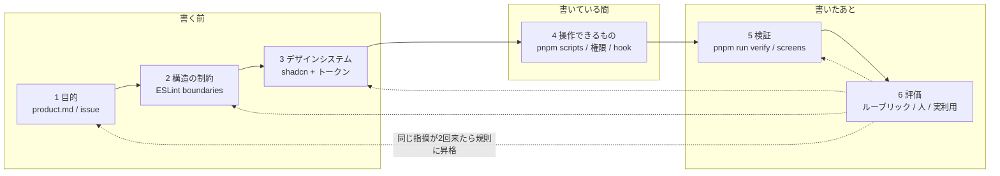
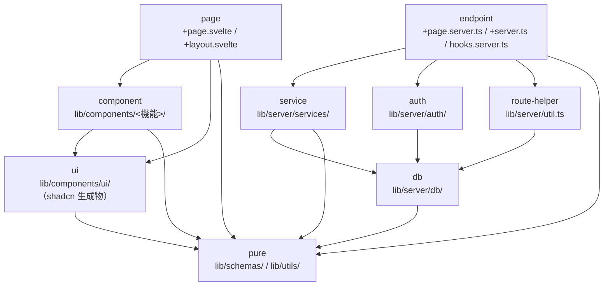
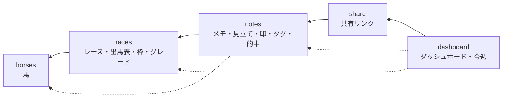
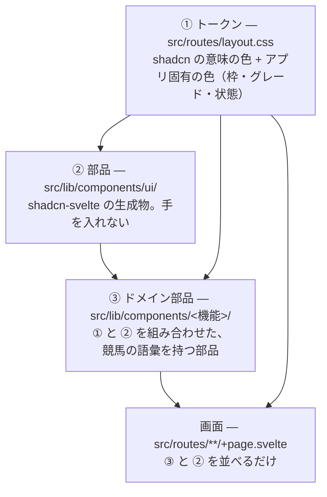
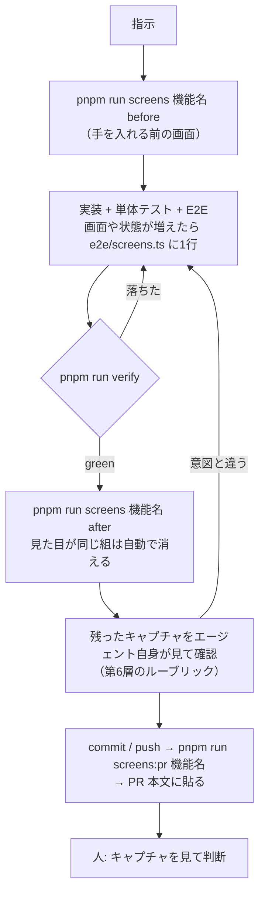
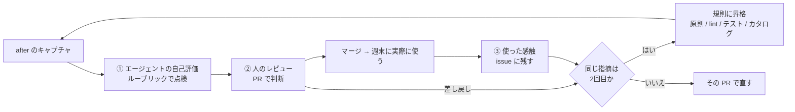

# k-note のハーネス

エージェント（または人）に変更を頼んでから PR が上がるまでを支える仕組み全体。
何を作るかの伝え方から、どこに書いてよいか、どう見せるか、何を操作してよいか、
どう確かめるか、良かったかをどう判断して次に活かすかまでを、6つの層に分けて決める。

- 作成日: 2026-09-23
- 更新日: 2026-09-23 — 検証の仕組みだけだった文書を6層の設計に組み直した。
  旧版の内容は第5層（→ 5章）にそのまま入っている
- ステータス: 第5層は稼働中。それ以外は設計。実装は 8章の順に別 PR で入れる
- 関連: [AGENTS.md](../AGENTS.md)（この仕組みを使う側の手順）/ [design.md](./design.md) /
  [architecture.md](./architecture.md)

---

## 0. 目的と、層の分け方

**人に回すのは「見た目と使い心地が意図どおりか」の判断だけにする。**

機械で確かめられることは、PR が上がる前に全部機械で確かめ終えている状態を作る。
そのために、エージェントが迷ったり間違えたりする場所を6つに分け、層ごとに
「正はどこに書いてあるか」「機械がどこまで強制するか」「人は何を判断するか」を決める。

```
┌────────────────────────────────────┐
│ 1. Goal / Product Context          │  何を・なぜ作るか
├────────────────────────────────────┤
│ 2. Architecture Constraints        │  どこに・どう実装してよいか
├────────────────────────────────────┤
│ 3. Design System                   │  どう見せるか
├────────────────────────────────────┤
│ 4. Tools / Runtime                 │  AI が何を操作できるか
├────────────────────────────────────┤
│ 5. Verification                    │  正しく動くか
├────────────────────────────────────┤
│ 6. Evaluation / Feedback Loop      │  良い UI・UX なのか
└────────────────────────────────────┘
```

上の3層は「書く前に知っておくこと」、下の3層は「書いたあとに確かめること」。
第6層で見つかった指摘は、同じ指摘が二度と来ないように上の層の規則へ戻す（→ 6-4）。



### 各層の現状

| 層 | 正（どこに書いてあるか） | 機械の強制 | 現状 |
| --- | --- | --- | --- |
| 1 目的 | README / design.md | なし | 仕様はあるが、「誰がどの場面で使うか」と UX の原則が文になっていない |
| 2 構造 | architecture.md 第2章 | **なし**（言葉の約束だけ） | 違反が4件ある（→ 2-5） |
| 3 見せ方 | `layout.css` / `components/ui/` | なし | 生の色指定が約250箇所。shadcn のトークンが半分しか使われていない |
| 4 操作 | AGENTS.md「コマンド」 | なし | 本番に触るコマンドの禁止は言葉だけ |
| 5 検証 | この文書 5章 | `pnpm run verify` / CI | 稼働中 |
| 6 評価 | なし | なし | 人がキャプチャを見るだけ。指摘が規則に戻る道が無い |

**機械の強制が無い層は、エージェントが読み落とした時点で破られる。** この設計の中心は、
第2層と第3層の約束を ESLint に落とし、`pnpm run lint`（＝ `verify` と CI）で止めることにある。

---

## 1. Goal / Product Context — 何を・なぜ作るか

### 1-1. 役割

エージェントが「この変更で誰の何が良くなるか」を知った状態で書き始めるようにする。
これが無いと、指示の字面は満たしているが使う場面に合わない画面ができる
（例: スマホで観戦しながら書くのに、横に長いフォームを作る）。
第6層の評価も、ここに書いた原則を物差しにする。

### 1-2. 正の置き場

| 文書 | 中身 | 状態 |
| --- | --- | --- |
| [README.md](../README.md) | 何のアプリか・いまのフェーズ | ある |
| [design.md](./design.md) | 要件・データモデル・画面・やらないこと | ある |
| **`docs/product.md`** | 誰が・どの場面で・何のために使うか。UX 原則。やらないと決めたこと | **足す** |
| **`.github/ISSUE_TEMPLATE/`** | 変更の頼み方の型 | **足す** |

`product.md` は1ページに収める。design.md は仕様の詳細で長いので、エージェントが
毎回最初に読む入口を別に置く。

### 1-3. UX 原則（草案）

design.md とこれまでの PR で下された判断から拾った。番号は PR やルーブリック（→ 6-1）から
`P3` のように引くためのもの。

| # | 原則 | 根拠 |
| --- | --- | --- |
| P1 | **ふりかえりは1画面・1送信。** 全頭分を1画面で書き、1回で保存する | design.md 第6章 `/races/[id]` |
| P2 | **既定は閉じる。** 他人のメモはどこにも出ない。共有は1件ずつ、明示の操作で | design.md 第2章 2-2 |
| P3 | **時間で入口を分ける。** 開催前は予想、開催後はふりかえり。その時に要らない操作は出さない | design.md 第6章 `/races/[id]/preview` |
| P4 | **毎回踏む導線だけ出しっぱなし。** それ以外は畳む（アカウントメニュー、`⋯`） | design.md 第6章 ヘッダ / 共有を `⋯` に畳んだ変更 |
| P5 | **スマホで書ける。** 390px で横にはみ出さず、片手で押せる | 画面カタログの mobile 幅 |
| P6 | **書きかけを失わない。** 送信前に画面を離れても戻せる | `DraftKeeper` |
| P7 | **色だけに意味を持たせない。** 枠・印・グレードは必ず文字も出す | `BracketBadge` のコメント |

これは草案で、正にするのは `product.md` を入れる PR で人が確かめてから。

### 1-4. 頼み方の型 — issue テンプレート

指示が「〜を直して」だけだと、エージェントは受け入れ条件を自分で作るしかない。
issue を次の型で書けば、そのまま PR の「なぜ」と第6層の評価の物差しになる。

```yaml
# .github/ISSUE_TEMPLATE/change.yml（案）
- 場面: いつ・どの端末で・何をしようとしているとき
- 困っていること: いま何が起きていて、なぜ困るか
- できたら: 何ができるようになれば良いか（見た目の案ではなく結果で）
- 関係する原則: P1〜P7 から（無ければ「新しい原則が要るか」を書く）
- 受け入れ条件: 箇条書き。E2E か画面カタログの1行に落とせる粒度で
```

### 1-5. 機械の強制

この層は文章なので機械では止めない。代わりに、PR テンプレートの「なぜ」に
関係する原則の番号を書かせ、第6層の自己評価と人のレビューで見る。

---

## 2. Architecture Constraints — どこに・どう実装してよいか

### 2-1. 役割

「この処理はどのファイルに書いてよいか」「どこからどこを import してよいか」を
**CI で止める**。architecture.md 第2章の6層構成はいま言葉の約束だけで、実際に破られている（→ 2-5）。
エージェントは近くにある既存コードを真似て書くので、一度破られた約束はそのまま増える。

依存の向きは **縦（層）と横（機能）の2軸**で決め、どちらも一方向にする。

### 2-2. 縦の軸 — 層



| from ＼ to | component | ui | pure | service | auth | db | route-helper |
| --- | --- | --- | --- | --- | --- | --- | --- |
| page | ✓ | ✓ | ✓ | ✗ | ✗ | ✗ | ✗ |
| component | ✓ | ✓ | ✓ | ✗ | ✗ | ✗ | ✗ |
| ui | ✗ | ✓ | `utils.ts` だけ | ✗ | ✗ | ✗ | ✗ |
| endpoint | ✗ | ✗ | ✓ | ✓ | ✓ | ✓ | ✓ |
| service | ✗ | ✗ | ✓ | 機能の向きに従う（→ 2-3） | ✗ | ✓ | ✗ |
| auth | ✗ | ✗ | ✓ | ✗ | ✓ | ✓ | ✗ |
| db | ✗ | ✗ | ✓ | ✗ | ✗ | ✓ | ✗ |
| pure | ✗ | ✗ | ✓ | ✗ | ✗ | ✗ | ✗ |

要点は3つ。

- **画面側（page / component）はサーバーのコードを型ですら import しない。** 画面が要る型は
  `./$types` の `PageData` から取るか、pure に置く。SvelteKit は `$lib/server` の値の import は
  止めるが `import type` は通すので、ここは自分で止める必要がある
- **service は SvelteKit を知らない**（architecture.md 第2章）。`@sveltejs/kit` と `$app/*` を禁じる
- **SQL は db と service にしか無い。** `drizzle-orm` を import してよいのは db / service / auth だけ

パッケージ単位の禁止は ESLint 標準の `no-restricted-imports` を `files` ごとに掛ける。

| 対象 | 禁止する import |
| --- | --- |
| `src/lib/server/services/**` `src/lib/server/auth/**` `src/lib/server/db/**` `src/lib/schemas/**` `src/lib/utils/**` | `@sveltejs/kit`, `$app/*` |
| `src/routes/**` `src/lib/components/**` `src/lib/schemas/**` `src/lib/utils/**` | `drizzle-orm`, `drizzle-orm/*` |
| `src/lib/server/auth/**` 以外 | `arctic`, `@oslojs/*` |

### 2-3. 横の軸 — 機能

機能は下の順に並べ、**右は左を使ってよいが、左は右を使わない**。順位で並べるので、
機能をまたぐ循環は起こりえない。



```ts
// eslint.config.js（案）— 左ほど下。ここが機能の順序の唯一の正
const FEATURES = ['horses', 'races', 'notes', 'share', 'dashboard'];
```

- **機能を持たないもの（shared）**: `lib/schemas/`・`lib/server/db/`・`lib/server/auth/`・
  `lib/utils/` 直下（`date` / `redirect` / `role`）・`components/ui/`・`components/shell/`（ヘッダ周り）。
  どの機能からも使ってよいが、shared から機能は使わない
- **ルート（`src/routes/`）は機能を組み合わせる場所**なので、横の軸の制約は受けない。
  機能どうしをつなぐのはルートだけ、という形にする
- 並びの根拠は今のコードの向き。`services/races.ts` は `findOrCreateHorse` を使い、
  `services/notes.ts` は `races` の型を使っている。逆向きの import は今は無い

**機能はディレクトリで表す。** ファイル名から機能を推すのは規則に書けないので、
component と utils は機能ごとのディレクトリに移す。service はもともと1機能1ファイルなのでそのまま。

```
src/lib/
├── components/
│   ├── ui/          shared（shadcn 生成物）
│   ├── shell/       shared   AccountMenu
│   ├── races/       GradeBadge / BracketBadge / RaceHeading / RaceFilterForm / PastRuns
│   ├── notes/       MarkBadge / MarkPicker / TagBadges / TagPicker / KindBadge / NoteMenu / AnswerCheck / DraftKeeper
│   └── share/       ShareControl / SharedBadge
├── utils/
│   ├── date.ts / redirect.ts / role.ts        shared
│   ├── races/race-filter.ts
│   ├── notes/answer.ts, note.ts
│   └── dashboard/dashboard.ts
└── server/services/  horses.ts / races.ts / notes.ts（share と dashboard は今は notes.ts の中）
```

どのディレクトリにも当たらないファイルは `boundaries/no-unknown-files` で落とす。
新しいファイルを足すときに、どの層・どの機能かを決めることを強制するため。

### 2-4. 検査の仕組み — eslint-plugin-boundaries

`eslint-plugin-boundaries` を入れ、`pnpm run lint` の中で回す。CI の「整形と lint」の段で
そのまま止まるので、ワークフローは変えない。

**dependency-cruiser ではなくこれを選んだ理由。** 2026-09-23 に両方をこのリポジトリに当てて比べた。

| | dependency-cruiser 18.4 | eslint-plugin-boundaries 7.2 |
| --- | --- | --- |
| `.svelte` の読み方 | Svelte コンパイラに通してから読む | svelte-eslint-parser の構文木をそのまま読む |
| `.svelte` の `import type` | **コンパイルで消えて見えない** | 見える |
| `PastRuns.svelte` → `services/races` の違反 | **検出できない** | 検出した |
| 実行の場所 | 別コマンド・別の段 | `pnpm run lint` に入る。エディタにも出る |
| 循環の検出 | ある | 無い（順位で並べるので要らない） |

画面側からサーバーの型を引く違反が実際にあり、それを見逃すツールでは目的を果たせない。

規則の書き方の骨子（v7 の書式で動くことを確認済み）:

```js
settings: {
  'import/resolver': { typescript: { project: './tsconfig.json' } }, // $lib を解決する
  'boundaries/elements': [
    // capture は pattern の * を順に拾う
    { type: 'component', pattern: 'src/lib/components/*/*.svelte', capture: ['feature'] },
    { type: 'service', pattern: 'src/lib/server/services/*.ts', capture: ['feature'] },
    // …層ごとに1行
  ],
  'boundaries/ignore': ['**/*.spec.ts'] // テストは対象の隣に置くので規則の外に出す
},
rules: {
  'boundaries/dependencies': [2, { default: 'disallow', policies: [
    ...layerPolicies,     // 2-2 の表
    ...featurePolicies    // FEATURES から生成。左 → 右 を disallow
  ] }],
  'boundaries/no-unknown-files': 2
}
```

試して分かった注意点:

- **policies は後ろに書いたものが勝つ。** 機能の禁止（disallow）は層の許可（allow）より後ろに置く
- `captured` に `{ anyOf: [...] }` を書くとプラグインが落ちる。1機能1 policy で生成する
- spec ファイルを `ignore` しないと `notes.spec` という機能として扱われる
- `mode: 'full'` は非推奨。`partialMatch: false` を使う

違反のメッセージには policy の `message` で「なぜ駄目か・どこに置けばよいか」を返す。
エージェントはエラー文を読んで直すので、規則名だけより直りが早い。

### 2-5. 今ある違反

試しに規則を当てて見つかったもの。規則を入れる PR で全部直す（件数が少ないので、抑制して先送りしない）。

| ファイル | 違反 | 直し方 |
| --- | --- | --- |
| `src/lib/components/PastRuns.svelte:3` | component → service（`import type { PastRun }`） | 型を `PageData` から取るか pure に移す |
| `src/routes/+page.svelte:13` | page → service（`import type { RaceProgressItem }`） | 同上 |
| `src/routes/settings/admin/+page.server.ts:2` | endpoint が `drizzle-orm` で直接 SQL を組む | ユーザー凍結を service（`services/users.ts`）に移す |
| `src/lib/server/services/notes.ts:6` | notes → dashboard（`WatchSourceRow` の型） | 型を notes 側に置き、dashboard から使う向きにする |

architecture.md 第2章の「モジュール依存図」は手で描いたもので、すでに実物とずれている
（`schemas/horse.ts` は無い）。規則を入れたら、図の正は `eslint.config.js` だと書き換える。

### 2-6. ランタイム上の約束との関係

AGENTS.md の「ランタイム上の約束」のうち、この層の規則で止まるようになるものと、残るもの。

| 約束 | 止め方 |
| --- | --- |
| サービス層は SvelteKit を import しない | **規則で止まる**（2-2） |
| 認証の判断は `hooks.server.ts` に閉じる | 一部。`auth` を import してよいのを endpoint に限る |
| メモを読む関数は `viewerId` を必須で受け、WHERE に入れる | 規則では止まらない。単体テストと E2E（他人の id で開けない）で見る |
| D1 クライアントはリクエストごとに作る | 規則では止まらない。`createDb` をモジュールスコープで呼ぶのを `no-restricted-syntax` で止めるのが候補 |
| 1リクエストの D1 クエリは10以内 | 第5層で数える（→ 5-7） |

---

## 3. Design System — どう見せるか

### 3-1. 役割

エージェントが画面を書くときに、色・大きさ・部品を**選ぶだけ**で済むようにする。
いまは `text-gray-500` のような生の色が約250箇所あり、画面ごとに少しずつ違う灰色や赤が
使われている。エージェントは近くの画面を真似るので、揺れはそのまま増える。

shadcn-svelte を前提にし、次の3段で組む。**下の段にあるもので済むなら、上の段を作らない。**



### 3-2. ① トークン

**色は意味で呼ぶ。** 画面とドメイン部品では、パレットの色名（`gray-500`・`red-600`）を使わない。

shadcn のトークンで足りるもの:

| 用途 | 使うもの | 今使われている生の色の例 |
| --- | --- | --- |
| 補足の文字 | `text-muted-foreground` | `text-gray-500` / `text-gray-600` |
| 罫線 | `border-border` | `border-gray-200` / `border-gray-300` |
| 薄い面 | `bg-muted` | `bg-gray-50` / `bg-gray-100` |
| 本文 | `text-foreground` | `text-gray-900` |
| 取り消せない操作・エラー | `destructive`（`Button variant="destructive"` など） | `bg-red-600` / `text-red-700` |

shadcn に無いので足すもの（`layout.css` の `:root` と `@theme inline` に、shadcn と同じ書式で）:

| トークン | 用途 | 今の書き方 |
| --- | --- | --- |
| `--warning` / `--warning-foreground` | 注意（書きかけあり、未確定） | `bg-amber-100 text-amber-900` |
| `--success` / `--success-foreground` | 済み・的中 | `bg-emerald-*` |
| `--info` / `--info-foreground` | 案内・共有中 | `bg-sky-100 text-sky-900` |
| `--bracket-1` 〜 `--bracket-8`（と `-foreground`） | 枠色。**JRA の帽子の色そのまま** | `BracketBadge` の中の表 |
| `--grade-g1` / `--grade-g2` / `--grade-g3` | グレード | `GradeBadge` の中の表 |
| `--text-2xs` | 11px の小さい文字 | `text-[11px]`（10箇所） |

枠色とグレードは「見やすさで選んだ色」ではなく**外の世界で決まっている色**なので、
トークンにして1箇所に閉じ込める。値は今の見た目と同じにする（→ 3-6 で「画面が変わらない」ことを機械で確かめる）。

ダークモードは今は作らない（`.dark` を付ける場所が無い）。ただしトークン経由にしておけば、
あとで `.dark` の値を埋めるだけで済む。

### 3-3. ② 部品 — shadcn-svelte

- 部品は `pnpm exec shadcn-svelte add <名前>` で入れる。バージョンは devDependencies の
  `shadcn-svelte` に揃える（`pnpm dlx` で最新を引くと、既存の部品と書き方がずれる）
- `src/lib/components/ui/` は手で直さない。見た目を変えたいときは、トークンを変えるか、
  呼ぶ側で `class` を足すか、③ のドメイン部品で包む
- 今あるもの: avatar / badge / button / card / dropdown-menu / input / label / select / separator / textarea
- **素の `<button>` `<select>` `<textarea>` を画面に書かない。** いまは画面側に素の `<button>` `<select>` `<textarea>` が
  13箇所あり、押せる大きさやフォーカスの見え方が部品ごとに違う。
  shadcn に無い操作が要るときは、まず `shadcn-svelte add` で足せるものが無いかを見る

どの部品を使うかの目安:

| やりたいこと | 使う部品 |
| --- | --- |
| 押して何かが起きる | `Button`（主操作は既定、その他は `variant="outline"` / `"ghost"`、消すものは `"destructive"`） |
| 状態や分類を小さく出す | `Badge`、または ③ のドメイン部品 |
| ひとかたまりの情報 | `Card` |
| 毎回は使わない操作を畳む（P4） | `DropdownMenu`（`⋯`） |
| 入力 | `Input` / `Textarea` / `Select` + `Label` |

### 3-4. ③ ドメイン部品

`src/lib/components/<機能>/` に置く、競馬の語彙を持つ部品（`GradeBadge`・`BracketBadge`・`MarkPicker` など）。

- 見た目の分岐（グレードごと、印ごと）は `tailwind-variants` の `tv()` で1箇所に書く。
  今は各部品が `Record<…, string>` の表で持っているが、shadcn の部品と同じ書き方にそろえる
- 色はトークンだけを使う
- 1部品につき `*.svelte.spec.ts` を1本（表示と操作）

### 3-5. 手引き — `docs/design-system.md`

エージェントが画面を書く前に読む1ページを足す。中身は 3-2 〜 3-4 の表と、次の決まり。

- 余白と大きさは Tailwind の既定の段（`gap-2` / `gap-4` / `p-4` …）だけを使う。`[...]` の任意値は使わない
- 押せるものは mobile で 24px 四方以上（WCAG 2.2 の 2.5.8）。一覧の行のように主に押すものは 44px を目安にする
- 文言: ボタンは動詞で終える（「保存する」「共有をやめる」）。確かめる文は、何が起きるかを先に書く

### 3-6. 機械の強制

| 決まり | 止め方 | 確認 |
| --- | --- | --- |
| 素の `<button>` `<select>` `<textarea>` を画面に書かない | `svelte/no-restricted-html-elements`（eslint-plugin-svelte に入っている） | 規則があることは確認済み |
| パレットの色名を使わない（`(bg\|text\|border\|ring\|fill)-(gray\|red\|…)-\d+`） | `eslint-plugin-better-tailwindcss` の `no-restricted-classes` | **未確認**。Svelte 5 と Tailwind v4 で動くかを実装の PR で最初に確かめる。動かなければ正規表現で探す小さなスクリプト（`scripts/check-design.ts`）を `lint` に足す |
| 任意値（`text-[11px]`）を使わない | 同上 | 同上 |
| `components/ui/` を手で直さない | 規則では止めない。lint の対象外にしてあるので、差分があれば PR で見て分かる | — |

`<input>` は止めない。20箇所のうち10箇所がフォームの `type="hidden"` で、要素名だけでは
区別できないため。残りの10箇所は置き換えの PR で `Input` に寄せる。

**置き換えは「見た目が変わらない」ことを機械で確かめながら進める。**
生の色を同じ値のトークンに置き換える PR は、`pnpm run screens <機能名> after` で
**残る画像が0枚**になるはず（→ 5-4。変わらなかった組は自動で消える）。1枚でも残れば
置き換えを間違えている。デザインの変更と置き換えを別の PR にするのはこのため。

**既存の違反は ESLint の一括抑制で凍結してから直す。** 約250箇所を1つの PR で直すと
見比べられないので、規則を入れる PR で `eslint --suppress-rule` により今ある違反だけを
`eslint-suppressions.json` に記録する。新しい違反は即座に落ち、記録された違反は
画面ごとの置き換え PR で減らしていく（`--prune-suppressions` で記録も減る）。
記録の件数は増やさない、を約束にする。

---

## 4. Tools / Runtime — AI が何を操作できるか

### 4-1. 役割

エージェントが「何を叩けば何が分かるか」を知っていて、「叩いてはいけないもの」は
叩けないようになっている状態を作る。

### 4-2. 操作面

| 目的 | コマンド | 所要 |
| --- | --- | --- |
| 全部確かめる | `pnpm run verify` | 数分 |
| 部分だけ | `pnpm run check` / `pnpm run lint` / `pnpm run test:unit -- --run` / `pnpm run test:e2e` | 数秒〜数分 |
| 直す | `pnpm run format` | 数秒 |
| 撮る・比べる | `pnpm run screens <機能名> before\|after [画面名...]` / `pnpm run screens:pr <機能名>` | 数分 |
| 触って見る（開発データ） | `.dev.vars` に `MOCK_AUTH="1"` を置いて `pnpm run dev` | — |
| 触って見る（seed と同じ状態） | **足す**: `pnpm run preview:e2e`（E2E と同じビルドと D1 で上げる） | — |
| データ | `pnpm run data:check` | 数秒 |
| スキーマ | `pnpm run db:generate` / `pnpm run db:migrate:local` | 数秒 |

**`preview:e2e` を足す理由。** 開発サーバーは手元の D1 を見るので、エージェントがブラウザで
触った画面とキャプチャの画面が一致しない。E2E の webServer（`playwright.config.ts`）と同じ
コマンドを script にして `.claude/launch.json` に載せれば、Claude のブラウザから
キャプチャと同じ状態を操作できる。

### 4-3. 叩いてはいけないもの — 言葉から権限へ

いま本番に触るコマンドの禁止は AGENTS.md の文章だけ。これを Claude Code の権限設定で止める。

```jsonc
// .claude/settings.json（コミットする。案）
{
  "permissions": {
    "deny": [
      "Bash(pnpm run deploy:*)",
      "Bash(pnpm run db:migrate:remote:*)",
      "Bash(pnpm run data:import:remote:*)",
      "Bash(pnpm exec wrangler deploy:*)",
      "Bash(pnpm exec wrangler secret:*)",
      "Bash(*--remote*)"
    ]
  }
}
```

書式（途中の `*` が効くか、PowerShell 経由も止まるか）は入れる PR で実際に叩いて確かめる。
Claude Code 以外のエージェントには効かないので、AGENTS.md の文章は残す。
**最後の防波堤は構造のほう**で、Cloudflare の API トークンは手元にも PR のワークフローにも無く、
`deploy.yml` と `data-import.yml` だけが持っている。

### 4-4. 書いている間の即時の手応え — hook

`verify` は数分かかるので、層の違反に気づくのが遅れる。ファイルを書いた直後に、
そのファイルだけを整形して lint する hook を置く。

```jsonc
// .claude/settings.json の hooks（案）
"PostToolUse": [{
  "matcher": "Edit|Write",
  "hooks": [{ "type": "command", "command": "node scripts/hook-lint-file.ts" }]
}]
```

`scripts/hook-lint-file.ts` は、書かれたファイルが `src/` 以下なら `prettier --write` と
`eslint` をそのファイルにだけ掛け、違反があれば出力をエージェントに返す。
第2層・第3層の規則がここで効くので、import を1行書いた時点で「その向きは駄目」と分かる。

### 4-5. 実行環境の前提

- Node 24 / pnpm 10（`packageManager`）。CI と同じ
- Windows と Linux の両方で動くこと。script は `node --experimental-strip-types` で書き、シェルに依存しない
- キャプチャは OS でフォントの描画が違う。before / after は同じマシンで撮る（→ 5-5）

---

## 5. Verification — 正しく動くか

旧版の harness.md の中身。稼働中。

### 5-1. 何を、どこで確かめるか

| 確かめること | 仕組み | 置き場 | 失敗したら |
| --- | --- | --- | --- |
| 型・Svelte の検査 | `svelte-check` | — | `pnpm run check` が落ちる |
| 整形・lint | Prettier / ESLint | — | `pnpm run lint` が落ちる |
| **層と機能の依存の向き**（第2層） | ESLint（boundaries） | `eslint.config.js` | `pnpm run lint` が落ちる（**足す**） |
| **トークンと部品の使い方**（第3層） | ESLint | `eslint.config.js` | `pnpm run lint` が落ちる（**足す**） |
| 純ロジック・サービス層・権限の絞り込み・日付の境界 | Vitest（node） | `src/**/*.spec.ts` | 単体テストが落ちる |
| コンポーネントの表示と操作 | Vitest（実 chromium） | `src/**/*.svelte.spec.ts` | 単体テストが落ちる |
| 画面の振る舞い・未ログイン/他人の id で開けないこと・form POST（CSRF） | Playwright（本番ビルド） | `e2e/*.e2e.ts` | E2E が落ちる |
| **全画面が開けること・実行時エラーが無いこと・mobile で横にはみ出さないこと** | 画面カタログ | `e2e/screens.ts` + `e2e/screens.e2e.ts` | E2E が落ちる |
| 見た目が意図どおりか | **人**がキャプチャを見る | `docs/screenshots/<機能名>/` | PR で差し戻す |

最後の行以外は全部 `pnpm run verify` に入っている。CI（`.github/workflows/ci.yml`）も同じものを回し、
画面カタログのキャプチャを artifact `screens` として上げる。

### 5-2. 全体の流れ



### 5-3. 部品

#### E2E 専用の D1 — `.wrangler/e2e`

E2E のプレビューサーバー（`playwright.config.ts` の webServer）は `wrangler dev --persist-to .wrangler/e2e`
で上がり、開発用の `.wrangler/state` とは別の D1 を見る。

以前は同じ D1 を共有していたため、手元で `data:import:local` した本物の出馬表や
`pnpm run dev` で書いたメモが E2E とキャプチャに混ざっていた。これでは人によって結果が変わり、
before / after の比較も成り立たない。

`globalSetup`（`e2e/seed.ts`）が毎回、次の順で状態を作り直す。

1. `wrangler d1 migrations apply --local --persist-to .wrangler/e2e`（冪等）
2. 全テーブルを `DELETE`（テーブル名はその場で `sqlite_master` から引く。テーブルを足しても直さなくてよい）
3. `e2e/seed.sql` を流す

これで E2E は `pnpm run test:e2e` だけで完結する。事前の `db:migrate:local` は要らない。

#### seed — `e2e/seed.sql` と `e2e/seed.ts`

- 行の id は固定の ULID 風の文字列にし、テストから参照するものは `seed.ts` に定数で export する
- ログインは seed のセッション（`SESSION_TOKEN`）を Cookie に載せて行う（`e2e/login.ts`）。
  本番ビルドにはモック認証が無いので、これが唯一の経路
- 日付に依存する画面（ダッシュボードの「今週」など）は `date('now', '+9 hours', ...)` で
  seed を流した日から決める。未来であり続けてほしい行は 2099 年に置く

#### 画面カタログ — `e2e/screens.ts`

人がキャプチャで確かめる画面の一覧。1画面（または1状態）1行。

```ts
{ name: 'race-preview-editing', path: `/races/${PREVIEW_RACE_ID}/preview`, auth: true,
  prepare: async (page) => { await page.getByText('書き直す', { exact: true }).click(); } }
```

- `name` はファイル名になる（英小文字とハイフン）
- `prepare` で「開いた」「入力した」などの状態にしてから撮る。同じ URL の別状態は別の行にする
- `screens.e2e.ts` がこれを desktop（1280px）と mobile（390px）の2幅で開き、
  応答が 400 未満であること・ログイン画面に飛ばされないこと・`pageerror` と `console.error` が
  無いこと・mobile で横にはみ出さないことを確かめてから、全体を撮る

**画面を足した・見せたい状態が増えたときは、ここに1行足すのが変更の一部。**
足さないと、その画面は機械の確認からもキャプチャからも漏れる。

### 5-4. キャプチャ — `pnpm run screens <機能名> <before|after> [画面名...]`

`scripts/screens.ts` が `screens.e2e.ts` だけを走らせ、
`docs/screenshots/<機能名>/<before|after>/<画面名>.<desktop|mobile>.png` に置く。

after のときは、同名の before と画素単位で比べ、**見た目が変わらなかった組は両方消す**。
残るのは「この変更で見た目が変わった画面」と「before の無い（新しい）画面」だけになる。

比較は chromium の canvas で行う（依存を増やさないため）。どれかのチャンネルが 16/255 を超えて
ずれた画素が1つでもあれば「変わった」とみなす。同じコードを2回撮っても枠線の縁などが
8/255 ほど揺れるので完全一致では比べられない。一方で gray-500 → gray-600 程度の色替えでも
30 前後は動くので、その間を取っている。

この性質は第3層の置き換えにも使う。**同じ値のトークンへの置き換えなら、残る画像は0枚になる。**

#### PR 本文 — `pnpm run screens:pr <機能名>`

`scripts/pr-screens.ts` が、キャプチャの表（画面 / before / after）を Markdown で出す。
画像の URL は `https://raw.githubusercontent.com/<owner>/<repo>/<コミットSHA>/...` で組む。

ブランチ名ではなく SHA を使うのは、ブランチ名だとあとの push で PR に貼った画像まで差し替わり、
ブランチを消すと画像ごと消えるから。そのため、キャプチャがコミット済みで push 済みでなければ
エラーで止まる。

### 5-5. 決定性のための約束

キャプチャの比較が意味を持つのは、同じコードなら同じ画像になるときだけ。

- **データは seed の行だけ。** 画面に出るものが足りなければ seed を足す。E2E のテストが行を
  書くのは構わない（次の実行の前に消える）。`pnpm run screens` は `screens.e2e.ts` だけを
  走らせるので、seed だけの状態で撮れる
- **before と after は同じマシンで撮る。** フォントの描画は OS で違う。CI の artifact と手元の
  キャプチャを見比べない
- アニメーションは止め（`animations: 'disabled'`）、キャレットは隠し、`networkidle` と
  `document.fonts.ready` を待ってから撮る
- 時刻に依存する表示は、seed を流した日の中では変わらない。日付をまたいで before / after を
  撮ると差が出うる

### 5-6. 画面カタログに足す検査

`screens.e2e.ts` は全画面を2幅で開いているので、1画面ごとに見られる UI の品質はここに足すのが安い。

| 検査 | やり方 | 落とす基準 |
| --- | --- | --- |
| アクセシビリティ | `@axe-core/playwright` を各画面に掛ける | 重大度 `critical` / `serious` だけ。`moderate` 以下は PR に件数を出すだけ |
| 押せる大きさ（P5） | mobile 幅で `a, button, [role=button], input, select, textarea` の外接矩形を測る | 24px 四方未満（WCAG 2.2 の 2.5.8）。インラインの文中リンクは除く |

どちらも初回は既存の違反が出るはずなので、画面ごとの許容リストを `screens.ts` に持たせて
始め、減らしていく（第3層の一括抑制と同じ考え方）。

### 5-7. 1リクエストの D1 クエリ数

AGENTS.md の「1リクエストの D1 クエリは10以内」はいま機械で見ていない。
E2E のビルドだけで、リクエストごとのクエリ数を応答ヘッダ（例: `x-k-note-queries`）に載せ、
`screens.e2e.ts` で10以下を確かめる。

- 数えるのは `createDb` が返す Drizzle に logger を渡す形で行う。リクエストごとに作るので
  数もリクエストに閉じる（モジュールスコープに持たない、の約束と両立する）
- ヘッダを付けるのは `wrangler dev --var E2E:1` のときだけ。`MOCK_AUTH` と同じく、
  本番のビルドでは分岐ごと消える形にする

### 5-8. 限界

- **admin の画面はカタログに無い。** seed のユーザーは `role='user'` だけ。管理画面
  （`/settings/admin`・`/races/new`・`/races/[id]/entries`）を撮るには admin のユーザーと
  セッションを seed に足し、`Screen` に「誰として開くか」を持たせる
- **開発サーバーにしか無い経路**（モック認証の警告帯・ユーザー切り替え）は本番ビルドに無いので撮れない
- 見た目の回帰を自動で止める仕組み（`toHaveScreenshot` の基準画像のコミット）は入れていない。
  OS ごとに基準画像が要り、見た目を変えるたびに更新の手間がかかる割に、この規模では
  人が before / after を見るほうが安い。変わった画面だけを出す仕組みで代えている

---

## 6. Evaluation / Feedback Loop — 良い UI・UX なのか

### 6-1. 役割

第5層は「壊れていないか」までしか見ない。「使いやすいか」「意図に合っているか」は
機械では決めきれないので、**判断の物差しを先に文にしておき**、エージェントの自己評価・
人のレビュー・実際に使った感触の3段で見る。そして、繰り返し出る指摘を下の層の規則に戻す。



### 6-2. ① エージェントの自己評価 — `docs/ux-rubric.md`

after のキャプチャを開いたとき（5-2 の F）に、エージェントが次の項目で点検する。
項目は第1層の原則（P1〜P7）と第3層の決まりから作る。

| # | 見ること | 原則 |
| --- | --- | --- |
| R1 | その画面でいちばんよく使う操作が、mobile の最初の1画面に入っているか | P4 / P5 |
| R2 | 使わない時期の操作が出ていないか（開催前にふりかえり、など） | P3 |
| R3 | 他人のメモ・他人の名前が出ていないか。共有の状態が見て分かるか | P2 |
| R4 | 書きかけが消える遷移を作っていないか | P6 |
| R5 | 色だけで区別しているものが無いか | P7 |
| R6 | 空のとき（メモ0件、出走馬0頭）に次に何をすればよいか分かるか | — |
| R7 | エラーのとき、何が起きて何をすればよいかが文で出るか | — |
| R8 | 同じ意味のものが画面ごとに違う見た目になっていないか | 第3層 |
| R9 | 文言がボタンは動詞、確認は結果を先に、になっているか | 第3層 |

PR 本文に「UX の自己評価」の欄を足し、**当てはまらなかった項目と、迷った項目だけ**を書く
（全部に ✓ を付けさせると読まれなくなる）。

### 6-3. ② 人のレビュー

人は PR のキャプチャを見て判断する（今と同じ）。変えるのは差し戻すときの書き方だけで、
**どの層の問題かを1語添える**。

| ラベル | 意味 | 直す場所 |
| --- | --- | --- |
| `意図` | やりたいことと違う | 第1層（指示・issue の書き方） |
| `構造` | 置き場所・依存の向きがおかしい | 第2層 |
| `見た目` | 揃っていない・トークンを外れている | 第3層 |
| `壊れ` | 動かない・崩れている | 第5層（なぜ機械で止まらなかったか） |
| `使い心地` | 動くが使いにくい | 第6層（ルーブリック） |

### 6-4. 指摘を規則に昇格する

**同じ指摘が2回来たら、3回目が起きないように下の層の仕組みにする。** 人のレビューで
同じことを言い続けるのが一番高くつくため。昇格先は機械で止められるものから選ぶ。

1. lint の規則にできるか（第2層・第3層）
2. テストか画面カタログの検査にできるか（第5層）
3. ルーブリックの項目にできるか（第6層）
4. どれも無理なら原則か AGENTS.md の文章にする（第1層）

昇格したものはこの文書の末尾「昇格の記録」に1行ずつ残す（いつ・どの指摘が・どこに入ったか）。
規則が増えすぎていないか、効いていない規則が無いかを見返せるようにするため。

### 6-5. ③ 使った感触

実際の利用は週末に集中する（architecture.md 第1章）。使って引っかかったことは、
その場で issue テンプレート（1-4）の「場面」と「困っていること」だけ書いて残す。
清書は平日にやればよい。本番のエラーは Workers Logs で人が見る（エージェントからは見ない）。

---

## 7. 決めたこと・決めていないこと

| 論点 | 決めたこと | 理由 |
| --- | --- | --- |
| 依存の検査ツール | eslint-plugin-boundaries | `.svelte` の `import type` を見逃さない（2-4） |
| 機能の表し方 | 層の下に機能のディレクトリ | SvelteKit の `$lib/server` の保護を保ったまま、規則を glob で書ける |
| 既存違反の扱い（第2層） | 規則を入れる PR で全部直す | 4件しかない |
| 既存違反の扱い（第3層） | 一括抑制で凍結して、画面ごとに減らす | 約250箇所。1つの PR で見比べられない |
| 見た目の回帰テスト | 入れない | 5-8 |

決めていないこと（実装の PR で決める）:

- **機能を最上位のディレクトリにするか。** `src/lib/features/<機能>/` に層を入れる形も
  取れる。機能の境界はこちらのほうが強く見えるが、サーバーのコードが `$lib/server` の外に出るので
  `*.server.ts` の命名で守ることになる。今回は移動の少ない「層の下に機能」を選んだ
- **share と dashboard を service で分けるか。** 今は `services/notes.ts` の中にある。
  分けるのは、機能の向きの規則が効き始めてから、違反の出方を見て決める
- 第3層の lint を ESLint プラグインにするか、自前のスクリプトにするか（3-6 の確認次第）

---

## 8. 入れる順番

1つの PR で1つの層を入れる。前の PR の仕組みが次の PR の検証に効くよう、この順にする。

| # | PR | 層 | 中身 | 画面への影響 |
| --- | --- | --- | --- | --- |
| 1 | 依存の規則 | 2 | boundaries と resolver を入れる。component / utils を機能のディレクトリへ移す。2-5 の4件を直す。architecture.md の依存図を差し替える | なし（キャプチャ0枚を確かめる） |
| 2 | 操作と即時の手応え | 4 | `.claude/settings.json`（deny と hook）、`preview:e2e`、`.claude/launch.json` | なし |
| 3 | トークンと手引き | 3 | 3-2 のトークンを足す。`docs/design-system.md`。lint 規則と一括抑制 | なし |
| 4〜 | 画面ごとの置き換え | 3 | 生の色と素の操作部品をトークンと shadcn に置き換える。1画面か1機能ずつ | **無いことを確かめる**（残る画像0枚） |
| 5 | 目的と評価の型 | 1 / 6 | `docs/product.md`、`docs/ux-rubric.md`、issue テンプレート、PR テンプレートに「UX の自己評価」 | なし |
| 6 | 画面カタログの検査 | 5 | axe、押せる大きさ、D1 クエリ数、admin の画面 | なし |

2 を 3 より先にするのは、hook があると置き換え中の違反がその場で分かり、4 以降の PR が速くなるため。

---

## 昇格の記録

6-4 で規則に昇格した指摘。

| 日付 | 指摘 | 入れた先 |
| --- | --- | --- |
| — | — | — |
