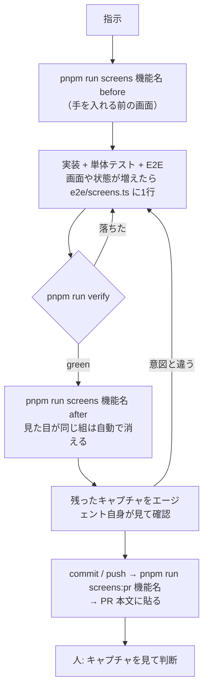

# k-note フロントエンドのハーネス

変更を「どう確かめるか」の仕組み。単体テスト・E2E・画面キャプチャをどう組み合わせ、
どこまでを機械に任せ、どこからを人が見るかを決める。

- 作成日: 2026-09-23
- 関連: [AGENTS.md](../AGENTS.md)（この仕組みを使う側の手順）/ [architecture.md](./architecture.md)

---

## 1. 目的

**人に回すのは「見た目が意図どおりか」の判断だけにする。**

エージェント（または人）に変更を頼んでから PR が上がるまでに、機械で確かめられることは
全部機械で確かめ終えている状態を作る。レビューする人は PR 本文の before / after の
キャプチャを見て、意図どおりかどうかだけを決めればよい。

そのために、次の3つを満たす。

1. **1コマンドで全部確かめられる。** `pnpm run verify` が green なら、型・整形・単体テスト・
   E2E（画面が開けること、認可、CSRF を含む）は通っている
2. **キャプチャは誰が撮っても同じになる。** 手元の開発データや撮り方の違いが写り込まない
3. **見せるのは変わった画面だけ。** 変わっていない画面を人が見比べる手間を無くす

## 2. 何を、どこで確かめるか

| 確かめること | 仕組み | 置き場 | 失敗したら |
| --- | --- | --- | --- |
| 型・Svelte の検査 | `svelte-check` | — | `pnpm run check` が落ちる |
| 整形・lint | Prettier / ESLint | — | `pnpm run lint` が落ちる |
| 純ロジック・サービス層・権限の絞り込み・日付の境界 | Vitest（node） | `src/**/*.spec.ts` | 単体テストが落ちる |
| コンポーネントの表示と操作 | Vitest（実 chromium） | `src/**/*.svelte.spec.ts` | 単体テストが落ちる |
| 画面の振る舞い・未ログイン/他人の id で開けないこと・form POST（CSRF） | Playwright（本番ビルド） | `e2e/*.e2e.ts` | E2E が落ちる |
| **全画面が開けること・実行時エラーが無いこと・mobile で横にはみ出さないこと** | 画面カタログ | `e2e/screens.ts` + `e2e/screens.e2e.ts` | E2E が落ちる |
| 見た目が意図どおりか | **人**がキャプチャを見る | `docs/screenshots/<機能名>/` | PR で差し戻す |

下の5行は全部 `pnpm run verify` に入っている。CI（`.github/workflows/ci.yml`）も同じものを回し、
画面カタログのキャプチャを artifact `screens` として上げる。

## 3. 全体の流れ



## 4. 部品

### 4-1. E2E 専用の D1 — `.wrangler/e2e`

E2E のプレビューサーバー（`playwright.config.ts` の webServer）は `wrangler dev --persist-to .wrangler/e2e`
で上がり、開発用の `.wrangler/state` とは別の D1 を見る。

以前は同じ D1 を共有していたため、手元で `data:import:local` した本物の出馬表や
`pnpm run dev` で書いたメモが E2E とキャプチャに混ざっていた。これでは人によって結果が変わり、
before / after の比較も成り立たない。

`globalSetup`（`e2e/seed.ts`）が毎回、次の順で状態を作り直す。

1. `wrangler d1 migrations apply --local --persist-to .wrangler/e2e`（冪等）
2. 全テーブルを `DELETE`（テーブル名はその場で `sqlite_master` から引く。テーブルを足しても直さなくてよい）
3. `e2e/seed.sql` を流す

これで E2E は `pnpm run test:e2e` だけで完結する。事前の `db:migrate:local` は要らない。

### 4-2. seed — `e2e/seed.sql` と `e2e/seed.ts`

- 行の id は固定の ULID 風の文字列にし、テストから参照するものは `seed.ts` に定数で export する
- ログインは seed のセッション（`SESSION_TOKEN`）を Cookie に載せて行う（`e2e/login.ts`）。
  本番ビルドにはモック認証が無いので、これが唯一の経路
- 日付に依存する画面（ダッシュボードの「今週」など）は `date('now', '+9 hours', ...)` で
  seed を流した日から決める。未来であり続けてほしい行は 2099 年に置く

### 4-3. 画面カタログ — `e2e/screens.ts`

人がキャプチャで確かめる画面の一覧。1画面（または1状態）1行。

```ts
{ name: 'race-preview-editing', path: `/races/${PREVIEW_RACE_ID}/preview`, auth: true,
  prepare: async (page) => { await page.getByText('書き直す', { exact: true }).click(); } }
```

- `name` はファイル名になる（英小文字とハイフン）
- `prepare` で「開いた」「入力した」などの状態にしてから撮る。同じ URL の別状態は別の行にする
- `screens.e2e.ts` がこれを desktop（1280px）と mobile（390px）の2幅で開き、
  応答が 400 未満であること・ログイン画面に飛ばされないこと・`pageerror` と `console.error` が
  無いこと・mobile で横にはみ出さないことを確かめてから、全体を撮る

**画面を足した・見せたい状態が増えたときは、ここに1行足すのが変更の一部。**
足さないと、その画面は機械の確認からもキャプチャからも漏れる。

### 4-4. キャプチャ — `pnpm run screens <機能名> <before|after> [画面名...]`

`scripts/screens.ts` が `screens.e2e.ts` だけを走らせ、
`docs/screenshots/<機能名>/<before|after>/<画面名>.<desktop|mobile>.png` に置く。

after のときは、同名の before と画素単位で比べ、**見た目が変わらなかった組は両方消す**。
残るのは「この変更で見た目が変わった画面」と「before の無い（新しい）画面」だけになる。

比較は chromium の canvas で行う（依存を増やさないため）。どれかのチャンネルが 16/255 を超えて
ずれた画素が1つでもあれば「変わった」とみなす。同じコードを2回撮っても枠線の縁などが
8/255 ほど揺れるので完全一致では比べられない。一方で gray-500 → gray-600 程度の色替えでも
30 前後は動くので、その間を取っている。

### 4-5. PR 本文 — `pnpm run screens:pr <機能名>`

`scripts/pr-screens.ts` が、キャプチャの表（画面 / before / after）を Markdown で出す。
画像の URL は `https://raw.githubusercontent.com/<owner>/<repo>/<コミットSHA>/...` で組む。

ブランチ名ではなく SHA を使うのは、ブランチ名だとあとの push で PR に貼った画像まで差し替わり、
ブランチを消すと画像ごと消えるから。そのため、キャプチャがコミット済みで push 済みでなければ
エラーで止まる。

## 5. 決定性のための約束

キャプチャの比較が意味を持つのは、同じコードなら同じ画像になるときだけ。

- **データは seed の行だけ。** 画面に出るものが足りなければ seed を足す。E2E のテストが行を
  書くのは構わない（次の実行の前に消える）。`pnpm run screens` は `screens.e2e.ts` だけを
  走らせるので、seed だけの状態で撮れる
- **before と after は同じマシンで撮る。** フォントの描画は OS で違う。CI の artifact と手元の
  キャプチャを見比べない
- アニメーションは止め（`animations: 'disabled'`）、キャレットは隠し、`networkidle` と
  `document.fonts.ready` を待ってから撮る
- 時刻に依存する表示は、seed を流した日の中では変わらない。日付をまたいで before / after を
  撮ると差が出うる

## 6. 限界と、次に足すもの

- **admin の画面はカタログに無い。** seed のユーザーは `role='user'` だけ。管理画面
  （`/settings/admin`・`/races/new`・`/races/[id]/entries`）を撮るには admin のユーザーと
  セッションを seed に足し、`Screen` に「誰として開くか」を持たせる
- **開発サーバーにしか無い経路**（モック認証の警告帯・ユーザー切り替え）は本番ビルドに無いので撮れない
- 見た目の回帰を自動で止める仕組み（`toHaveScreenshot` の基準画像のコミット）は入れていない。
  OS ごとに基準画像が要り、見た目を変えるたびに更新の手間がかかる割に、この規模では
  人が before / after を見るほうが安い。変わった画面だけを出す仕組みで代えている
