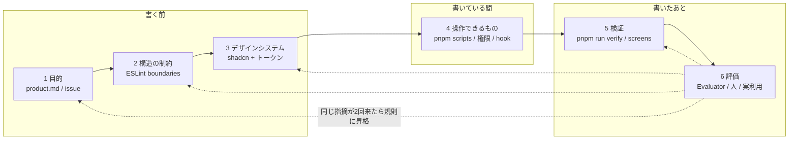
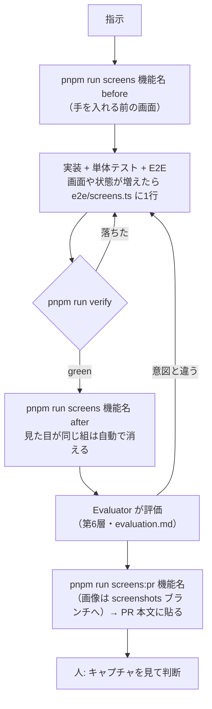
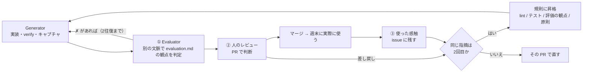

# uma-memo のハーネス

エージェント（または人）に変更を頼んでから PR が上がるまでを支える仕組み全体。
何を作るかの伝え方から、どこに書いてよいか、どう見せるか、何を操作してよいか、
どう確かめるか、良かったかをどう判断して次に活かすかまでを、6つの層に分けて決める。

- 作成日: 2026-09-23
- 更新日: 2026-09-23 — 検証の仕組みだけだった文書を6層の設計に組み直した。
  旧版の内容は第5層（→ 5章）にそのまま入っている
- 更新日: 2026-09-23 — コンテキストの設計（第7章）を足した。AGENTS.md を知識の目次にし、
  書くときに要る決まりを分野ごとの文書（architecture / frontend / design-system / testing / api）に移した。
  この文書には、仕組みをなぜこう組むかと、これから入れるものだけを残す
- ステータス: 第5層とコンテキスト（第7章）は稼働中。それ以外は設計。実装は 9章の順に別 PR で入れる
- **読む場面:** ハーネスの仕組みそのものを変えるとき。lint の規則・検査を足すとき。
  日々の作業では読まなくてよい（要ることは AGENTS.md の目次から各文書へ）
- 関連: [AGENTS.md](../AGENTS.md)（目次）/ [product.md](./product.md) / [architecture.md](./architecture.md)

---

## 0. 目的と、層の分け方

**人に回すのは「見た目と使い心地が意図どおりか」の判断だけにする。**

機械で確かめられることは、PR が上がる前に全部機械で確かめ終えている状態を作る。
そのために、エージェントが迷ったり間違えたりする場所を6つに分け、層ごとに
「正はどこに書いてあるか」「機械がどこまで強制するか」「人は何を判断するか」を決める。

```
┌────────────────────────────────────┐
│ 1. Goal / Product Context          │  何を・なぜ作るか
├────────────────────────────────────┤
│ 2. Architecture Constraints        │  どこに・どう実装してよいか
├────────────────────────────────────┤
│ 3. Design System                   │  どう見せるか
├────────────────────────────────────┤
│ 4. Tools / Runtime                 │  AI が何を操作できるか
├────────────────────────────────────┤
│ 5. Verification                    │  正しく動くか
├────────────────────────────────────┤
│ 6. Evaluation / Feedback Loop      │  良い UI・UX なのか
└────────────────────────────────────┘
```

上の3層は「書く前に知っておくこと」、下の3層は「書いたあとに確かめること」。
第6層で見つかった指摘は、同じ指摘が二度と来ないように上の層の規則へ戻す（→ 6-4）。
6層の知識を、エージェントがどの順でどこから読むかは第7章「コンテキストの設計」で決める。



### 各層の現状

| 層 | 正（どこに書いてあるか） | 機械の強制 | 現状 |
| --- | --- | --- | --- |
| 1 目的 | README / product.md | なし | 仕様はあるが、「誰がどの場面で使うか」と UX の原則が文になっていない |
| 2 構造 | architecture.md 第2章 | **なし**（言葉の約束だけ） | 違反が4件ある（→ 2-5） |
| 3 見せ方 | design-system.md / `layout.css` / `components/ui/` | なし | 生の色指定が約250箇所。shadcn のトークンが半分しか使われていない |
| 4 操作 | AGENTS.md「コマンド」 | なし | 本番に触るコマンドの禁止は言葉だけ |
| 5 検証 | testing.md | `pnpm run verify` / CI | 稼働中 |
| 6 評価 | なし | なし | 人がキャプチャを見るだけ。指摘が規則に戻る道が無い |

**機械の強制が無い層は、エージェントが読み落とした時点で破られる。** この設計の中心は、
第2層と第3層の約束を ESLint に落とし、`pnpm run lint`（＝ `verify` と CI）で止めることにある。

---

## 1. Goal / Product Context — 何を・なぜ作るか

### 1-1. 役割

エージェントが「この変更で誰の何が良くなるか」を知った状態で書き始めるようにする。
これが無いと、指示の字面は満たしているが使う場面に合わない画面ができる
（例: スマホで観戦しながら書くのに、横に長いフォームを作る）。
第6層の評価も、ここに書いた原則を物差しにする。

### 1-2. 正の置き場

| 文書 | 中身 | 状態 |
| --- | --- | --- |
| [README.md](../README.md) | 何のアプリか・いまのフェーズ | ある |
| [product.md](./product.md)（旧 design.md） | 要件・データモデル・画面・やらないこと | ある |
| product.md の冒頭 | 誰が・どの場面で・何のために使うか。UX 原則（1-3） | **足す** |
| **`.github/ISSUE_TEMPLATE/`** | 変更の頼み方の型 | **足す** |

product.md は仕様の詳細で長いので、UX 原則は冒頭の1画面に収め、エージェントが最初に読む入口にする。

### 1-3. UX 原則（草案）

product.md とこれまでの PR で下された判断から拾った。番号は PR や Evaluator の評価（→ 6-2）から
`P3` のように引くためのもの。

| # | 原則 | 根拠 |
| --- | --- | --- |
| P1 | **ふりかえりは1画面・1送信。** 全頭分を1画面で書き、1回で保存する | product.md 第6章 `/races/[id]` |
| P2 | **既定は閉じる。** 他人のメモはどこにも出ない。共有は1件ずつ、明示の操作で | product.md 第2章 2-2 |
| P3 | **時間で入口を分ける。** 開催前は予想、開催後はふりかえり。その時に要らない操作は出さない | product.md 第6章 `/races/[id]/preview` |
| P4 | **毎回踏む導線だけ出しっぱなし。** それ以外は畳む（アカウントメニュー、`⋯`） | product.md 第6章 ヘッダ / 共有を `⋯` に畳んだ変更 |
| P5 | **スマホで書ける。** 390px で横にはみ出さず、片手で押せる | 画面カタログの mobile 幅 |
| P6 | **書きかけを失わない。** 送信前に画面を離れても戻せる | `DraftKeeper` |
| P7 | **色だけに意味を持たせない。** 枠・印・グレードは必ず文字も出す | `BracketBadge` のコメント |

これは草案で、正にするのは product.md の冒頭に入れる PR で人が確かめてから。

### 1-4. 頼み方の型 — issue テンプレート

指示が「〜を直して」だけだと、エージェントは受け入れ条件を自分で作るしかない。
issue を次の型で書けば、そのまま PR の「なぜ」と第6層の評価の物差しになる。

```yaml
# .github/ISSUE_TEMPLATE/change.yml（案）
- 場面: いつ・どの端末で・何をしようとしているとき
- 困っていること: いま何が起きていて、なぜ困るか
- できたら: 何ができるようになれば良いか（見た目の案ではなく結果で）
- 関係する原則: P1〜P7 から（無ければ「新しい原則が要るか」を書く）
- 受け入れ条件: 箇条書き。E2E か画面カタログの1行に落とせる粒度で
```

### 1-5. 機械の強制

この層は文章なので機械では止めない。代わりに、PR テンプレートの「なぜ」に
関係する原則の番号を書かせ、第6層の Evaluator と人のレビューで見る。

---

## 2. Architecture Constraints — どこに・どう実装してよいか

### 2-1. 役割

「この処理はどのファイルに書いてよいか」「どこからどこを import してよいか」を
**CI で止める**。architecture.md 第2章の6層構成はいま言葉の約束だけで、実際に破られている（→ 2-5）。
エージェントは近くにある既存コードを真似て書くので、一度破られた約束はそのまま増える。

依存の向きは **縦（層）と横（機能）の2軸**で決め、どちらも一方向にする。

### 2-2. 規則の中身 — architecture.md 第2章

**import してよい先の表は [architecture.md 第2章「依存の向き」](./architecture.md) を正にする。**
エージェントが書くときに読むのはそちらで、この文書は「どう止めるか」だけを持つ。要点は3つ。

- 縦（層）: 画面側はサーバーのコードを型ですら import しない。service は SvelteKit を知らない。
  SQL（`drizzle-orm`）は db / service / auth にしか無い
- 横（機能）: `horses ← races ← notes ← share ← dashboard` の順に並べ、右は左を使ってよいが左は右を使わない。
  順位なので循環は起こりえない。並びは今のコードの向き（`services/races.ts` が `findOrCreateHorse` を、
  `services/notes.ts` が `races` の型を使っている）に合わせた
- ルート（`src/routes/`）は機能を組み合わせる場所なので、横の軸の制約は受けない

パッケージ単位の禁止（`@sveltejs/kit`・`drizzle-orm`・`arctic` を使ってよい場所）は ESLint 標準の
`no-restricted-imports` を `files` ごとに掛ける。ファイル間の向きは次の 2-4 のプラグインで見る。

```ts
// eslint.config.js（案）— 左ほど下。機能の順序はここと architecture.md 第2章で揃える
const FEATURES = ['horses', 'races', 'notes', 'share', 'dashboard'];
```

### 2-3. 機能をディレクトリで表す

ファイル名から機能を推すのは規則に書けないので、
component と utils は機能ごとのディレクトリに移す。service はもともと1機能1ファイルなのでそのまま。

```
src/lib/
├── components/
│   ├── ui/          shared（shadcn 生成物）
│   ├── shell/       shared   AccountMenu
│   ├── races/       GradeBadge / BracketBadge / RaceHeading / RaceFilterForm / RaceListEmpty / PastRuns
│   ├── notes/       MarkBadge / MarkPicker / TagBadges / TagPicker / KindBadge / NoteMenu / AnswerCheck / DraftKeeper
│   └── share/       ShareControl / SharedBadge
├── utils/
│   ├── date.ts / redirect.ts / role.ts        shared
│   ├── races/race-filter.ts
│   ├── notes/answer.ts, note.ts
│   └── dashboard/dashboard.ts
└── server/services/  horses.ts / races.ts / notes.ts（share と dashboard は今は notes.ts の中）
```

どのディレクトリにも当たらないファイルは `boundaries/no-unknown-files` で落とす。
新しいファイルを足すときに、どの層・どの機能かを決めることを強制するため。

### 2-4. 検査の仕組み — eslint-plugin-boundaries

`eslint-plugin-boundaries` を入れ、`pnpm run lint` の中で回す。CI の「整形と lint」の段で
そのまま止まるので、ワークフローは変えない。

**dependency-cruiser ではなくこれを選んだ理由。** 2026-09-23 に両方をこのリポジトリに当てて比べた。

| | dependency-cruiser 18.4 | eslint-plugin-boundaries 7.2 |
| --- | --- | --- |
| `.svelte` の読み方 | Svelte コンパイラに通してから読む | svelte-eslint-parser の構文木をそのまま読む |
| `.svelte` の `import type` | **コンパイルで消えて見えない** | 見える |
| `PastRuns.svelte` → `services/races` の違反 | **検出できない** | 検出した |
| 実行の場所 | 別コマンド・別の段 | `pnpm run lint` に入る。エディタにも出る |
| 循環の検出 | ある | 無い（順位で並べるので要らない） |

画面側からサーバーの型を引く違反が実際にあり、それを見逃すツールでは目的を果たせない。

規則の書き方の骨子（v7 の書式で動くことを確認済み）:

```js
settings: {
  'import/resolver': { typescript: { project: './tsconfig.json' } }, // $lib を解決する
  'boundaries/elements': [
    // capture は pattern の * を順に拾う
    { type: 'component', pattern: 'src/lib/components/*/*.svelte', capture: ['feature'] },
    { type: 'service', pattern: 'src/lib/server/services/*.ts', capture: ['feature'] },
    // …層ごとに1行
  ],
  'boundaries/ignore': ['**/*.spec.ts'] // テストは対象の隣に置くので規則の外に出す
},
rules: {
  'boundaries/dependencies': [2, { default: 'disallow', policies: [
    ...layerPolicies,     // 2-2 の表
    ...featurePolicies    // FEATURES から生成。左 → 右 を disallow
  ] }],
  'boundaries/no-unknown-files': 2
}
```

試して分かった注意点:

- **policies は後ろに書いたものが勝つ。** 機能の禁止（disallow）は層の許可（allow）より後ろに置く
- `captured` に `{ anyOf: [...] }` を書くとプラグインが落ちる。1機能1 policy で生成する
- spec ファイルを `ignore` しないと `notes.spec` という機能として扱われる
- `mode: 'full'` は非推奨。`partialMatch: false` を使う

違反のメッセージには policy の `message` で「なぜ駄目か・どこに置けばよいか」を返す。
エージェントはエラー文を読んで直すので、規則名だけより直りが早い。

### 2-5. 今ある違反

試しに規則を当てて見つかったもの。規則を入れる PR で全部直す（件数が少ないので、抑制して先送りしない）。

| ファイル | 違反 | 直し方 |
| --- | --- | --- |
| `src/lib/components/PastRuns.svelte:3` | component → service（`import type { PastRun }`） | 型を `PageData` から取るか pure に移す |
| `src/routes/+page.svelte:13` | page → service（`import type { RaceProgressItem }`） | 同上 |
| `src/routes/settings/admin/+page.server.ts:2` | endpoint が `drizzle-orm` で直接 SQL を組む | ユーザー凍結を service（`services/users.ts`）に移す |
| `src/lib/server/services/notes.ts:6` | notes → dashboard（`WatchSourceRow` の型） | 型を notes 側に置き、dashboard から使う向きにする |

architecture.md 第2章にあった手描きの「モジュール依存図」は、実物とずれていた
（`schemas/horse.ts` は無い）ので消した。依存の向きの正は、この層と `eslint.config.js` だけにする。

### 2-6. ランタイム上の約束との関係

architecture.md 第0章「守ること」のうち、この層の規則で止まるようになるものと、残るもの。

| 約束 | 止め方 |
| --- | --- |
| サービス層は SvelteKit を import しない | **規則で止まる**（2-2） |
| 認証の判断は `hooks.server.ts` に閉じる | 一部。`auth` を import してよいのを endpoint に限る |
| メモを読む関数は `viewerId` を必須で受け、WHERE に入れる | 規則では止まらない。単体テストと E2E（他人の id で開けない）で見る |
| D1 クライアントはリクエストごとに作る | 規則では止まらない。`createDb` をモジュールスコープで呼ぶのを `no-restricted-syntax` で止めるのが候補 |
| 1リクエストの D1 クエリは10以内 | 第5層で数える（→ 5-4） |

---

## 3. Design System — どう見せるか

### 3-1. 役割

エージェントが画面を書くときに、色・大きさ・部品を**選ぶだけ**で済むようにする。
いまは `text-gray-500` のような生の色が約250箇所あり、画面ごとに少しずつ違う灰色や赤が
使われている。エージェントは近くの画面を真似るので、揺れはそのまま増える。

shadcn-svelte を前提に「① トークン → ② shadcn の部品 → ③ ドメイン部品」の3段で組み、
**下の段にあるもので済むなら上の段を作らない。**

### 3-2. 決まりの中身 — design-system.md

**トークンの表・部品の選び方・ドメイン部品の一覧・大きさと文言の決まりは
[design-system.md](./design-system.md) を正にする。** この文書は、その決まりを
どう止めるか（3-3）と、今の約250箇所をどう移すか（3-3 の後半）だけを持つ。

要点:

- 色は意味で呼ぶ。shadcn のトークン（`text-muted-foreground`・`border-border`・`bg-muted`・`destructive`）で足りないものは
  アプリ固有のトークン（`--warning`・`--success`・`--info`・`--bracket-1〜8`・`--grade-g1〜g3`・`--text-2xs`）として足す
- 枠色とグレードは外の世界で決まっている色なので、トークンにして1箇所に閉じ込める
- `components/ui/` は `pnpm exec shadcn-svelte add` で入れ、手で直さない。素の `<button>` `<select>` `<textarea>` を書かない
  （今は画面側に13箇所ある）

### 3-3. 機械の強制

| 決まり | 止め方 | 確認 |
| --- | --- | --- |
| 素の `<button>` `<select>` `<textarea>` を画面に書かない | `svelte/no-restricted-html-elements`（eslint-plugin-svelte に入っている） | 規則があることは確認済み |
| パレットの色名を使わない（`(bg\|text\|border\|ring\|fill)-(gray\|red\|…)-\d+`） | `eslint-plugin-better-tailwindcss` の `no-restricted-classes` | **未確認**。Svelte 5 と Tailwind v4 で動くかを実装の PR で最初に確かめる。動かなければ正規表現で探す小さなスクリプト（`scripts/check-design.ts`）を `lint` に足す |
| 任意値（`text-[11px]`）を使わない | 同上 | 同上 |
| `components/ui/` を手で直さない | 規則では止めない。lint の対象外にしてあるので、差分があれば PR で見て分かる | — |

`<input>` は止めない。20箇所のうち10箇所がフォームの `type="hidden"` で、要素名だけでは
区別できないため。残りの10箇所は置き換えの PR で `Input` に寄せる。

**置き換えは「見た目が変わらない」ことを機械で確かめながら進める。**
生の色を同じ値のトークンに置き換える PR は、`pnpm run screens <機能名> after` で
**残る画像が0枚**になるはず（→ [testing.md 5-1](./testing.md)。変わらなかった組は自動で消える）。1枚でも残れば
置き換えを間違えている。デザインの変更と置き換えを別の PR にするのはこのため。

**既存の違反は ESLint の一括抑制で凍結してから直す。** 約250箇所を1つの PR で直すと
見比べられないので、規則を入れる PR で `eslint --suppress-rule` により今ある違反だけを
`eslint-suppressions.json` に記録する。新しい違反は即座に落ち、記録された違反は
画面ごとの置き換え PR で減らしていく（`--prune-suppressions` で記録も減る）。
記録の件数は増やさない、を約束にする。

---

## 4. Tools / Runtime — AI が何を操作できるか

### 4-1. 役割

エージェントが「何を叩けば何が分かるか」を知っていて、「叩いてはいけないもの」は
叩けないようになっている状態を作る。

### 4-2. 操作面

| 目的 | コマンド | 所要 |
| --- | --- | --- |
| 全部確かめる | `pnpm run verify` | 数分 |
| 部分だけ | `pnpm run check` / `pnpm run lint` / `pnpm run test:unit` / `pnpm run test:e2e` | 数秒〜数分 |
| 直す | `pnpm run format` | 数秒 |
| 撮る・比べる | `pnpm run screens <機能名> before\|after [画面名...]` / `pnpm run screens:pr <機能名>` | 数分 |
| 触って見る（開発データ） | `.dev.vars` に `MOCK_AUTH="1"` を置いて `pnpm run dev` | — |
| 触って見る（seed と同じ状態） | **足す**: `pnpm run preview:e2e`（E2E と同じビルドと D1 で上げる） | — |
| データ | `pnpm run data:check` | 数秒 |
| スキーマ | `pnpm run db:generate` / `pnpm run db:migrate:local` | 数秒 |

**`preview:e2e` を足す理由。** 開発サーバーは手元の D1 を見るので、エージェントがブラウザで
触った画面とキャプチャの画面が一致しない。E2E の webServer（`playwright.config.ts`）と同じ
コマンドを script にして `.claude/launch.json` に載せれば、Claude のブラウザから
キャプチャと同じ状態を操作できる。

### 4-3. 叩いてはいけないもの — 言葉から権限へ

いま本番に触るコマンドの禁止は architecture.md 第0章の文章だけ。これを Claude Code の権限設定で止める。

```jsonc
// .claude/settings.json（コミットする。案）
{
  "permissions": {
    "deny": [
      "Bash(pnpm run deploy:*)",
      "Bash(pnpm run db:migrate:remote:*)",
      "Bash(pnpm run data:import:remote:*)",
      "Bash(pnpm exec wrangler deploy:*)",
      "Bash(pnpm exec wrangler secret:*)",
      "Bash(*--remote*)"
    ]
  }
}
```

書式（途中の `*` が効くか、PowerShell 経由も止まるか）は入れる PR で実際に叩いて確かめる。
Claude Code 以外のエージェントには効かないので、文章の約束は残す。
**最後の防波堤は構造のほう**で、Cloudflare の API トークンは手元にも PR のワークフローにも無く、
`deploy.yml` と `data-import.yml` だけが持っている。

### 4-4. 書いている間の即時の手応え — hook

`verify` は数分かかるので、層の違反に気づくのが遅れる。ファイルを書いた直後に、
そのファイルだけを整形して lint する hook を置く。

```jsonc
// .claude/settings.json の hooks（案）
"PostToolUse": [{
  "matcher": "Edit|Write",
  "hooks": [{ "type": "command", "command": "node scripts/hook-lint-file.ts" }]
}]
```

`scripts/hook-lint-file.ts` は、書かれたファイルが `src/` 以下なら `prettier --write` と
`eslint` をそのファイルにだけ掛け、違反があれば出力をエージェントに返す。
第2層・第3層の規則がここで効くので、import を1行書いた時点で「その向きは駄目」と分かる。

### 4-5. 実行環境の前提

- Node 24 / pnpm 10（`packageManager`）。CI と同じ
- Windows と Linux の両方で動くこと。script は `node --experimental-strip-types` で書き、シェルに依存しない
- キャプチャは OS でフォントの描画が違う。before / after は同じマシンで撮る（→ [testing.md 第6章](./testing.md)）

---

## 5. Verification — 正しく動くか

稼働中。**仕組みの説明と使い方は [testing.md](./testing.md) を正にする**（テストの置き場、E2E 専用の D1、seed、
画面カタログ、キャプチャの撮り方と比べ方、決定性の約束、限界）。この文書は、なぜこう組んだかの要点と、これから足す検査だけを持つ。

### 5-1. 組み方の要点

- **1コマンドで全部確かめられる。** `pnpm run verify` が green なら、型・整形・lint・単体テスト・
  E2E（画面が開けること、認可、CSRF を含む）は通っている。CI も同じものを回す
- **キャプチャは誰が撮っても同じになる。** E2E 専用の D1 を毎回 seed から作り直し、手元の開発データを写さない
- **見せるのは変わった画面だけ。** after を before と画素で比べ、変わらなかった組は消す
- 第2層・第3層の規則が入ると、`pnpm run lint` に「層と機能の依存の向き」「トークンと部品の使い方」が加わる

### 5-2. 全体の流れ



### 5-3. 画面カタログに足す検査

`screens.e2e.ts` は全画面を2幅で開いているので、1画面ごとに見られる UI の品質はここに足すのが安い。

| 検査 | やり方 | 落とす基準 |
| --- | --- | --- |
| アクセシビリティ | `@axe-core/playwright` を各画面に掛ける | 重大度 `critical` / `serious` だけ。`moderate` 以下は PR に件数を出すだけ |
| 押せる大きさ（P5） | mobile 幅で `a, button, [role=button], input, select, textarea` の外接矩形を測る | 24px 四方未満（WCAG 2.2 の 2.5.8）。インラインの文中リンクは除く |

どちらも初回は既存の違反が出るはずなので、画面ごとの許容リストを `screens.ts` に持たせて
始め、減らしていく（第3層の一括抑制と同じ考え方）。

### 5-4. 1リクエストの D1 クエリ数

architecture.md 第0章の「1リクエストの D1 クエリは10以内」はいま機械で見ていない。
E2E のビルドだけで、リクエストごとのクエリ数を応答ヘッダ（例: `x-uma-memo-queries`）に載せ、
`screens.e2e.ts` で10以下を確かめる。

- 数えるのは `createDb` が返す Drizzle に logger を渡す形で行う。リクエストごとに作るので
  数もリクエストに閉じる（モジュールスコープに持たない、の約束と両立する）
- ヘッダを付けるのは `wrangler dev --var E2E:1` のときだけ。`MOCK_AUTH` と同じく、
  本番のビルドでは分岐ごと消える形にする

### 5-5. CI の構成

手元の `pnpm run verify` と CI は同じものを回す。**CI にしか無い検査を作らない**（手元で再現できないと直せない）。
例外は PR 本文の検査だけで、これは PR が無いと意味が無い。

| ワークフロー | ジョブ | 回すもの | 状態 |
| --- | --- | --- | --- |
| `ci.yml` | 検証 | `data:check` → `check` → `lint`（Prettier・ESLint・`docs:check`）→ 単体テスト | 稼働中。`docs:check` は今回 lint に入れた |
| `ci.yml` | E2E | `test:e2e`（画面カタログを含む）。キャプチャを artifact `screens` に上げる | 稼働中 |
| `pr-body.yml` | 欄が埋まっているか | `scripts/check-pr-body.ts`。「何を変えたか」「レビューで見てほしいところ」「なぜ」「画面」「評価」が空なら落ちる | **今回入れた** |
| `deploy.yml` | — | リリース時に `ci.yml` を呼び直してからデプロイ | 稼働中（人がリリースする） |
| `data-import.yml` | — | `main` の `data/races/**` の変更を本番 D1 に投入 | 稼働中 |

これから lint と E2E に入るもの（ワークフローは変えずに、中身が増える）:

| 層 | 入るもの | 入る場所 |
| --- | --- | --- |
| 2 | 層と機能の依存の向き（boundaries）・パッケージの禁止 | 検証 / lint |
| 3 | パレットの色名・任意値・素の操作部品の禁止 | 検証 / lint |
| 5 | axe・押せる大きさ・1リクエストの D1 クエリ数 | E2E |
| 6 | Evaluator | **人が決める**（6-2 の最後） |

**E2E の不安定なテストは直した（2026-09-23）。** 全体を並列で回すと、レースのメモを保存して読み直すテスト
（`races.e2e.ts`「開催前に書いた見立ては…」・`dashboard.e2e.ts`「予想だけしたレースが…」）が時々落ちていた。
原因は hydration 前の入力が hydration で消えることで、入力の前に hydration を待つようにした
（→ [testing.md 第2章](./testing.md)）。リトライでは隠していない。

---

## 6. Evaluation / Feedback Loop — 良い UI・UX なのか

### 6-1. 役割

第5層は「壊れていないか」までしか見ない。「使いやすいか」「頼まれたものか」は
機械では決めきれないので、**判断の物差しを先に文にしておき**（[evaluation.md](./evaluation.md)）、
Evaluator・人のレビュー・実際に使った感触の3段で見る。そして、繰り返し出る指摘を下の層の規則に戻す。



### 6-2. ① Generator と Evaluator を分ける

**書いたエージェントに、自分の成果物の合否を付けさせない。** 書いた本人は「こう作ったつもり」を
知っているので、自分の画面を甘く読む。キャプチャを自分で見て確かめる（5-2）のは崩れを拾うためで、
合否の判断ではない。合否は、別の文脈で動く Evaluator が付ける。

| | Generator | Evaluator |
| --- | --- | --- |
| 受け取るもの | 指示・コード・文書 | **指示の原文**・差分・キャプチャ・evaluation.md だけ |
| 受け取らないもの | — | Generator の説明や意図の解説 |
| 書き換え | する | しない（読むだけ） |
| 実体 | いま作業しているエージェント | Claude Code では `.claude/agents/evaluator.md` のサブエージェント。ほかのエージェントでは新しいセッション |

観点は4つに分け、項目と「機械が見ている部分」を [evaluation.md 第3章](./evaluation.md) に置く。

| 観点 | 見ること |
| --- | --- |
| Functional | 操作できるか・error state・loading state・空の state |
| Accessibility | keyboard 操作・label・contrast・focus・色だけに頼らない |
| Design | hierarchy・spacing・consistency・density |
| Product | goal を満たすか・不要な機能を足していないか・原則に反していないか |

決めたこと:

- **判定は `✓` `✗` `—` `?` の4つ。確かめていないものを `✓` にしない。** 見られなかったら `?` と、何を見れば確かめられるかを書かせる。
  評価で一番まずいのは「見ていないのに通す」こと
- **根拠（キャプチャのファイル名か `ファイル:行`）の無い指摘はしない。** 印象の指摘は直しようがない
- **Generator は指摘をそのまま採らない。** 指摘ごとに事実を確かめてから直す。Evaluator も間違える
- **やり取りは2往復まで。** 残った `✗` と `?` は PR 本文の「評価」に載せて人に回す。
  エージェントどうしで延々と回すより、人が一度見るほうが早い
- 機械で見られる項目（label・contrast・focus の一部）は、axe を入れたら（5-3）機械に移し、Evaluator からは外す

**CI で Evaluator を回すか。** PR ごとに GitHub Actions から自動で回す形（`anthropics/claude-code-action` など）も取れるが、
API キーをリポジトリのシークレットに置くことになり、料金もかかる。シークレットの扱いは人が決める約束
（architecture.md 第0章）なので、今は手元で Generator が呼ぶ形にし、CI に載せるかは人が決める（第8章）。

### 6-3. ② 人のレビュー

人は PR のキャプチャを見て判断する（今と同じ）。変えるのは差し戻すときの書き方だけで、
**どの層の問題かを1語添える**。

| ラベル | 意味 | 直す場所 |
| --- | --- | --- |
| `意図` | やりたいことと違う | 第1層（指示・issue の書き方） |
| `構造` | 置き場所・依存の向きがおかしい | 第2層 |
| `見た目` | 揃っていない・トークンを外れている | 第3層 |
| `壊れ` | 動かない・崩れている | 第5層（なぜ機械で止まらなかったか） |
| `使い心地` | 動くが使いにくい | 第6層（evaluation.md の観点） |

### 6-4. 指摘を規則に昇格する

**同じ指摘が2回来たら、3回目が起きないように下の層の仕組みにする。** 人のレビューで
同じことを言い続けるのが一番高くつくため。昇格先は機械で止められるものから選ぶ。

1. lint の規則にできるか（第2層・第3層）
2. テストか画面カタログの検査にできるか（第5層）
3. evaluation.md の観点にできるか（第6層）
4. どれも無理なら、原則（product.md）か、第7章の置き場に従って分野の文書の約束にする

昇格したものはこの文書の末尾「昇格の記録」に1行ずつ残す（いつ・どの指摘が・どこに入ったか）。
規則が増えすぎていないか、効いていない規則が無いかを見返せるようにするため。

### 6-5. ③ 使った感触

実際の利用は週末に集中する（architecture.md 第1章）。使って引っかかったことは、
その場で issue テンプレート（1-4）の「場面」と「困っていること」だけ書いて残す。
清書は平日にやればよい。本番のエラーは Workers Logs で人が見る（エージェントからは見ない）。

---

## 7. コンテキストの設計 — AGENTS.md は知識の目次

### 7-1. 役割

エージェントは作業のたびに AGENTS.md を読む（Claude Code は CLAUDE.md から毎回読み込む）。
ここに全部を書くと、毎回の読み込みが重くなり、関係の無い約束に埋もれて肝心の約束を読み落とす。
逆に分けただけで入口が無いと、要る文書にたどり着けない。

**AGENTS.md は知識の目次にし、詳細は分野ごとの文書に1つずつ置く。** エージェントは
目次から「いま触る分野」の文書だけを開く。

### 7-2. 形

```
AGENTS.md（目次。毎回読む）
│
├── architecture → docs/architecture.md   層・依存の向き・ランタイムの約束・DB とデータ・コスト
├── frontend     → docs/frontend.md       ファイルの役割・Svelte の書き方・フォーム・コンポーネント
├── design       → docs/design-system.md  トークン・shadcn の部品・ドメイン部品・大きさと文言
├── testing      → docs/testing.md        テストの置き場・E2E・画面カタログ・キャプチャ
├── api          → docs/api.md            ルートの一覧・action の約束・サービス層の関数の約束
└── evaluation   → docs/evaluation.md     Generator と Evaluator の分け方・評価の観点
│
└── ほか          product.md（何を・なぜ）/ harness.md（この文書）/ operations.md（構築とデプロイ）/
                  data/README.md（出走馬データ）
```

読む深さは3段にする。

| 段 | 何を | いつ |
| --- | --- | --- |
| 1 | AGENTS.md — 目指す状態、止めてよいとき、手順の骨子、目次 | 毎回 |
| 2 | 分野の文書 — 冒頭の「読む場面」で要否を決め、要る章だけ読む | 触る分野だけ |
| 3 | コードのコメント — その場所に固有の理由（「なぜ 404 か」など） | そのファイルを触るとき |

### 7-3. 書き方の約束

| 約束 | 理由 |
| --- | --- |
| AGENTS.md には詳細を書かない。**120行以内** | 毎回読むものは短くないと読み落とされる |
| 1つの知識は1つの文書にだけ書き、他からはリンクする | 写すと片方だけ直されてずれる |
| どの文書も冒頭に「読む場面」と「ここに無いもの（どこにあるか）」を書く | 開く前に要否を決められ、開いたあと他所へ探しに行ける |
| 約束は理由と一緒に書く | 理由が無いと、例外の場面で判断できない |
| 「書くときに要る決まり」と「なぜそう組んだか・これから入れるもの」を分ける | 前者は frontend / design-system / testing / api / architecture 第0章、後者は product / architecture / harness。日々の作業で後者を読まずに済む |
| まだ無いもの（予定のトークン・規則）は「まだ使えない」と書く | 書いてあるものは使えると読まれる |
| 名前で取り違えない | design.md を product.md に改名したのは design-system.md と紛れるため |
| 文書を足したら AGENTS.md の目次に足す | 目次に無い文書は読まれない |
| CLAUDE.md は AGENTS.md を読み込み、Claude Code 固有のことだけを書く | 他のエージェントと同じ知識を見るため |

### 7-4. 長く自走させるための書き方

Opus 5.5 の使い方の手引き（[Getting the most out of Opus 5.5](https://claude.dev/blog/getting-the-most-out-of-opus-5-5/)）から、
このリポジトリに当てはまるものを取り入れた。

| 取り入れたこと | どこに |
| --- | --- |
| **完了の条件を先に書く。** 何がそろえば終わりかが分かれば、途中で確認を求めずに進められる | AGENTS.md「目指す状態」の4条件 |
| **止まる条件を決める。** 入力が要るときと、取り消しにくい操作の前だけ止まる | AGENTS.md「目指す状態」 |
| 取り消しにくい操作は権限の確認を残す | 第4層 4-3（deny） |
| **長い作業は進み具合をファイルに残す。** 会話が要約されても続きを拾える | AGENTS.md「作業の手順」の `TASKS.md`（コミットしない） |
| **サブエージェントの結果は確かめてから採る** | 第6層 6-2（Evaluator の指摘をそのまま採らない） |
| **確かめていないものは確かめていないと書く** | evaluation.md の `?` |
| 人のレビューの前にエージェントに差分を見させる | 第6層 6-2（Evaluator）。コードの誤りは `/code-review` も使える |
| **人の判断が要ることを先に読ませる** | PR テンプレートの「レビューで見てほしいところ」を2番目に上げた |
| デザインは「避けたいもの」を並べる | design-system.md 第6章 |
| 「よく考えて」のような指示は書かない（モデルが自分で考える） | 文書と、Evaluator の定義（`.claude/agents/evaluator.md`） |

### 7-5. 機械の強制 — `scripts/check-docs.ts`

`pnpm run lint` の中で回る（＝ `verify` と CI で止まる）。

- 文書の中の相対リンクの先が在る
- `docs/*.md` がすべて AGENTS.md から張られている（目次に無い文書を作らない）
- AGENTS.md が120行以内
- コード・文書に出てくる `〇〇.md` という名前の文書が在る（改名したときの取り残しを拾う）。
  `drizzle/` の生成物は手で直さない約束なので対象外

見出しへのリンク（`#...`）の先までは見ない。日本語の見出しの anchor の作り方が GitHub 次第で、
確かめる手間に見合わない。

---

## 8. 決めたこと・決めていないこと

| 論点 | 決めたこと | 理由 |
| --- | --- | --- |
| 依存の検査ツール | eslint-plugin-boundaries | `.svelte` の `import type` を見逃さない（2-4） |
| 機能の表し方 | 層の下に機能のディレクトリ | SvelteKit の `$lib/server` の保護を保ったまま、規則を glob で書ける |
| 既存違反の扱い（第2層） | 規則を入れる PR で全部直す | 4件しかない |
| 既存違反の扱い（第3層） | 一括抑制で凍結して、画面ごとに減らす | 約250箇所。1つの PR で見比べられない |
| 見た目の回帰テスト | 入れない | [testing.md 第7章](./testing.md) |

決めていないこと（実装の PR で決める）:

- **機能を最上位のディレクトリにするか。** `src/lib/features/<機能>/` に層を入れる形も
  取れる。機能の境界はこちらのほうが強く見えるが、サーバーのコードが `$lib/server` の外に出るので
  `*.server.ts` の命名で守ることになる。今回は移動の少ない「層の下に機能」を選んだ
- **share と dashboard を service で分けるか。** 今は `services/notes.ts` の中にある。
  分けるのは、機能の向きの規則が効き始めてから、違反の出方を見て決める
- 第3層の lint を ESLint プラグインにするか、自前のスクリプトにするか（3-3 の確認次第）
- **Evaluator を CI で自動で回すか。** API キーをシークレットに置くことと、PR ごとの料金を人が決める（6-2）

---

## 9. 入れる順番

1つの PR で1つの層を入れる。前の PR の仕組みが次の PR の検証に効くよう、この順にする。

| # | PR | 層 | 中身 | 画面への影響 |
| --- | --- | --- | --- | --- |
| 0 | コンテキストと評価（**済み**） | 5 / 6 / 7 | AGENTS.md を目次にし、architecture / frontend / design-system / testing / api / evaluation に分けた。`docs:check`・Evaluator のサブエージェント・`pr-body.yml` | なし |
| 1 | 依存の規則 | 2 | boundaries と resolver を入れる。component / utils を機能のディレクトリへ移す。2-5 の4件を直す | なし（キャプチャ0枚を確かめる） |
| 2 | 操作と即時の手応え | 4 | `.claude/settings.json`（deny と hook）、`preview:e2e`、`.claude/launch.json` | なし |
| 3 | トークンと lint | 3 | design-system.md 2-2 のトークンを足し、「今使えるもの」に移す。lint 規則と一括抑制 | なし |
| 4〜 | 画面ごとの置き換え | 3 | 生の色と素の操作部品をトークンと shadcn に置き換える。1画面か1機能ずつ | **無いことを確かめる**（残る画像0枚） |
| 5 | 目的の型 | 1 | product.md の冒頭に UX 原則、issue テンプレート | なし |
| 6 | 画面カタログの検査 | 5 | axe、押せる大きさ、D1 クエリ数、admin の画面 | なし |

2 を 3 より先にするのは、hook があると置き換え中の違反がその場で分かり、4 以降の PR が速くなるため。

---

## 昇格の記録

6-4 で規則に昇格した指摘。

| 日付 | 指摘 | 入れた先 |
| --- | --- | --- |
| — | — | — |
