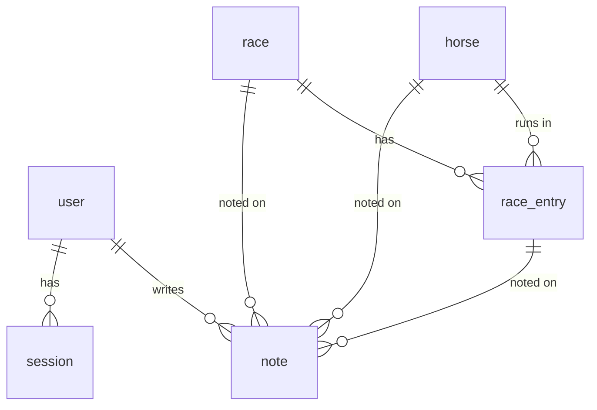

# uma-memo プロダクト仕様

競馬の観戦メモを残し、レース単位／馬単位でふりかえるための Web アプリ。
Cloudflare Workers 上で動かす。

- 作成日: 2026-09-20
- 更新日: 2026-09-21 — 公開範囲を「既定 private・共有は1メモずつ」に変更し、
  招待コードとメンバー概念を廃止、サイト管理者（`admin`）だけを残した（→ 第2章 2-2 / 第4章 / 第8章 Phase 5）
- 更新日: 2026-09-22 — 開催前のレースに「見立て」（`race_preview`）を書けるようにし、
  ふりかえり画面は開催前には開けないようにした（→ 第5章 note / 第6章 `/races/[id]` と `/races/[id]/preview`）
- 更新日: 2026-09-23 — design.md から改名した（design-system.md と取り違えないため）。
  「API の形」は api.md に移した
- 更新日: 2026-09-23 — アプリ名を k-note から uma-memo に変え、独自ドメイン `uma-memo.com` を当てた（→ 第4章）
- ステータス: 確定（実装着手可）
- **読む場面:** 機能を足す・変えるとき。何を・なぜ作るか、画面に何を出すか、やらないと決めたことを確かめるとき
- 関連: [architecture.md](./architecture.md) — アーキテクチャ / コスト / 技術選定の根拠

---

## 1. 前提・要件

### 決定済み

| 項目 | 決定 |
| --- | --- |
| 利用者 | 1人1空間。メモは既定で本人だけのもの。グループ／メンバーの概念は持たない |
| メモの公開範囲 | **既定は非公開。** 見せたいメモだけ1件ずつリンクを発行する（→ 第2章 2-2） |
| データ入力 | 馬・レース・出走馬は [data/races/](../data/races/) の YAML を PR で入れる。YAML は手でも、netkeiba から取ってくるコマンド（`data:fetch`）でも書ける。**アプリが外部から自動で取り込むことはしない**（取り込みは人が PR をマージした時点） |
| フロントエンド | SvelteKit (Svelte 5) |
| 実行環境 | Cloudflare Workers |
| 認証 | Google OAuth（自前セッション）。Google アカウントがあれば誰でも登録できる |
| 特権 | サイト管理者（`admin`）だけ。メンテ作業用で、**他人のメモは読めない**（→ 第4章） |

### やりたいこと（優先度順）

1. **レースのふりかえり** — レースを見終わったあと、そのレースについてまとめて記録する
2. **レース自体のメモ** — ペース、馬場、展開など「レースの性質」の記録
3. **レース単位の観戦メモ** — そのレースで出走馬それぞれがどう走ったか
4. **馬ごとのメモ蓄積・タイムライン** — 1頭を追いかけ、過去のメモを時系列で読み返す
5. **見せたいメモだけ見せる** — 既定は非公開。共有したいメモに限ってリンクを発行して渡す

### 今回はやらないこと（Phase 6 以降）

- グループ／チーム共有、メンバー招待、マルチテナント（**そもそも作らない**）
- 公開タイムライン、フォロー、他人のメモの一覧・検索
- タグ・全文検索（自分のメモに限れば将来やってよい。他人のメモは対象外）
- 次走チェックリスト／通知
- 外部データ（netkeiba / JRA 等）をアプリが自動で取り込むこと。取ってきて YAML を書く道具（`data:fetch`）はあるが、入るのはレビューを通った PR だけ
- 馬券収支の管理
- モバイルアプリ、ネイティブ通知

---

## 2. 設計の中心となる考え方

柱は2本ある。**メモを1テーブルに統一すること**と、**メモを既定で閉じておくこと**。
前者が読みやすさを、後者が安全側の既定を決めている。

### 2-1. メモの実体は1テーブル

要件を素直にテーブルへ落とすと「レースのメモ」と「馬のメモ」が別物になり、
**馬ごとのタイムラインを作るときに両方をマージする羽目になる**。

そこで、メモの実体を **1つの `note` テーブル**に統一し、
「どのレースの」「どの馬の」メモかを **非正規化して保持する**。

```
レース観戦メモを書く
  → note (kind='entry', race_id=R, horse_id=H, race_entry_id=E)
        ↓                                ↓
  レース詳細で「このレースのメモ」    馬詳細で「この馬のタイムライン」
  として race_id で引ける              として horse_id で引ける
```

1回の書き込みが、レース側からも馬側からも自然に読める。
タイムラインは `WHERE horse_id = ? ORDER BY occurred_at DESC` の1クエリで済み、
JOIN もマージもいらない。これが本アプリのデータモデルの肝。

### 2-2. 既定は非公開。共有は1メモずつ

メモは人に見せる前提で書くものではない。**既定は `private`、書いた本人しか読めない。**
見せたくなったメモだけ、1件ずつ共有リンクを発行して渡す。

| 値 | 意味 | 誰が読めるか |
| --- | --- | --- |
| `private`（既定） | 非公開 | 本人だけ |
| `unlisted` | リンクを知っている人だけ | 本人 ＋ `/notes/[id]` を開いた人（**ログイン不要**） |

共有が満たすべきことは3つ。

1. **URL を渡せば、URL を知っている人は見られる** — ログインを要求しない。
   相手にアカウントを作らせずに見せることが共有の目的なので、ここで認証を挟んだら意味がない
2. **検索では辿り着けない** — サイト内の一覧にも検索にも出さず、検索エンジンにも載せない
3. **他人のメモは「最近のメモ」に出ない** — ダッシュボードも馬のタイムラインも自分のメモだけ

3 がいちばん効く。これは「ログイン中のアプリは `visibility` を一切見ない」という帰結を生む。

```
ログイン中のすべての読み取り   →  WHERE author_id = :viewer        （visibility を見ない）
共有ページ /notes/[id] だけ    →  WHERE id = :id AND visibility = 'unlisted'
```

可視性の分岐が**アプリ全体で1箇所に閉じる**。
「他人のどれが見えてどれが見えないか」を全クエリで正しく書き続ける必要がなくなり、
漏れうる場所が共有ページ1つだけになる。第5章の主要クエリが軒並み単純なのはこのため。

なお **馬・レース・出走馬（マスタ）は全ユーザー共通**で、メモだけが個人のものになる。
「誰の馬か」は存在しない。これが「メンバー」概念を外しても破綻しない理由でもある。

---

## 3. 技術スタック

| レイヤ | 採用 | 理由 |
| --- | --- | --- |
| フレームワーク | SvelteKit 2 / Svelte 5 (runes) | 決定済み。フォーム中心のアプリと相性が良い |
| アダプタ | `@sveltejs/adapter-cloudflare` | Workers + Static Assets で配信 |
| DB | Cloudflare D1 (SQLite) | リレーショナルな読み書きが主体。無料枠で十分 |
| ORM | Drizzle ORM + drizzle-kit | D1 対応が厚く、マイグレーションが SQL で読める |
| バリデーション | Valibot | Zod より軽く、Workers のバンドルサイズに効く |
| スタイル | Tailwind CSS v4 | 追加ビルド設定がほぼ不要 |
| テスト | Vitest（単体）/ Playwright（E2E） | |
| デプロイ | Wrangler + GitHub Actions | |

### API の形

**専用の REST API は作らない。** SvelteKit の `load` + form actions で完結させる。
理由とルートの一覧は [api.md](./api.md)。

---

## 4. 認証と権限 — Google OAuth

**Google OAuth でログインする**方式を採る。
作った当初は独自ドメインが無く（`*.workers.dev` で運用していた）、Cloudflare Access が使えなかったのが出発点。
`uma-memo.com` を取った今も、誰でも登録できる仕組みなので Access は入れない。パスワードは一切保存しない。

### 招待コードは廃止する

招待は「閉じた場に誰を入れるか」を決める仕組みだった。
メモが既定で非公開になった以上、**入ってきた人に見えるのは自分のメモだけ**で、
守るべき「場」が存在しない。門を残す理由がないので、まるごと畳む。

- `invite` テーブル / `/invite/[code]` / `/settings/members` を削除
- `role` は `owner` / `member` をやめ、**`admin` / `user`** の2値にする
- Google アカウントがあれば誰でも登録できる

### 使うもの

- **[Arctic](https://arcticjs.dev/) v3** — OAuth プロバイダのクライアント。依存が軽く Workers で動く
- **[Oslo](https://oslojs.dev/)**（`@oslojs/crypto`, `@oslojs/encoding`）— トークン生成とハッシュ
- セッションストアは D1。Web Crypto API は Workers 標準なので追加依存なし

### ログインフロー

```
/login
  └ [Googleでログイン]
      ↓
GET /auth/google
  ├ state と PKCE code_verifier を生成
  ├ HttpOnly Cookie に10分間だけ保存
  └ Google の認可画面へ 302
      ↓
GET /auth/google/callback?code=...&state=...
  ├ Cookie の state と照合（不一致なら 400）
  ├ code + code_verifier をトークンに交換
  ├ id_token から sub / email / name / picture を取り出す
  └ user を google_sub で検索
       ├ 既存 → セッション発行して /
       └ 未登録 → user を作成 → セッション発行して /
```

登録に条件はない。判定は `email === ADMIN_EMAIL` なら `role='admin'`、それ以外は `role='user'`。

### サイト管理者（`admin`）

メンテ作業のための区分を1つだけ置く。**メンバー管理のためではない。**

- Worker のシークレット `ADMIN_EMAIL` に自分のアドレスを入れる
- ログインのたびに email と突き合わせ、一致すれば `admin`
- `user` テーブルが空かどうかは条件にしない。登録が開いている以上
  「最初の1人」という概念が成立しないため

| | admin | user |
| --- | --- | --- |
| 自分のメモの読み書き | ○ | ○ |
| **他人のメモを読む** | **×** | **×** |
| 馬・レース・出走馬（マスタ）の追加・修正・削除 | ○ | ×（→ 下記） |
| ユーザー一覧の閲覧・凍結（`deleted_at` を立てる） | ○ | × |

**admin でも他人のメモは読めない。** これは運用上の約束ではなく、
サービス層が例外なく `author_id = :viewer` で絞っていることの帰結にする（→ 第2章 2-2）。
メンテとは「マスタデータの直し」であって、メモを覗くことではない。

ただし admin がレースを消せば `ON DELETE CASCADE` で他人のメモも消える。
**読めないが消せる**という非対称は残る。削除操作には確認を1枚挟み、
`race` / `horse` の物理削除は admin 画面からのみ可能にする。

### マスタの書き込みを admin に寄せる理由

登録を誰にでも開くと、**全ユーザー共通のマスタ（馬・レース・出走馬）を
誰でも書き換えられる**状態になる。これは荒らしに弱く、
`race_ident` / `horse_name_birth` の UNIQUE を他人に踏み荒らされると自分の記録も壊れる。

一方で出走馬の投入はすでに画面ではなく [data/](../data/) の YAML の PR 経路に寄せてある。
したがって**マスタへの書き込みは「投入スクリプト」と「admin」の2経路だけ**とし、
一般ユーザーは読むだけにする。一般ユーザーができるのは自分のメモの読み書きに限られる。

投入スクリプトがメモに触れるのは、出走しなかった候補を取り下げる（`withdrawn`）ときだけ。
そのときも消さずに、その馬の近況メモ（`kind='horse'`）へ移す（→ [data/README.md](../data/README.md)「取り下げる」）。

**弾くだけでなく、導線そのものを出さない。** 403 で止めるだけだと、一般ユーザーの
画面には押すたびにエラーになるボタン（レースを登録・出走馬を編集・プロフィールを編集）が
並ぶことになる。管理機能の導線は `isAdmin`（`$lib/utils/role`）で囲って admin にだけ出し、
**一般ユーザーに残す導線はメモを書くものだけ**にする。
操作を弾くのはサーバー（`ctxAdmin`）、見せないのは画面、と役割を分けて両方やる。

> 一般ユーザーにもレース登録をさせたくなったら、ここを緩めるのが最初の一手になる
> （→ 第9章 #10）。緩めるなら「自分が作った行だけ編集可」＋「他人が参照している行は消せない」
> の2条件を同時に足すこと。

### セッション

| 項目 | 決定 |
| --- | --- |
| トークン | 32バイトの乱数を base32 エンコードして Cookie に入れる |
| DB に置くもの | **トークンそのものではなく SHA-256 ハッシュ**。D1 が漏れてもなりすませない |
| Cookie | `session` / `HttpOnly` / `Secure` / `SameSite=Lax` / `Path=/` |
| 有効期限 | 30日 |
| 更新 | スライディング。残り15日を切ったアクセスで30日に延長（毎回 UPDATE しない） |
| ログアウト | `session` 行を削除し Cookie を破棄 |

`SameSite=Lax` は OAuth のリダイレクト（トップレベルの GET ナビゲーション）で Cookie が送られるので問題ない。

### hooks.server.ts

認証の判断はここに閉じ込め、ルートからは `event.locals.user` しか見ない。
今回の変更点は、**公開パスから `/invite/` が消えて `/notes/` が入る**こと。

```ts
// src/hooks.server.ts（骨子）
const PUBLIC_PATHS = ['/login', '/auth/', '/notes/'];

export const handle: Handle = async ({ event, resolve }) => {
  const token = event.cookies.get('session');
  event.locals.user = token
    ? await validateSession(event.platform!.env.DB, token) // 期限切れなら null + 行削除
    : null;

  if (!event.locals.user && !PUBLIC_PATHS.some((p) => event.url.pathname.startsWith(p))) {
    redirect(302, `/login?redirect=${encodeURIComponent(event.url.pathname)}`);
  }
  return resolve(event);
};
```

`/notes/` を公開にしても、そこで出せるのは `visibility = 'unlisted'` の1行だけ
（→ 第6章）。ログイン済みでも未ログインでも、このルートの WHERE 句は変わらない。

`robots.txt` はここに要らない。`static/` に置いた実ファイルは
Workers Static Assets が直接返し、**Worker 自体が起動しない**ので `hooks` を通らない。

```ts
// src/app.d.ts
declare global {
  namespace App {
    interface Locals {
      user: { id: string; email: string; displayName: string; role: 'admin' | 'user' } | null;
    }
    interface Platform {
      env: {
        DB: D1Database;
        GOOGLE_CLIENT_ID: string;
        GOOGLE_CLIENT_SECRET: string;
        ADMIN_EMAIL: string;
      };
    }
  }
}
```

### シークレットの管理

| 変数 | 本番 | ローカル |
| --- | --- | --- |
| `GOOGLE_CLIENT_ID` | `pnpm exec wrangler secret put` | `.dev.vars`（`.gitignore` 済み） |
| `GOOGLE_CLIENT_SECRET` | 同上 | 同上 |
| `ADMIN_EMAIL` | 同上 | 同上 |

Google Cloud Console の OAuth クライアントには、リダイレクト URI を3つ登録する。
リダイレクト URI は実行中のオリジンから組み立てるので、コード側に URL は書いていない。

- `http://localhost:5173/auth/google/callback`
- `https://uma-memo.com/auth/google/callback`
- `https://k-note.<subdomain>.workers.dev/auth/google/callback`（workers.dev を止めるまで）

### セキュリティ上の押さえどころ

- **CSRF** — SvelteKit の form actions は既定で Origin ヘッダを検証する（`csrf.checkOrigin`）。これを無効化しない
- **state / PKCE** — Arctic が生成するものをそのまま使い、callback で必ず照合する
- **オープンリダイレクト** — `?redirect=` は `/` で始まる相対パスのみ許可する（`//evil.com` を弾く）
- **共有ページ** — 未ログインで到達できる唯一のルート。`noindex` / `no-referrer` / `no-store` と
  「`private` は 404」を守る（→ 第6章）
- **期限切れセッション** — 検証時に見つけたら即削除する遅延クリーンアップ。取りこぼしは Cron を足すか、放置してもよい（行が増えるだけ）

---

## 5. データモデル



### user

| カラム | 型 | 備考 |
| --- | --- | --- |
| id | text PK | ULID |
| google_sub | text UNIQUE NOT NULL | Google の `sub`。**ログイン時の引き当てキー**。email は変わりうるので使わない |
| email | text UNIQUE NOT NULL | 表示用。`ADMIN_EMAIL` との突き合わせにも使う |
| display_name | text NOT NULL | Google の `name` を初期値に、あとから変更可 |
| avatar_url | text | Google の `picture` |
| role | text NOT NULL | `admin` / `user`。既定は `user`（→ 第4章） |
| deleted_at | integer | 退会は論理削除（→ 第9章 #8）。NULL 以外はログイン不可 |
| created_at / updated_at | integer NOT NULL | unixepoch |

### session

| カラム | 型 | 備考 |
| --- | --- | --- |
| id | text PK | セッショントークンの **SHA-256 ハッシュ（hex）**。生トークンは保存しない |
| user_id | text FK→user.id ON DELETE CASCADE NOT NULL | |
| expires_at | integer NOT NULL | unixepoch。スライディングで延長される |
| created_at | integer NOT NULL | |

- `INDEX session_user ON session(user_id)` — 「全端末からログアウト」用
- `INDEX session_expires ON session(expires_at)` — 期限切れの一括削除用

### horse

| カラム | 型 | 備考 |
| --- | --- | --- |
| id | text PK | |
| name | text NOT NULL | 馬名 |
| name_kana | text | |
| sex | text | `牡` / `牝` / `セ` |
| birth_year | integer | |
| trainer | text | 調教師 |
| owner_name | text | 馬主 |
| sire | text | 父 |
| dam | text | 母 |
| profile_memo | text | プロフィール欄の常設メモ（タイムラインとは別） |
| external_ref | text | netkeiba の馬ID等。**将来の取り込み用に最初から置く** |
| created_by | text FK→user.id | |
| created_at / updated_at | integer | |

- `UNIQUE INDEX horse_name_birth ON horse(name, birth_year)` — 同名馬対策
- `INDEX horse_name ON horse(name)`

### race

| カラム | 型 | 備考 |
| --- | --- | --- |
| id | text PK | |
| date | text NOT NULL | `YYYY-MM-DD` |
| course | text NOT NULL | 競馬場（東京、中山…） |
| race_number | integer | 第Nレース |
| name | text | レース名 |
| grade | text | `G1` / `G2` / `G3` / `L` / `OP` / NULL |
| class_name | text | 条件（3勝クラス 等） |
| surface | text | `芝` / `ダート` / `障害` |
| distance | integer | m |
| direction | text | `右` / `左` / `直線` |
| track_condition | text | `良` / `稍重` / `重` / `不良` |
| weather | text | |
| external_ref | text | 将来の取り込み用 |
| created_by | text FK→user.id | |
| created_at / updated_at | integer | |

- `INDEX race_date ON race(date DESC)`
- `UNIQUE INDEX race_ident ON race(date, course, race_number)`

### race_entry（出走馬）

| カラム | 型 | 備考 |
| --- | --- | --- |
| id | text PK | |
| race_id | text FK→race.id ON DELETE CASCADE | |
| horse_id | text FK→horse.id | |
| bracket | integer | 枠番 |
| horse_number | integer | 馬番 |
| jockey | text | |
| weight_carried | real | 斤量 |
| horse_weight | integer | 馬体重 |
| horse_weight_diff | integer | 増減 |
| odds | real | |
| popularity | integer | 人気 |
| finish_position | integer | 着順。NULL = 未確定／除外 |
| finish_time | text | `1:34.2` |
| margin | text | 着差 |
| passing | text | 通過順（`3-3-2-2`） |
| last_3f | real | 上がり3F |

- `UNIQUE INDEX entry_race_horse ON race_entry(race_id, horse_id)`
- `UNIQUE INDEX entry_race_number ON race_entry(race_id, horse_number)`
- `INDEX entry_horse ON race_entry(horse_id)`

### data_import（YAML の適用状況）

マスタの投入は `data/races/*.yaml` を PR で更新して行う（→ [data/README.md](../data/README.md)）。
開催日ごとにファイルが増えるので、毎回すべてを再適用すると
「今週ぶんを入れるために過去1年を流し直す」ことになる。適用済みを覚えておき、差分だけ流す。

| カラム | 型 | 備考 |
| --- | --- | --- |
| file | text PK | `data/races/` からの相対ファイル名。`2026-09-26.yaml` |
| hash | text NOT NULL | ファイル内容の SHA-256（hex） |
| applied_at | integer NOT NULL | unixepoch |

**置き場所を D1 にしているのが要点。** 適用状況は投入先ごとに違う（ローカル D1 と本番 D1 で
進み方が別）ので、リポジトリ内のファイルでは片方しか表せない。
状態をデータと同じ場所に置けば、ずれようがない。

このテーブルだけはアプリから一切読まない。投入スクリプト専用。

### note（メモ — 本アプリの中心）

| カラム | 型 | 備考 |
| --- | --- | --- |
| id | text PK | |
| author_id | text FK→user.id NOT NULL | |
| kind | text NOT NULL | `race` / `race_preview` / `horse` / `entry` / `preview` |
| race_id | text FK→race.id ON DELETE CASCADE | kind に応じて埋まる |
| horse_id | text FK→horse.id ON DELETE CASCADE | 同上 |
| race_entry_id | text FK→race_entry.id ON DELETE CASCADE | 同上 |
| body | text NOT NULL | Markdown |
| tags | text NOT NULL | 付けた札。固定の選択肢から複数。JSON の配列（既定 `[]`） |
| visibility | text NOT NULL | **既定 `private`**（本人だけ）/ `unlisted`（リンクを知っている人だけ） |
| occurred_at | text NOT NULL | タイムライン用。レース紐付きならレース日、それ以外は記入日 |
| created_at / updated_at | integer NOT NULL | |

#### 札（`tags`）

以前は「次走期待度 1–5」という★の数だった。書くときは迷わず付けられるが、
**あとで読むと「なぜその数字なのか」が残らない。** 次走の判断に使いたいのは
数字ではなく理由の方なので、観点に名前を付けた固定の選択肢に置き換えた。

| 系統 | 札 |
| --- | --- |
| 結論 | `次走買い` `次走消し` |
| 負けた／勝った理由 | `不利` `馬場向かず` `馬場一致` `ペース合わず` |
| レースの質 | `ハイレベル戦` `好ラップ` `好上がり` |

- **選択肢は固定で、ユーザーは増やせない。** 正は `src/lib/schemas/note.ts` の `NOTE_TAGS`
- 複数付けられる（「不利」＋「次走買い」が普通の使い方）
- 並びは `NOTE_TAGS` の順に正規化して保存する。チェックした順で持つと、
  中身が同じでも保存のたびに JSON が変わって差分に見える
- **本文が空でも札だけで残せる。** 印（`mark`）と同じ扱い。「不利だけ付けておく」が成立する

**別テーブルに正規化していない。** 読むのはいつも「このメモに何が付いているか」で、
note を引けば一緒に来る形が要る。**札で横断検索する画面が無い**うちは JSON の配列で足り、
検索したくなったらそのとき正規化する。DB 側の CHECK は `json_valid(tags)` まで。
中身が選択肢のどれかであることはサービス層（valibot）が保証する。

**kind ごとの埋め方（CHECK 制約で強制する）**

| kind | race_id | horse_id | race_entry_id | 意味 |
| --- | --- | --- | --- | --- |
| `race_preview` | ○ | NULL | NULL | **開催前**のレースの見立て（馬場の想定、狙いどころ） |
| `race` | ○ | NULL | NULL | **開催後**のレース自体のメモ（ペース、馬場、展開） |
| `horse` | NULL | ○ | NULL | レースに紐づかない馬のメモ（調教、近況、印象） |
| `preview` | ○ | ○ | ○ | **開催前**にこの馬をどう見ていたか（印はここだけ） |
| `entry` | ○ | ○ | ○ | **開催後**にこのレースでこの馬がどう走ったか |

```sql
CHECK (
     (kind IN ('race', 'race_preview') AND race_id IS NOT NULL AND horse_id IS NULL AND race_entry_id IS NULL)
  OR (kind = 'horse' AND race_id IS NULL     AND horse_id IS NOT NULL AND race_entry_id IS NULL)
  OR (kind IN ('entry', 'preview') AND race_id IS NOT NULL AND horse_id IS NOT NULL AND race_entry_id IS NOT NULL)
)
```

**開催前と開催後は必ず別の行にする。** 列の埋まり方は同じなので1行にまとめたくなるが、
まとめると走ったあとに書いた瞬間「走る前に何を考えていたか」が上書きで消える。
事前の見立てと事後の結果を見比べられることがふりかえりを書く理由なので、
ここを1行にすると機能そのものが成立しなくなる。`race_preview` / `race` と
`preview` / `entry` の2組は、どちらも同じ理由で分かれている。

`entry` のとき `race_id` / `horse_id` は `race_entry` から導出できるが、**あえて持つ**。
これによって主要クエリがすべて単一テーブルのインデックススキャンで済む。
整合性はサービス層（`race_entry` から値をコピーして INSERT する）で担保する。

**インデックスは `author_id` で始める。** ログイン中の読みはすべて
`WHERE author_id = :viewer` で絞られるので（→ 第2章 2-2）、
先頭が `race_id` / `horse_id` のままだと自分のメモを読むだけで他人の行までスキャンする。
D1 は**スキャンした行数**で課金されるため、これは可視性の話であると同時にコストの話でもある。

- `INDEX note_author_horse ON note(author_id, horse_id, occurred_at DESC)` — 馬のタイムライン
- `INDEX note_author_race_id ON note(author_id, race_id)` — レース詳細・ふりかえり・予想
- `INDEX note_author ON note(author_id, created_at DESC)` — 最近のメモ／共有中のメモ一覧
- 共有ページは主キーの1件引きなので追加のインデックスは要らない

加えて upsert（編集＝上書き）のための UNIQUE が3本ある。名前が似ているが別物。

- `UNIQUE note_author_entry_kind ON note(author_id, race_entry_id, kind) WHERE race_entry_id IS NOT NULL`
- `UNIQUE note_author_race ON note(author_id, race_id) WHERE kind = 'race'`
- `UNIQUE note_author_race_preview ON note(author_id, race_id) WHERE kind = 'race_preview'`

**レースのメモは kind ごとに別の部分ユニークで持つ。** 1本にまとめて
`(author_id, race_id)` だけで一意にすると、見立てとふりかえりが同じ行に落ちる。
出走馬側の `note_author_entry_kind` が `kind` を含んでいるのと同じ理由で、
こちらは**索引そのものを分けている**（`kind` を索引の列に足すと、
1人が同じレースに `horse` 以外の種別を何行でも作れるようになってしまう）。

### 主要クエリ

```sql
-- 馬のタイムライン（レース観戦メモも近況メモも混ざって時系列で出る）
SELECT * FROM note
WHERE author_id = ?1 AND horse_id = ?2
ORDER BY occurred_at DESC, created_at DESC;

-- レース詳細で出す全メモ（レース自体のメモ + 各馬のメモ）
SELECT * FROM note
WHERE author_id = ?1 AND race_id = ?2;

-- ダッシュボード: 最近のメモ（他人のメモは出ない）
SELECT * FROM note
WHERE author_id = ?1
ORDER BY created_at DESC LIMIT 20;

-- 共有中のメモ一覧（/settings/shares）
SELECT * FROM note
WHERE author_id = ?1 AND visibility = 'unlisted'
ORDER BY updated_at DESC;

-- 共有ページ /notes/[id]。未ログインで通る唯一の読み
SELECT * FROM note
WHERE id = ?1 AND visibility = 'unlisted';
```

**`visibility` が出てくるのは下の2本だけ。** 上の3本は viewer 自身の行しか触らないので、
公開範囲の判定そのものが存在しない。ここが今回の要件変更でいちばん効いている箇所で、
「他人の行を出さない」ことをクエリごとに間違えずに書き続ける必要がなくなった。

---

## 6. 画面とルーティング

```
── 公開（ログイン不要） ──────────────────────────────────
/notes/[id]                   ★共有ページ。unlisted のメモ1件だけを出す
/login                        ログイン（[Googleでログイン] のみ）
/auth/google                  認可画面へリダイレクト（GET）
/auth/google/callback         OAuth コールバック
/（未ログイン）                紹介ページ。データは出さない。Google の同意画面のホームページ
/privacy                      プライバシーポリシー（Google の同意画面に登録する）
/terms                        利用規約（同上）
/robots.txt                   クロール制御

── 要ログイン ────────────────────────────────────────────
/                             ダッシュボード（**自分の**最近のメモ / 今週のレース / 過去のレース）
/auth/logout                  ログアウト（POST のみ）
/this-week                    今週の重賞（連休は火曜まで含む → 第9章 #15）
/races                        レース一覧（日付降順）
/races/[id]                   ★レース詳細＝ふりかえりの主戦場
/races/[id]/preview           ★出馬表 + 馬柱 + 予想印（出走前メモ）
/horses                       馬一覧・インクリメンタル検索
/horses/[id]                  ★馬詳細＝プロフィール + タイムライン
/settings/profile             プロフィール（自分の表示名を見るだけ）
/settings/shares              共有中のメモ一覧＝**共有を取り消す場所**

── admin のみ ────────────────────────────────────────────
/races/new                    レース登録
/races/[id]/edit              レース情報編集（未実装。いまは YAML の再投入で直す）
/races/[id]/entries           出走馬の一括入力・編集
/horses/new                   馬登録（未実装。馬は出走馬の入力か YAML で作られる）
/horses/[id]/edit             馬情報編集（`/horses/[id]` にインラインで実装済み。**馬名は含まない** → 第9章 #13）
/settings/admin               ユーザー一覧・凍結、マスタの削除
```

`/invite/[code]` と `/settings/members` は招待の廃止に伴って削除する（→ 第4章）。

ヘッダの右端はアバター1つ（アカウントメニュー）にまとめる。プロフィール・共有中・
管理・ログアウトはその中に畳む。出しっぱなしにするのは毎回踏む導線（今週・レース・馬）だけ。

### `/` — ダッシュボードのレース欄

レースは **「今週のレース」と「過去のレース」の2枠**に分けて出す。

```
┌──────────────────────────────────────────────┐
│ ■ 今週のレース  9/21(月) 〜 9/27(日)  [＋登録]│
│ 2026-09-26 中山11R オールカマー      メモ 0  │
│ 2026-09-27 阪神11R 神戸新聞杯        メモ 3  │
├──────────────────────────────────────────────┤
│ ■ 過去のレース  直近3週                      │
│ 2026-09-20 中山11R ○○S              メモ 2  │
│ 2026-09-13 中京11R △△特別           メモ 0  │
└──────────────────────────────────────────────┘
```

**1本の一覧で日付順に並べると、この画面が使えなくなる。** 重賞は開催のずっと前に
枠だけ登録する（→ [data/README.md](../data/README.md)）ので、先の予定が上を埋めて
今週の開催が見えない。ここで知りたいのは2つ、「これから書くレース（今週）」と
「書いたか確かめたいレース（終わったばかり）」で、間にある先の予定はどちらでもない。

- **今週** — `/this-week` と同じ範囲（連休は火曜まで → `resolveWeek`）。画面ごとに
  週の切り方が違うと、同じレースが今週に出たり出なかったりする。並びは日付の昇順
- **過去** — 今週の**前**の3週間（`weeksBefore`）。週の頭で切るので、日曜に見ても
  月曜に見ても中身が変わらない。並びは日付の降順（最後に走ったレースから）
- どちらも重賞に絞らない。`/this-week` は予想の入口なので JRA・芝・重賞だけだが、
  ダッシュボードは自分が書く場所の目次なので、条件戦が落ちると歯抜けに見える
- 3週より古いレースはここには出ない。探すのは `/races`（絞り込みつきの全件）

### ★ `/races/[id]` — ふりかえり画面

このアプリで一番よく使う画面。**1画面・1送信でレース1本分のふりかえりが完結する**ことを目標にする。

**まだ走っていないレースでは開けない。** 開催前にこの画面を開くと予想画面
（`/races/[id]/preview`）へ 302 で送る。走る前に「どう走ったか」を訊く欄が出ていると、
書く場所を間違えたのかと読ませてしまう。**入口ごとに塞ぐのではなく、この画面自身が
行き先を持つ**：ダッシュボードもレース一覧も馬タイムラインも開催前のレースを普通に並べるので、
どこか1つを直し忘れた時点で穴が開く。一覧側でもリンク先を分けてあるが、それは
1回余計に往復しないためで、正しさを担保しているのはこの画面の振り分けのほう。

開催前かどうかの線引きは `isUpcoming(date, today)`（`date > today`）で、
**当日は「開催前」にしない**。朝は開催前でも走り終えた夕方には開催前ではなく、
日付だけでは決められないので、その日のうちはふりかえりを書けるようにする。
馬タイムラインの `[出走予定]` と同じ線引きで、**画面ごとにずらさない**。

```
┌──────────────────────────────────────────────┐
│ 2026-09-20 中山11R  オールカマー (G2)        │
│ 芝2200m / 右 / 良 / 晴                       │
├──────────────────────────────────────────────┤
│ ■ レースのメモ                               │
│ ┌──────────────────────────────────────────┐ │
│ │ 前半緩くて上がり勝負。内有利。           │ │
│ └──────────────────────────────────────────┘ │
├──────────────────────────────────────────────┤
│ ■ 出走馬                                     │
│ 1着 ⑤ ホースA   ルメール  1:34.2            │
│     ┌──────────────────────────────────────┐ │
│     │ 直線で外に出してから一完歩が速い。   │ │
│     └──────────────────────────────────────┘ │
│     [次走買い][次走消し][不利][馬場向かず]…  │
│ 2着 ③ ホースB   武豊      クビ               │
│     ┌──────────────────────────────────────┐ │
│     │ 出遅れ。距離ロスあり、着差以上。     │ │
│     └──────────────────────────────────────┘ │
│     [次走買い][次走消し][不利][馬場向かず]…  │
│  …                                           │
├──────────────────────────────────────────────┤
│              [ まとめて保存 ]                │
└──────────────────────────────────────────────┘
```

- 開催前に書いた見立て（`race_preview`）があれば、レースのメモの上に**読み取り専用**で出す。
  ここから直せるようにすると「結果を見たあとで見立てを書き換える」ができてしまい、
  事前と事後を別の行にした意味が無くなる。直すのは予想画面
- 全馬分のテキストエリアを1つの `<form>` に入れ、1回の form action で保存
- 本文も札も空の馬はスキップ（note を作らない）。**既存メモがあれば消える**＝これが削除操作
- 既存メモがあればそこに表示され、編集＝上書き
- 保存は D1 の `batch()` で1往復にまとめる

#### 書き忘れと、書いたものが消えること

この2つは別の問題で、原因も対策も違う。混ぜて考えると的を外す。

| 問題 | 原因 | 対策 |
| --- | --- | --- |
| 書き忘れ | 保存していないことに気づけない | 未保存の件数表示 ＋ 離脱時の確認 |
| 書いたものが消える | 離脱・リロード・**電波が悪くて保存が失敗** | localStorage の下書き |

**保存の単位は一括のまま。** 1頭ごとにサーバーへ送る案もあるが、競馬場で電波が悪いと
18回のうち何回かが黙って失敗し、どれが落ちたか分からなくなる。
一括なら「1回成功したか」だけ見れば済む。**オフラインで守れるのは端末内の下書きだけ**で、
1頭ごとのサーバー保存はそこを守らない。

下書き（`DraftKeeper.svelte`）の決めごと:

- 入れるのは**サーバーの値から変えた項目だけ**。触っていない馬の欄を空で持ち回らない
- **復元は明示操作**（「復元する」を押す）。自動で流し込むと「空欄＝削除」と噛み合って、
  既存メモが黙って消える事故になる
- 消すのは**保存が通ったときだけ**。失敗したら残す（電波が悪くて落ちた場合に書いたものを失わない）
- `localStorage` は private モードなどで例外を投げる。読み書きは全部 try/catch で囲み、
  使えなくても入力は続けられるようにする。下書きは保険であって本体ではない

#### `update({ reset: false })` が要る

`use:enhance` の既定の `update()` は**フォームを `reset()` する**。
Svelte はテキストエリアを `.value` で更新するので `defaultValue` は空のままで、
リセットすると全欄が空になる。そのあとの再描画では、値が変わっていないメモが
「変化なし」と判断されて描き直されない。**保存した直後に中身が消えたように見える。**

表示の正はサーバーの `data` であってフォームの初期値ではないので、`reset: false` を渡す。
この画面は「空欄＝そのメモを消す」仕様なので、消えたように見えた状態でもう一度保存すると
**本当に消える**。見た目の問題では済まない。

### ★ `/horses/[id]` — 馬詳細

```
┌──────────────────────────────────────────────┐
│ ホースA  牡4 / 父サンプル / 美浦・○○厩舎    │
│ [プロフィールメモ]                           │
├──────────────────────────────────────────────┤
│ ■ タイムライン          [+ 近況メモを追加]   │
│                                              │
│ 2026-10-25  [出走予定] 東京11R 天皇賞(秋)    │← メモはまだ無い
│                                              │
│ 2026-09-20  中山11R オールカマー(G2) 1着     │
│   直線で外に出してから一完歩が速い。         │
│   [次走買い][好上がり]                       │
│                                              │
│ 2026-08-16  [出走] 新潟10R ○○特別 5着      │← 何も書かなかった走り
│                                              │
│ 2026-08-02  （近況メモ）                     │
│   北海道滞在。追い切りの動き良いとのこと。   │
│                                              │
│ 2026-06-15  東京11R ○○S(G3) 3着            │
│   道中かかり気味。折り合い次第。             │
│   [不利][ハイレベル戦]                       │
└──────────────────────────────────────────────┘
```

レース紐付きメモと近況メモが同じ流れに並ぶ。これが `note` を1テーブルにした狙い。

**並びは未来 → 過去。** 次走が先頭に来て、古い走りほど下に沈む。
馬を追う理由は「次どこに出るか」なので、開くたびに下までたどるのは筋が悪い。

**骨はメモではなく出走（`race_entry`）。** メモを書いた日だけを並べると、
走ったのに何も書かなかったレースがタイムラインから消え、「間隔が空いた」のか
「書き忘れた」のかが読めなくなる。そこで出走を先に並べ、そこにメモを重ねる。

- メモのある出走は**メモの行だけ**出す（レース名も着順もメモ行が持っている）。
  突き合わせは `race_entry_id`。1走に出走前メモとふりかえりメモの2件が付くことがあるので、
  1件でもあれば出走だけの行は出さない
- 出走は全ユーザー共通のマスタなので、**誰が見ても同じ**。メモだけが viewer で絞られる
- まだ日が来ていない出走は `[出走予定]` として着順を出さない。
  当日は「予定」にしない（朝は予定でも、走り終えた夕方には予定ではない）

### ★ `/races/[id]/preview` — 予想画面

出馬表の形で、各馬に**馬柱**と**自分の過去メモ**を並べる。ふりかえりが結果を見て書く場なのに対して、
こちらは**結果を見る前に書く場**。開催前に書けるのはこの画面だけ。

書けるのは2つ。**レース全体の見立て**（`race_preview`）と、1頭ごとの出走前メモ（`preview`）。

**見立ては出走馬が1頭もいなくても書ける。** これから組まれる重賞は日付と格だけ先に
登録され、出馬表はその後に入る（→ [data/README.md](../data/README.md)）。
この段階が「このレースを狙う」と思いつく時期そのものなのに、書き留める先がどこにも無かった。
出走馬が0頭のときは保存ボタンも「レースの見立てを保存」と名乗る（書くものが1つしかないのに
「出走前メモを保存」と言うと、画面に出ていない何かも保存されるように読める）。

見出しをふりかえりの「レースのメモ」と別の名前（「レースの見立て」）にしてあるのは、
**同じ名前だと同じ欄に見える**ため。実際には別の行で、どちらを保存してももう片方は消えない。

```
┌──────────────────────────────────────────────┐
│ 3  ⑤ ホースA  ルメール                  ◎   │
│ ┌──────────────────────────────────────────┐ │← 馬柱（薄い面に載せる）
│ │ 08/23 札幌記念 G2 芝2000m良  1着 2人気 上34.2│ │
│ │ 06/28 宝塚記念 G1 芝2200m稍重 5着 4人気 上35.8│ │
│ └──────────────────────────────────────────┘ │
│   2026-08-02 近況                            │← 自分の過去メモ
│   北海道滞在。追い切りの動き良い。           │
│   ◎ ○ ▲ △ ×                                │
└──────────────────────────────────────────────┘
```

**馬柱は簡略版にする。** 競馬新聞のフル馬柱は斤量・馬体重・通過順・タイムまで載せるが、
この画面は競馬場で片手で読むことを前提にしている。横スクロールが要る密度にすると、
その場で使えなくなる。出すのは「いつ・何で・どう走ったか」に絞る。

| 出す | 出さない（DB には入れる） |
| --- | --- |
| 日付 / レース名・格（条件戦はクラス）/ 馬場・距離・状態 / 着順 / 人気 / 上がり3F | 斤量 / 馬体重 / 通過順 / タイム / 着差 / オッズ |

**重賞に限らない。** 格が無いレースは `class_name`（`1勝クラス` 等）を代わりに出す。
重賞は格の札で足りるが、**条件戦は条件そのものがレースの識別子**になる。
重賞で絞っているのは `/this-week` の1画面だけで、レース一覧にも馬柱にもその絞りは無い
（1勝クラスの走りにメモを残したいなら、そのレースを登録して気にしている馬だけ
出走馬に入れればよい。全頭そろえる必要はない）。

材料は**過去のレースの `race_entry` そのもの**で、専用のテーブルは要らない。
`horse_id IN (...)` で1クエリにまとめ、頭ごとの件数は取ってから JS で切る
（SQL で頭ごとに絞るには窓関数が要るが、この規模なら取って捨てるほうが単純）。
これで16頭いても読みは5クエリに収まる。

**着順が入っていない行も落とさない。** 出馬表だけ登録して結果が未入力のレースは実際にある。
落とすと「走っていない」と見分けが付かなくなるので、`—` を出す。

> 馬柱が成立するかどうかは、**過去のレースに結果が入っているか**だけで決まる。
> 結果は出馬表と同じ [data/races/](../data/races/) の YAML に追記する（→ [data/README.md](../data/README.md)）。
> 画面からも `/races/[id]/entries` で入るが、毎週16頭×12レースを手で打つ前提にはしない。

### ★ `/notes/[id]` — 共有ページ

**未ログインで到達できる唯一のルート。** 出すのはメモ1件だけ。

```sql
SELECT ... FROM note WHERE id = ?1 AND visibility = 'unlisted'
```

- ヒットしなければ **404**。`private` でも「存在しない」でも同じ 404 にする。
  403 を返すと「その ID のメモは在る」ことを教えてしまう
- 条件にログイン状態を入れない。**著者が開いても第三者が開いても同じページ**になるので、
  渡す前に自分で踏んで見え方を確かめられる。自分のメモでも `private` なら 404

```
┌──────────────────────────────────────────────┐
│ 2026-09-20  中山11R オールカマー(G2)         │
│ ホースA  1着                                 │
│                                              │
│ 直線で外に出してから一完歩が速い。           │
│ [次走買い][好上がり]                         │
│                                              │
│ — UCHIYAMA Ryota                             │
└──────────────────────────────────────────────┘
```

出すもの: メモ本文、札／印、日付、文脈（レース名・日付・馬名・着順）、著者の表示名。
**出さないもの:** アプリ内へのリンク、同じ著者の他のメモ、前後のメモへの導線、一覧への戻り。
1件で閉じていること自体が「検索で辿り着けない」を支えている。

#### 検索に載せない

要件の「検索することはできない」は、サイト内とサイト外の両方を指す。

| 経路 | 対策 |
| --- | --- |
| サイト内の一覧・検索 | 他人のメモを返すクエリが存在しない（→ 第5章「主要クエリ」） |
| 検索エンジン | `/notes/[id]` のレスポンスに `X-Robots-Tag: noindex, nofollow` |
| Referer 経由の漏れ | `Referrer-Policy: no-referrer`。共有ページから外部リンクを踏んでも URL が渡らない |
| 共有キャッシュ | `Cache-Control: private, no-store` |

**`robots.txt` で `/notes/` を Disallow してはいけない。**
クロールを止めるとクローラは `X-Robots-Tag: noindex` を読めず、
外部からリンクされた URL が「内容なしの URL だけ」の形でインデックスされうる。
狙いはクロールの拒否ではなくインデックスの拒否なので、**crawl は許して noindex を読ませる**。

`static/robots.txt` を次の内容に差し替える（いまは全許可になっている）。

```
User-agent: *
Disallow: /
Allow: /notes/
```

#### URL の推測不能性

ID は ULID（48ビットのタイムスタンプ + **80ビットの乱数**）。
乱数部だけで 2^80 あり、総当たりは成立しない。共有トークンを別に持つ必要はない。

ただし **`private` に戻してから再共有すると URL は同じもの**になる。
一度渡した URL を持っている相手は、再共有した瞬間にまた見られる。
取り消しを「渡した相手から確実に取り上げる」ことにしたくなったら、
`share_token` 列を足して再共有のたびに振り直す（→ 第9章 #11）。今はやらない。

### 共有の操作をどこに置くか

**保存フォームからは公開範囲の入力を外す。** 保存は常に `private` で入る。
ふりかえり画面で18頭分のチェックボックスを並べても、既定が非公開である以上ほぼ誰も触らず、
「うっかり公開」の事故だけが残る。

共有は書いたあとの別の操作にする。

- 表示済みの各メモに `[共有リンクを作る]` — 押すと `unlisted` になり、URL とコピーボタンが出る
- 共有中のメモには `[共有をやめる]`（`private` に戻す）と「共有中」バッジ
- `/settings/shares` に共有中のメモを一覧し、まとめて取り消せる

既定が非公開になったので、目印を付けるべきは**例外のほう**。
`private` に鍵アイコンを出す現在の表示は逆になり、**「共有中」を出す**形に変わる。

---

## 7. ディレクトリ構成

置き場所の一覧は [README の「ディレクトリ構成」](../README.md)、どこに何を書いてよいか
（層と機能の依存の向き）は [architecture.md 第2章](./architecture.md)にある。

`wrangler.toml` の要点:

```toml
name = "k-note"
main = "src/worker.js"
compatibility_date = "2026-09-01"

assets = { directory = ".svelte-kit/cloudflare" }

[[d1_databases]]
binding = "DB"
database_name = "k-note"
database_id = "..."
```

ローカル開発は `vite dev`（`platformProxy` でローカル D1 に接続）。
マイグレーションは `pnpm run db:migrate:local` / `db:migrate:remote`
（中身は `wrangler d1 migrations apply`。`wrangler` は devDependency なので、
直接叩くなら `pnpm exec` を前に付ける）。

---

## 8. 実装フェーズ

### Phase 0 — 土台

- SvelteKit + adapter-cloudflare のプロジェクト初期化
- D1 作成、Drizzle 接続、マイグレーション実行パスの確立
- `wrangler deploy` が通るところまで。**この時点で一度デプロイして疎通を確認する**

### Phase 1 — 認証

- Google Cloud Console で OAuth クライアント作成、リダイレクト URI を2つ登録
- `user` / `session` テーブルとマイグレーション
- Arctic で `/auth/google` → `/auth/google/callback`
- セッション発行・検証・延長・破棄（`src/lib/server/auth/session.ts`）
- `hooks.server.ts` で `locals.user` を埋め、未ログインを `/login` へ
- `ADMIN_EMAIL` による admin 判定
- **完了条件: 自分がログインでき、別の Google アカウントでもログインでき、
  その2人のメモが互いに一切見えない**

### Phase 2 — 馬とレースの CRUD

- 馬の登録・一覧・検索・編集
- レースの登録・一覧・編集
- 出走馬の一括入力（`/races/[id]/entries`）— 馬名入力時に既存馬をサジェスト、なければその場で新規作成

### Phase 3 — メモ（ここが本体）

- レースふりかえり画面（`/races/[id]`）
- 馬タイムライン（`/horses/[id]`）
- 近況メモの追加
- **メモはすべて `private` で保存する。** 共有は Phase 5 で足す

### Phase 4 — 仕上げ

- ダッシュボード（自分の最近のメモ）
- モバイル幅のレイアウト調整（競馬場で片手で打てること）

### Phase 5 — 共有（実装済み）

「招待制・既定 shared」だった実装からの差分は次のとおり。

**DB**

- `note.visibility` を `shared` / `private` → **`private` / `unlisted`** に変更。
  既存行の `shared` は**すべて `private` に倒す**（安全側に倒す。共有は本人が改めて選ぶ）
- 既定値を `'private'` に変更
- `user.role` を `owner` / `member` → `admin` / `user` に変更（`owner`→`admin`, `member`→`user`）
- `invite` テーブルを削除
- インデックスを `author_id` 先頭に張り替え（→ 第5章）

**サーバー**

- `notes.ts` の `visibleTo(viewerId)` を `eq(note.authorId, viewerId)` に置き換える。
  `listRaceNotes` / `getHorseTimeline` / `listRecentNotes` / `listHorses` のメモ件数が対象
- `auth/invite.ts`・`schemas/invite.ts` と `/invite/[code]` を削除
- `/settings/members` を `/settings/admin` に、`requireOwner` を `requireAdmin` に
- `OWNER_EMAIL` → `ADMIN_EMAIL`。「user テーブルが空なら」の条件を外す
- マスタ書き込みルート（`/races/new`, `/races/[id]/edit`, `/races/[id]/entries`,
  `/horses/new`, `/horses/[id]/edit`）に `requireAdmin` を付ける
- モック認証の2人を `owner` / `member` から `admin` / `user` に改名

**UI**

- ふりかえり・予想・近況メモの各フォームから公開範囲のチェックボックスを外す
- `LockIcon`（private を示す鍵）を「共有中」バッジに置き換える
- 各メモに `[共有リンクを作る]` / `[共有をやめる]` を足す
- `/settings/shares`（共有中の一覧）を追加

**新規ルート・静的ファイル**

- `/notes/[id]` — 共有ページ。`X-Robots-Tag` / `Referrer-Policy` / `Cache-Control` を付ける
- `static/robots.txt` — **既存ファイルの差し替え。** いまは `Disallow:`（全許可）なので、
  `Disallow: /` ＋ `Allow: /notes/` にする

**完了条件:** ログアウトした状態で共有 URL が開け、共有を外すと 404 になり、
別アカウントでログインしても他人のメモがどの画面にも1件も出てこない。

### Phase 6 以降 — 今回のスコープ外

- タグ・全文検索（D1 の FTS5 が使える。**自分のメモに限る**）
- 次走チェックリストと通知（Workers Cron + Web Push）
- 外部データ取り込み（`external_ref` を突き合わせキーにする）
- 共有の取り消しを URL ごと無効化する（`share_token` の導入 → 第9章 #11）

---

## 9. 決めておきたいこと

| # | 論点 | 決定 |
| --- | --- | --- |
| 1 | 認証方式 | **Google OAuth のみ。招待コードは廃止**（→ 第4章） |
| 2 | メモの既定公開範囲 | **`private`。** 共有は1メモずつリンクを発行する（→ 第2章 2-2） |
| 3 | 他人のメモが見えるか | **見えない。** 共有リンクを踏んだときだけ、そのメモ1件が読める。編集・削除は本人のみ |
| 4 | 着順・タイムまで入力するか | 任意入力。全部 NULL でもメモは書ける |
| 5 | 馬の重複登録 | `(name, birth_year)` で UNIQUE。入力時にサジェストして衝突を避ける |
| 6 | ID 形式 | ULID。時系列ソート可能で、乱数80ビットあるので共有 URL にそのまま使える（→ 第6章） |
| 7 | 日時の保持 | `occurred_at` は `YYYY-MM-DD` の文字列、その他は unixepoch 整数。JST 固定 |
| 8 | 退会・ユーザーの凍結 | **論理削除**。`user.deleted_at` を立て、`session` を全削除してログイン不能にする。行自体は消さない（`note.author_id` が NOT NULL のため）。**同時に共有中のメモを `private` に倒す** — 退会した人の共有が残り続けないように |
| 9 | Google アカウントの変更 | `google_sub` で引くので email 変更には追従する。別 Google アカウントへの移行は Phase 6 以降 |
| 10 | マスタ（馬・レース・出走馬）を誰が書けるか | **admin と投入スクリプトだけ。** 登録を誰にでも開く以上、全員共通のマスタを全員に開けない（→ 第4章）。緩めるのは最初の一手として妥当だが、条件を2つ足すこと |
| 11 | 共有の取り消しで URL ごと無効化するか | **しない。** `private` に戻せば即 404 だが、再共有すると同じ URL に戻る。必要になったら `share_token` 列を足して振り直す |
| 12 | 共有ページに著者名を出すか | **出す。** 共有は本人の意思なので隠す理由がない。出すのは `display_name` だけで、email とアバターは出さない |
| 13 | 馬名の訂正をどこでするか | **YAML の PR から。画面には編集手段を置かない。** 直せるのは `ref` を書いた馬だけで、名前で引き当てている最中に名前を変えるのは循環していて成立しない（→ [data/README.md](../data/README.md)） |
| 14 | 一般ユーザーがマスタを足したいとき | **「追加リクエスト」という別の形を取る。現時点では未実装。** 一般ユーザーはマスタを直接書けないまま（→ #10）。リクエストを受ける導線も、admin が捌く画面も、まだ無い |
| 15 | 「今週」の範囲 | **月曜〜日曜（JST）。ただし連休で月曜・火曜まで開催がある週は、その最終日まで。** JRA は3連休・4連休だと月曜（まれに火曜）まで開催する。月曜で機械的に切ると、同じ開催の月曜・火曜が「来週」に落ちて予想の入口から消える。伸ばす根拠は**登録済みのレースそのもの**で、祝日カレンダーは持たない（月曜に重賞があるのは連休のときだけ）。伸ばしたぶんは次の週から外し、同じ日が2つの週に出ないようにする（→ `src/lib/utils/date.ts`） |

---

## 10. この設計のリスク

- **共有 URL は渡したら戻らない** — `unlisted` は「知られていないこと」だけが守り。
  渡した相手が転送すれば、その先の人も見られる。**取り消しても URL は同じ**なので、
  再共有で過去の相手に再び見える（→ 第9章 #11）。
  読ませたくないものは最初から共有しない、が唯一の運用
- **既定を private にしても、共有ボタンの押し間違いは1クリックで起きる** —
  だから共有の操作を保存フォームから切り離し、URL の表示を伴う明示的な操作にする（→ 第6章）。
  加えて `/settings/shares` で「いま何を共有しているか」を常に一覧できるようにする
- **`author_id` で絞り忘れたクエリが1本でもあれば要件が崩れる** — `visibility` を見ない設計は
  単純さと引き換えに「絞り忘れ＝全員に見える」になる。
  サービス層の全関数が `viewerId` を**必須引数**で受け取る形を崩さないこと。
  既定引数や省略可能にした時点でこの防波堤は消える
- **登録を開いたぶん、マスタと D1 の使用量が他人の手に握られる** — 一般ユーザーにマスタを
  書かせないのはそのため（→ 第9章 #10）。それでもメモの書き込みは自由なので、
  荒れたら1ユーザーあたりの行数制限を足す
- **手入力の負担** — 出走馬18頭を毎週手で打つのは続かない。これは画面ではなく
  `data/races/*.yaml` を PR で更新する経路に逃がした（→ [data/README.md](../data/README.md)）。
  人でも AI でも同じ口から入れられることと、**枠が決まる前後で二度書ける**ことが効いている。
  画面からの一括入力は admin の直し用に残す
- **`note` の非正規化** — `race_entry` を削除・付け替えしたときに `note.horse_id` が置き去りになりうる。外部キーの `ON DELETE CASCADE` と、付け替えを「削除＋再作成」ではなく UPDATE で扱うルールで防ぐ
- **D1 の制約** — **1リクエストあたりのクエリ数は Free plan で50**（Paid で1000）。18頭分を扱うふりかえり画面で N+1 を書くと現実的に到達する。読みは JOIN、書きは `batch()` にまとめ、**1リクエスト10クエリ以内**を設計ルールとする（→ [architecture.md 第7章](./architecture.md#7-制約とスケール限界)）
- **セッション検証が全リクエストに乗る** — `hooks.server.ts` で毎回 D1 を1回引く。D1 は数ms なので実用上は問題ないが、遅いと感じたら KV にセッションキャッシュを置く（Phase 6 以降）
- **独自ドメインと `*.workers.dev` の併存** — Cookie はホストごとなので、`uma-memo.com` と `k-note.<subdomain>.workers.dev` のセッションは別になる（両方でログインが要る）。コード側の移行はリダイレクト URI の追加だけで済む。workers.dev を止めるのは、独自ドメインで回ることを確かめ、旧 URL の共有リンクを救う手を打ってから（→ [operations.md](./operations.md#独自ドメインへ移す)）
